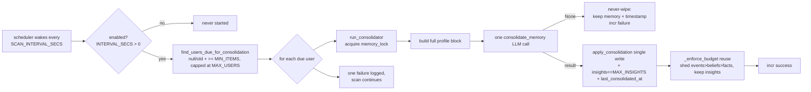

# Design — Phase 11: Periodic memory consolidation (the "dreaming" pass)

## Overview

Phase 11 adds a scheduled background pass that periodically reviews a user's **entire** profile across a long horizon to do what localized, per-overflow extraction structurally cannot: refresh the summary/style, merge and de-duplicate accumulated items, and **synthesize a small, bounded set of durable behavioral/identity insights**. It runs fully off the hot path, serialized under the per-user `memory_lock`, rate-limited per user, bounded per scan, and is **disabled by default** (`CONSOLIDATION_INTERVAL_SECS = 0`).

The design deliberately reuses the codebase's established patterns so it adds almost no new machinery:

- **Scheduler** ≅ `health.start_metrics_logger` — one background loop started from `main.py` after `init_db()`, no-op when its interval ≤ 0, self-healing on errors.
- **Per-user run** ≅ `memory_compressor.compress_user_memory` — one LLM call, single-write apply through a `models` helper, **never-wipe-on-failure**, deterministic budget enforcement, `metrics.incr`.
- **Serialization** ≅ `user_task_manager.run_compressor` — a new `run_consolidator` guarded by the per-conversation `memory_lock`.
- **LLM call** ≅ `llm_service.compress_memory` via `_structured_call` — a new `consolidate_memory` returning `MemoryConsolidation | None`.
- **Schema** ≅ `MemoryCompression` — a new `MemoryConsolidation` reusing the `Compressed*` item shapes plus an `insights` list.
- **Config** ≅ existing `_env_*` helpers — all optional, safe defaults, no new required config.

Guiding principle (the perf-doc priority order): **responsiveness → robustness → minimize LLM calls**. Consolidation touches none of the hot path, is bounded in both runtime work and stored state, and costs at most one LLM call per due user per cadence.

## Architecture

### Component map

```mermaid
graph TD
    MAIN[main.py<br/>after init_db] -->|start when enabled| SCH
    subgraph Background (off hot path)
        SCH[health.start_consolidation_scheduler<br/>periodic loop]
        UTM[user_task_manager.run_consolidator<br/>memory_lock]
        CON[memory_consolidator.consolidate_user_memory]
    end
    SCH -->|due-user scan| MODELSQ[models.find_users_due_for_consolidation]
    SCH -->|dispatch per user| UTM
    UTM -->|under memory_lock| CON
    CON -->|build full profile| LOADER[memory_loader.build_memory_block]
    CON -->|one LLM call| LLM[llm_service.consolidate_memory<br/>_structured_call]
    LLM --> SCHEMA[(MemoryConsolidation)]
    CON -->|single write| APPLY[models.apply_consolidation]
    CON -->|enforce budget| BUD[memory_compressor._enforce_budget]
    CON -->|incr| MET[(metrics registry)]
    APPLY --> DB[(user_profiles<br/>+ insights, last_consolidated_at)]
    LOADER -->|renders insights section| DB
```

### New & changed modules

| Module | Change |
|---|---|
| `app/services/memory_consolidator.py` | **New.** `consolidate_user_memory(user_id)` — the per-user pass (one LLM call, single-write apply, never-wipe, budget enforce, metrics). Mirrors `memory_compressor.py`. |
| `app/services/health.py` | Add `start_consolidation_scheduler()` + `_consolidation_loop(...)`, mirroring `start_metrics_logger` / `_metrics_logger_loop`. Lazy imports inside the loop to avoid import cycles. |
| `app/services/user_task_manager.py` | Add `run_consolidator(chat_id)` — serialize the run under `state.memory_lock`, mirroring `run_compressor` (no cooldown needed; cadence is governed by `last_consolidated_at`). |
| `app/services/llm_service.py` | Add `consolidate_memory(...)` via `_structured_call` with `call_type="memory_consolidation"`. Additive. |
| `app/services/schemas.py` | Add `ConsolidatedInsight` + `MemoryConsolidation`, reusing `CompressedFact`/`CompressedBelief`/`CompressedEvent`. |
| `app/services/memory_loader.py` | `compile_memory_text` renders a new `=== BEHAVIORAL INSIGHTS ===` section (defensive read, empty placeholder). Pure, additive. |
| `app/database/models.py` | Add `find_users_due_for_consolidation(...)` and `apply_consolidation(...)`; `ensure_user` initializes `insights: []` on insert (`$setOnInsert`). |
| `app/prompts/consolidation_prompt.py` | **New.** `SYSTEM_CONSOLIDATION_PROMPT`, following `compression_prompt.py`. |
| `app/config.py` | Add `CONSOLIDATION_INTERVAL_SECS`, `CONSOLIDATION_SCAN_INTERVAL_SECS`, `CONSOLIDATION_MAX_USERS_PER_SCAN`, `CONSOLIDATION_MIN_ITEMS`, `MAX_INSIGHTS` (all optional, safe defaults). |
| `main.py` | Start the scheduler after `init_db()` when enabled; log it. No-op when disabled. |
| `docs/development/{memory_engine,configuration}.md`, `.env.example`, `docs/project_plan.md`, `README.md` | Documentation. |

## Insights: definition, storage decision & rationale

**What an insight is.** A durable, higher-level behavioral or identity observation synthesized across the *whole* profile and history — e.g. "Tends to get stressed during exam season; values reassurance then", "Has steadily shifted from finance toward creative work over the past year", "Processes setbacks by withdrawing first, then talking". It is **not** an atomic fact (a stored detail) and **not** a belief (the user's own stated opinion/value). It is ThinkMate's synthesized read on patterns.

**Decision: store insights in a dedicated, bounded profile-level `insights` list — NOT folded into `beliefs`.**

Rationale (the two options weighed):

| | Dedicated `insights` list (CHOSEN) | Fold into `beliefs` (rejected) |
|---|---|---|
| **Provenance** | System-synthesized observations — distinct origin from user-stated content. Keeping them separate keeps the data model honest. | Conflates "what ThinkMate inferred" with "what the user said they believe", muddying both extraction and future compression. |
| **Boundedness** | Trivially bounded by `MAX_INSIGHTS` on every write; cannot grow without limit. | `beliefs` is unbounded and shed first-in-first-out by `_enforce_budget`; insights would be silently dropped under budget pressure. |
| **Survivability** | Rendered in their own section and treated as highest-priority durable content the budget enforcer never drops. | Would be deleted before facts during budget enforcement — exactly the durable content we most want to keep. |
| **Prompt surfacing** | A dedicated `=== BEHAVIORAL INSIGHTS ===` section makes the bot's longer-term understanding explicit to the model. | Buried among ordinary beliefs; less legible to the model. |
| **Extraction interplay** | Per-overflow extraction keeps writing `beliefs` independently; consolidation owns `insights` — no contention. | Extraction and consolidation would both churn `beliefs`, risking dedup/merge fights. |

So insights live at `user_profiles.insights` (a list of `{content, created_at, updated_at}`), capped at `config.MAX_INSIGHTS`, rendered by `compile_memory_text`, and exempt from the deterministic budget enforcer's shedding order (it drops oldest events → beliefs → facts, never insights). Because `MAX_INSIGHTS` is small (default 5) and each is one short sentence, their character contribution is bounded and minor.

## Data Models

### `user_profiles` additions (additive, no migration)

```jsonc
{
  "_id": 12345,
  "profile_summary": "...",
  "communication_style": "...",
  "emotional_state": { /* unchanged */ },
  "facts":   [ /* unchanged */ ],
  "beliefs": [ /* unchanged */ ],
  "events":  [ /* unchanged */ ],

  // --- Phase 11 additions ---
  "insights": [
    { "content": "Tends to get stressed during exam season; values reassurance then.",
      "created_at": "2024-06-01T...", "updated_at": "2024-06-01T..." }
  ],
  "last_consolidated_at": "2024-06-01T...",   // absent/null on profiles never consolidated

  "created_at": "...", "updated_at": "..."
}
```

Both new fields are read defensively (`doc.get("insights") or []`, `doc.get("last_consolidated_at")`), so profiles written before Phase 11 work unchanged (Requirement 6.6). `ensure_user` adds `insights: []` via `$setOnInsert`; `last_consolidated_at` is intentionally left unset on insert so a fresh user is "due" only once they accumulate `≥ CONSOLIDATION_MIN_ITEMS`.

### New schemas (`app/services/schemas.py`)

```python
class ConsolidatedInsight(BaseModel):
    content: str = Field(description="A durable, higher-level behavioral/identity observation "
                                     "synthesized across the user's whole history.")

class MemoryConsolidation(BaseModel):
    profile_summary: Optional[str] = Field(None, description="Refreshed high-level profile summary.")
    communication_style: Optional[str] = Field(None, description="Refreshed communication preferences.")
    consolidated_facts:   list[CompressedFact]   = Field(default_factory=list)
    consolidated_beliefs: list[CompressedBelief] = Field(default_factory=list)
    consolidated_events:  list[CompressedEvent]  = Field(default_factory=list)
    insights:             list[ConsolidatedInsight] = Field(default_factory=list)
    emotional_state:      Optional[EmotionLog] = None
```

Reusing `CompressedFact`/`CompressedBelief`/`CompressedEvent` keeps the apply path symmetric with `replace_user_memory` and avoids new item shapes.

### Fixed metric set (reusing the Phase 10 registry)

| Metric name | Type | Recorded at | Meaning |
|---|---|---|---|
| `consolidation.runs` | counter | start of `consolidate_user_memory` | How often the dreaming pass runs. |
| `consolidation.success` | counter | after a result is applied | Successful consolidations. |
| `consolidation.failure` | counter | on `None` result or exception | Failed consolidations (no memory wiped). |

### Config keys (`app/config.py`, all optional)

```python
CONSOLIDATION_INTERVAL_SECS: float       # per-user cadence; default 0.0 = DISABLED
CONSOLIDATION_SCAN_INTERVAL_SECS: float  # scheduler wake period; default 3600.0
CONSOLIDATION_MAX_USERS_PER_SCAN: int    # bounded work per wake; default 50
CONSOLIDATION_MIN_ITEMS: int             # min facts+beliefs+events to bother; default 8
MAX_INSIGHTS: int                        # cap on stored insights; default 5
```

No new *required* config; with the defaults the scheduler never starts and behavior is identical to Phase 10.

## Components and Interfaces

New parameters are additive; existing functions keep their signatures.

### `app/services/health.py` (scheduler)

```python
def start_consolidation_scheduler() -> "asyncio.Task | None":
    """Start the periodic consolidation scheduler when enabled; no-op (None) when disabled.

    Enabled only when config.CONSOLIDATION_INTERVAL_SECS > 0 (Req 1.2). Starts a single
    background task that self-heals on errors (Req 1.7). Mirrors start_metrics_logger.
    """
    if config.CONSOLIDATION_INTERVAL_SECS <= 0:
        return None
    try:
        return asyncio.get_running_loop().create_task(
            _consolidation_loop(config.CONSOLIDATION_SCAN_INTERVAL_SECS)
        )
    except RuntimeError:
        return None


async def _consolidation_loop(scan_interval: float) -> None:
    while True:
        try:
            await asyncio.sleep(scan_interval)
            await _run_consolidation_scan()
        except asyncio.CancelledError:
            break
        except Exception as e:        # never crash the loop (Req 1.7)
            logger.debug(f"consolidation scan iteration failed: {e}")


async def _run_consolidation_scan() -> None:
    # Lazy imports avoid an import cycle (user_task_manager -> chat_manager -> ...).
    from app.database.connection import db_session
    from app.database import models
    from app.services.user_task_manager import user_task_manager

    async with db_session() as db:
        due = await models.find_users_due_for_consolidation(
            db,
            interval_secs=config.CONSOLIDATION_INTERVAL_SECS,
            min_items=config.CONSOLIDATION_MIN_ITEMS,
            limit=config.CONSOLIDATION_MAX_USERS_PER_SCAN,
        )
    processed = 0
    for user_id in due:
        try:
            await user_task_manager.run_consolidator(user_id)   # serialized under memory_lock
            processed += 1
        except Exception as e:        # one user's failure must not abort the scan (Req 1.6)
            logger.warning(f"Consolidation failed for user {user_id}: {e}")
    logger.info(f"[consolidation] scan: {len(due)} due, {processed} processed.")
```

- Lazy imports inside the scan mirror `readiness`'s lazy `ping_db` import and prevent a startup import cycle (`health` is imported by `main`/`commands`; `user_task_manager` pulls in `chat_manager`).
- The loop structure (sleep → guarded work → swallow errors → continue; break on cancel) is copied from `_metrics_logger_loop`.

### `app/services/memory_consolidator.py` (new, mirrors the compressor)

```python
async def consolidate_user_memory(user_id: int) -> None:
    """Review the full profile, synthesize durable insights, merge/refresh, enforce budget.

    One LLM call. Never wipes memory on failure (mirrors compress_user_memory). Advances
    last_consolidated_at only on success.
    """
    logger.info(f"Memory consolidation started for user {user_id}.")
    metrics.incr("consolidation.runs")
    try:
        async with db_session() as db:
            memory_text, _ = await build_memory_block(db, user_id)
            system_prompt = (
                f"{SYSTEM_CONSOLIDATION_PROMPT}\n\n"
                f"MAX INSIGHTS: {config.MAX_INSIGHTS}. Emit at most {config.MAX_INSIGHTS} insights."
            )
            consolidation = await llm_service.consolidate_memory(user_id, system_prompt, memory_text)
            if consolidation is None:
                # Failed call: keep existing memory + timestamp untouched (never-wipe).
                logger.warning(f"Consolidation failed for user {user_id}; keeping existing memory.")
                metrics.incr("consolidation.failure")
                return
            await models.apply_consolidation(db, user_id, consolidation)   # single write, sets last_consolidated_at
            await _enforce_budget(db, user_id)                             # reuse deterministic enforcement
            metrics.incr("consolidation.success")
            logger.info(f"Memory consolidation done for user {user_id}.")
    except Exception as e:  # noqa: BLE001 — never raise into the scheduler (Req 2.8)
        logger.error(f"Consolidation failed for user {user_id}: {e}")
        metrics.incr("consolidation.failure")
```

`_enforce_budget` is imported from `app.services.memory_compressor` and reused unchanged: it does one read, sheds oldest events → beliefs → facts in memory (never insights), and writes once. Because `compile_memory_text` now includes the (bounded) insights section, the enforcer naturally accounts for them while never dropping them.

### `app/services/user_task_manager.py` (serialization)

```python
async def run_consolidator(self, chat_id: int):
    """Run consolidation in the background, serialized per conversation via memory_lock.

    No cooldown is needed here — cadence is governed by last_consolidated_at at scan time;
    the memory_lock just guarantees it never races the extractor/compressor.
    """
    state = await self.get_state(chat_id)
    if state.memory_lock.locked():
        logger.info(f"Memory lock held for chat {chat_id}; skipping consolidator.")
        return
    async with state.memory_lock:
        from app.services.memory_consolidator import consolidate_user_memory
        await consolidate_user_memory(chat_id)
```

### `app/services/llm_service.py` (LLM call)

```python
async def consolidate_memory(
    self, user_id: int, system_prompt: str, raw_memory_text: str
) -> MemoryConsolidation | None:
    """Consolidate a user's full profile into a refreshed profile + durable insights.

    Returns None on failure (mirrors compress_memory) so the caller skips the write and
    never wipes memory.
    """
    messages = [
        {"role": "system", "content": system_prompt},
        {"role": "user", "content": raw_memory_text},
    ]
    model = config.LLM_EXTRACTION_MODEL or config.LLM_MODEL
    return await self._structured_call(
        user_id=user_id, call_type="memory_consolidation", model=model, messages=messages,
        schema=MemoryConsolidation, temperature=config.EXTRACTION_TEMPERATURE, timeout=60.0,
    )
```

Because `_structured_call` already increments per-type LLM metrics from `call_type`, consolidation LLM volume/latency are surfaced as `llm.memory_consolidation.*` for free (Phase 10).

### `app/database/models.py` (CRUD)

```python
async def find_users_due_for_consolidation(
    db, *, interval_secs: float, min_items: int, limit: int
) -> list[int]:
    """Return up to `limit` user ids due for consolidation.

    Due = last_consolidated_at older than (now - interval_secs) OR null/absent, AND
    len(facts)+len(beliefs)+len(events) >= min_items. Iterates the due-by-time candidates
    and applies the item-count threshold in Python (array-length predicates are awkward and
    not portable to mongomock), stopping once `limit` qualifying users are collected so the
    helper's own work is bounded (Req 1.9).
    """
    cutoff = _utcnow() - timedelta(seconds=interval_secs)
    query = {"$or": [
        {"last_consolidated_at": {"$exists": False}},
        {"last_consolidated_at": None},
        {"last_consolidated_at": {"$lt": cutoff}},
    ]}
    due: list[int] = []
    async for doc in db["user_profiles"].find(query, {"facts": 1, "beliefs": 1, "events": 1}):
        count = len(doc.get("facts") or []) + len(doc.get("beliefs") or []) + len(doc.get("events") or [])
        if count >= min_items:
            due.append(doc["_id"])
            if len(due) >= limit:
                break
    return due


async def apply_consolidation(db, user_id: int, consolidation: "MemoryConsolidation"):
    """Single-$set apply of a consolidation result + last_consolidated_at (mirrors replace_user_memory)."""
    now = _utcnow()
    set_fields: dict = {}
    if consolidation.profile_summary is not None:
        set_fields["profile_summary"] = consolidation.profile_summary
    if consolidation.communication_style is not None:
        set_fields["communication_style"] = consolidation.communication_style
    if consolidation.emotional_state:
        set_fields["emotional_state"] = { ...same shape as replace_user_memory... }

    set_fields["facts"]   = [ {category, content, confidence:1.0, created_at:now, updated_at:now} for f in consolidation.consolidated_facts ]
    set_fields["beliefs"] = [ {content, created_at:now, updated_at:now} for b in consolidation.consolidated_beliefs ]
    set_fields["events"]  = [ {description, event_date, significance, emotional_context:"", created_at:now} for e in consolidation.consolidated_events ]
    set_fields["insights"] = [
        {"content": ins.content, "created_at": now, "updated_at": now}
        for ins in consolidation.insights[: config.MAX_INSIGHTS]      # truncate to cap (Req 8.4)
    ]
    set_fields["last_consolidated_at"] = now
    set_fields["updated_at"] = now
    await db["user_profiles"].update_one({"_id": user_id}, {"$set": set_fields})
```

The `MemoryConsolidation` import follows the existing `from app.services.schemas import MemoryExtraction, MemoryCompression` line.

### `app/services/memory_loader.py` (insights rendering)

`compile_memory_text` gains a section after `=== SUBJECTIVE BELIEFS ===` (and before the timeline or mood — placed so the model sees the durable read alongside the rest of the profile):

```python
insights = doc.get("insights") or []
lines.append("=== BEHAVIORAL INSIGHTS ===")
if insights:
    for ins in insights:
        lines.append(f"- {ins.get('content')}")
else:
    lines.append("(No long-term insights yet)")
lines.append("")
```

Pure and additive: callers (including `_enforce_budget`, which recomputes `compile_memory_text`) automatically account for the section's length; an absent `insights` key renders the placeholder and matches prior behavior plus one extra section header (the empty-profile floor shifts slightly — tests that assert exact budget floors use values well above it).

### `app/prompts/consolidation_prompt.py` (new)

`SYSTEM_CONSOLIDATION_PROMPT` follows `compression_prompt.py`: it explains the model receives the user's COMPLETE profile, and must (1) refresh `profile_summary` and `communication_style`, (2) merge/de-duplicate facts/beliefs/events without inventing anything, (3) preserve the latest emotional state, and (4) synthesize **at most `MAX_INSIGHTS`** durable, higher-level behavioral/identity insights grounded in evidence across the profile — returning JSON matching the schema. The run injects the effective `MAX_INSIGHTS` cap (mirroring how the compressor injects its target character budget).

### `main.py` (wiring)

```python
from app.services.health import start_metrics_logger, start_consolidation_scheduler
...
if start_consolidation_scheduler() is not None:
    logger.info(
        f"Consolidation scheduler started "
        f"(scan every {config.CONSOLIDATION_SCAN_INTERVAL_SECS}s, "
        f"per-user every {config.CONSOLIDATION_INTERVAL_SECS}s)."
    )
```

Placed right after the metrics-logger start (post `init_db()`), so it runs under the same asyncio loop and is a no-op when disabled.

## The consolidation flow



## Error Handling

- **Never-wipe on failure.** A `None` from `consolidate_memory` skips `apply_consolidation` entirely, so existing memory **and** `last_consolidated_at` are untouched (Requirement 2.4, 2.7). Mirrors `compress_user_memory`.
- **Run never raises into the scheduler.** `consolidate_user_memory` wraps its body in `try/except`, logs, increments `consolidation.failure`, and returns (Requirement 2.8).
- **One user can't abort a scan.** `_run_consolidation_scan` wraps each `run_consolidator` call in `try/except` and continues (Requirement 1.6).
- **Loop self-heals.** `_consolidation_loop` swallows per-iteration errors and continues on the next interval; cancellation breaks cleanly (Requirement 1.7), exactly like `_metrics_logger_loop`.
- **Disabled is inert.** With `CONSOLIDATION_INTERVAL_SECS <= 0`, `start_consolidation_scheduler` returns `None` and nothing else changes (Requirement 1.2, 4.2).
- **Lock contention is a skip, not a wait.** If `memory_lock` is held (an extractor/compressor is mid-run), `run_consolidator` logs and skips; the user is simply picked up on a later scan (Requirement 6.2). No deadlock, no race.
- **Bounded state.** `apply_consolidation` truncates insights to `MAX_INSIGHTS`; `_enforce_budget` keeps the profile ≤ `USER_MEMORY_BUDGET_CHARS`; the scan processes ≤ `CONSOLIDATION_MAX_USERS_PER_SCAN` (Requirement 6.4).
- **Defensive reads.** Missing `insights`/`last_consolidated_at` on legacy documents are handled by `.get(...) or []` / `.get(...)` so no migration is required (Requirement 6.6).
- **Metrics never break a run.** All `metrics.incr` calls go through the Phase 10 registry whose mutators swallow their own errors (Requirement 5.4).

## Correctness Properties

These are the testable invariants the implementation must satisfy; the testing strategy and tasks validate each.

### Property 1: Disabled is a no-op
When `CONSOLIDATION_INTERVAL_SECS <= 0`, `start_consolidation_scheduler()` returns `None`, no scan runs, no LLM call is made, and no profile is modified.

**Validates: Requirements 1.2, 4.2, 6.1**

### Property 2: Due selection is correct and bounded
`find_users_due_for_consolidation` returns exactly the users whose `last_consolidated_at` is null/absent or older than `now - interval_secs` AND whose facts+beliefs+events count ≥ `min_items`, never more than `limit` of them.

**Validates: Requirements 1.3, 1.4, 1.9, 8.2**

### Property 3: Serialized under memory_lock
A consolidation run executes only while holding the user's `memory_lock`; if the lock is held it is skipped, so it never runs concurrently with the extractor/compressor for the same id.

**Validates: Requirements 1.5, 6.2**

### Property 4: One LLM call, single-write apply
A successful run makes exactly one `consolidate_memory` call and persists the result (summary, style, merged items, insights, `last_consolidated_at`) in a single `apply_consolidation` write.

**Validates: Requirements 2.2, 2.3, 8.3**

### Property 5: Never-wipe on failure
A `None` result leaves the profile's `facts`/`beliefs`/`events`/`insights` **and** `last_consolidated_at` unchanged.

**Validates: Requirements 2.4, 2.7, 6.3**

### Property 6: Always under budget after a run
After a successful run, `compile_memory_text(profile)` length ≤ `USER_MEMORY_BUDGET_CHARS`, achieved by reusing the deterministic single-pass enforcer.

**Validates: Requirements 2.5**

### Property 7: Insights are bounded, durable, and rendered
Stored insights never exceed `MAX_INSIGHTS`; `compile_memory_text` renders the insights section (placeholder when empty); the budget enforcer never drops insights.

**Validates: Requirements 3.2, 3.3, 3.4, 3.5, 3.6, 8.4**

### Property 8: Scheduler is resilient
A single user's failure does not abort the scan; an exception inside one loop iteration does not kill the loop; at most `CONSOLIDATION_MAX_USERS_PER_SCAN` users are processed per wake.

**Validates: Requirements 1.4, 1.6, 1.7, 6.3**

### Property 9: Backward compatibility
With the feature disabled (default), every previously passing test passes unmodified; legacy profiles without `insights`/`last_consolidated_at` work without migration.

**Validates: Requirements 6.1, 6.6, 9.6**

## Testing Strategy

All tests use **mongomock + pytest-asyncio** per `tests/conftest.py` conventions (async mock wrappers, autouse DB patch, reactions disabled). No real LLM or network; the LLM is patched with `AsyncMock` as in `tests/test_batching_and_concurrency.py`. Config overrides follow the save/restore pattern in `tests/test_hardening.py`. Where metrics are asserted, a `metrics.reset()` fixture isolates state (as in `tests/test_metrics_instrumentation.py`).

### Schema & LLM call (Requirement 7)
- `MemoryConsolidation` validates a representative JSON payload (summary/style/items/insights/emotional_state) and defaults empty lists.
- `consolidate_memory` returns a parsed `MemoryConsolidation` when `_structured_call` yields one and `None` when it fails (patch the underlying call), proving the never-wipe sentinel.

### CRUD (Requirement 8)
- `find_users_due_for_consolidation`: seed profiles with null / old / recent `last_consolidated_at` and varying item counts; assert only null/old users with `≥ min_items` are returned, recent or item-poor users are excluded, and `limit` caps the result.
- `apply_consolidation`: assert a single coherent profile is written, `last_consolidated_at`/`updated_at` set, and `insights` truncated to `MAX_INSIGHTS` even when the result carries more.
- `ensure_user`: asserts `insights` initializes to `[]` on insert.

### Run (Requirement 2)
- Valid result (LLM patched): assert applied + `last_consolidated_at` advanced + ends ≤ `USER_MEMORY_BUDGET_CHARS` (seed an over-budget profile and assert `not over` afterward, as in `test_enforce_budget_terminates_under_budget`).
- `None` result: assert memory unchanged AND `last_consolidated_at` not advanced AND `apply_consolidation`/`save` not called (mirrors `test_extraction_all_attempts_fail_still_trims`'s no-write assertion).
- Run never raises even if the LLM raises.

### Insights rendering (Requirement 3)
- `compile_memory_text` renders the `=== BEHAVIORAL INSIGHTS ===` section with items and the placeholder when empty; a profile dict with no `insights` key renders the placeholder and does not raise.

### Serialization (Requirements 1.5, 6.2)
- `run_consolidator` acquires `memory_lock` and calls `consolidate_user_memory`; when the lock is already held it skips (patch the consolidator with `AsyncMock` and assert not called), mirroring `test_compression_cooldown_skips_recent`'s skip assertion style.

### Scheduler (Requirement 1)
- `start_consolidation_scheduler()` returns `None` when `CONSOLIDATION_INTERVAL_SECS <= 0` (mirrors `test_disabled_when_interval_zero`).
- With the scheduler enabled and `run_consolidator` patched, a scan over seeded due users processes at most `CONSOLIDATION_MAX_USERS_PER_SCAN`, continues past a user whose run raises, and logs a summary.
- The loop self-heals: force `_run_consolidation_scan` to raise once and assert the task stays alive (mirrors `test_loop_self_heals_on_error`). Background tasks are cancelled/awaited in `finally` so none leak.

### Final checkpoint (Requirement 9.6)
- Full suite (`uv run pytest`) green, no warnings, no external services — same bar as Phases 8–10 — with consolidation disabled by default and all pre-existing tests unmodified.
