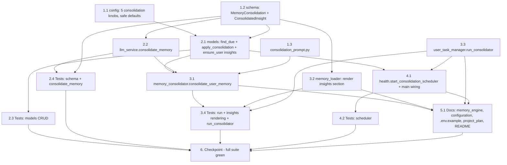

# Implementation Plan

## Overview

This plan delivers Phase 11 (periodic memory consolidation — the "dreaming" pass) as an additive, off-the-hot-path, single-instance background feature that is **disabled by default**. Work proceeds bottom-up so disjoint files parallelize: first the leaf primitives (config knobs, the `MemoryConsolidation` schema, the consolidation prompt), then the data/LLM layer (models CRUD + `consolidate_memory`) and the disjoint rendering/serialization edits, then the consolidator service that ties them together, then the scheduler loop + `main.py` wiring, then docs, and finally a full-suite checkpoint. Every implementation task is paired with a test task using **mongomock + pytest-asyncio** per `tests/conftest.py` (LLM patched with `AsyncMock`, config save/restore as in `tests/test_hardening.py`, `metrics.reset()` isolation as in `tests/test_metrics_instrumentation.py`). The feature reuses existing patterns (`start_metrics_logger`, `compress_user_memory`, `run_compressor`, `_structured_call`, `_enforce_budget`) and is additive only — same signatures, same defaults — so the existing suite passes unmodified.

## Task Dependency Graph



```json
{
  "waves": [
    { "wave": 1, "tasks": ["1.1", "1.2", "1.3"] },
    { "wave": 2, "tasks": ["2.1", "2.2", "3.2", "3.3"] },
    { "wave": 3, "tasks": ["2.3", "2.4", "3.1", "4.1"] },
    { "wave": 4, "tasks": ["3.4", "4.2"] },
    { "wave": 5, "tasks": ["5.1"] },
    { "wave": 6, "tasks": ["6"] }
  ]
}
```

## Tasks

- [ ] 1. Foundations — config, schema, prompt (disjoint leaf files)

  - [ ] 1.1 Add optional consolidation config knobs
    - In `app/config.py`, add five optional keys via the existing `_env_float`/`_env_int` helpers, each with a safe default and **no new required config**: `CONSOLIDATION_INTERVAL_SECS: float` (default `0.0` = disabled), `CONSOLIDATION_SCAN_INTERVAL_SECS: float` (default `3600.0`), `CONSOLIDATION_MAX_USERS_PER_SCAN: int` (default `50`), `CONSOLIDATION_MIN_ITEMS: int` (default `8`), `MAX_INSIGHTS: int` (default `5`)
    - Place them under a new `# --- Consolidation (Phase 11) ---` section consistent with the existing field style; ensure the bot starts and behaves identically when all are unset (disabled default)
    - _Requirements: 4.1, 4.2, 4.3_

  - [ ] 1.2 Add the `MemoryConsolidation` schema
    - In `app/services/schemas.py`, add `class ConsolidatedInsight(BaseModel)` with a single `content: str` field (described as a durable, higher-level behavioral/identity observation), and `class MemoryConsolidation(BaseModel)` mirroring `MemoryCompression`: optional `profile_summary`, optional `communication_style`, `consolidated_facts: list[CompressedFact]`, `consolidated_beliefs: list[CompressedBelief]`, `consolidated_events: list[CompressedEvent]`, `insights: list[ConsolidatedInsight]`, and optional `emotional_state: EmotionLog`, all list fields defaulting via `Field(default_factory=list)`
    - Reuse the existing `CompressedFact`/`CompressedBelief`/`CompressedEvent` shapes so the apply path stays symmetric with `replace_user_memory`
    - _Requirements: 7.1_

  - [ ] 1.3 Add the consolidation system prompt
    - Create `app/prompts/consolidation_prompt.py` with `SYSTEM_CONSOLIDATION_PROMPT`, following `app/prompts/compression_prompt.py`: explain the model receives the user's COMPLETE profile and must (1) refresh `profile_summary` and `communication_style`, (2) merge/de-duplicate facts/beliefs/events without inventing anything and preserving categories/significance, (3) preserve the latest emotional state, and (4) synthesize durable, higher-level behavioral/identity **insights** grounded in evidence across the whole profile — returning JSON matching the schema
    - State that the run will supply a maximum insight count and that the model must emit at most that many insights (the run injects `MAX_INSIGHTS`, mirroring how the compressor injects its target character budget)
    - _Requirements: 7.3, 7.4_

- [ ] 2. Data layer & LLM call

  - [ ] 2.1 Add consolidation CRUD to `models.py`
    - In `app/database/models.py`, import `MemoryConsolidation` (alongside the existing `MemoryExtraction, MemoryCompression` import) and add `insights: []` to `ensure_user`'s `$setOnInsert` (additive; `last_consolidated_at` is intentionally left unset on insert)
    - Add `async def find_users_due_for_consolidation(db, *, interval_secs, min_items, limit) -> list[int]`: query `user_profiles` for `last_consolidated_at` null/absent OR `< now - interval_secs`, iterate with a `{facts,beliefs,events}` projection, keep only users whose `len(facts)+len(beliefs)+len(events) >= min_items`, and stop once `limit` qualifying ids are collected (bounded work, mongomock-friendly — no array-length query operators)
    - Add `async def apply_consolidation(db, user_id, consolidation)`: a single `$set` write of refreshed `profile_summary`/`communication_style` (only when present), merged `facts`/`beliefs`/`events` (same item dict shapes as `replace_user_memory`), `emotional_state` (when present), `insights` truncated to `config.MAX_INSIGHTS` (each `{content, created_at, updated_at}`), `last_consolidated_at = now`, and `updated_at = now`
    - _Requirements: 8.1, 8.2, 8.3, 8.4_

  - [ ] 2.2 Add `consolidate_memory` to `LLMService`
    - In `app/services/llm_service.py`, import `MemoryConsolidation` and add `async def consolidate_memory(self, user_id, system_prompt, raw_memory_text) -> MemoryConsolidation | None` implemented via `_structured_call` with `call_type="memory_consolidation"`, `model = config.LLM_EXTRACTION_MODEL or config.LLM_MODEL`, `schema=MemoryConsolidation`, `temperature=config.EXTRACTION_TEMPERATURE`, `timeout=60.0` — mirroring `compress_memory`
    - Preserve the `None`-on-failure contract so the caller can skip the write and never wipe memory; rely on `_structured_call`'s existing per-type metrics so `llm.memory_consolidation.*` is surfaced for free
    - _Requirements: 7.2_

  - [ ] 2.3 Tests: consolidation CRUD
    - In a new `tests/test_consolidation_models.py` (mongomock + pytest-asyncio), seed profiles with `last_consolidated_at` null / old (`< now - interval`) / recent and varying facts+beliefs+events counts; assert `find_users_due_for_consolidation` returns exactly the null/old users meeting `min_items`, excludes recent or item-poor users, and never returns more than `limit`
    - Assert `apply_consolidation` writes a single coherent profile (summary/style/facts/beliefs/events/insights), sets `last_consolidated_at` and `updated_at`, and truncates `insights` to `MAX_INSIGHTS` even when given more (use the config save/restore pattern from `tests/test_hardening.py`); assert `ensure_user` initializes `insights` to `[]`
    - _Requirements: 8.2, 8.3, 8.4, 9.1, 9.2_

  - [ ] 2.4 Tests: schema + `consolidate_memory`
    - In a new `tests/test_consolidation_llm.py`, validate `MemoryConsolidation` against a representative JSON payload (summary, style, items, insights, emotional_state) and assert empty-list defaults; patch `LLMService._structured_call` with `AsyncMock` to assert `consolidate_memory` returns the parsed `MemoryConsolidation` on success and `None` when the structured call fails (proving the never-wipe sentinel)
    - Assert the call passes `call_type="memory_consolidation"` and the `MemoryConsolidation` schema through to `_structured_call`
    - _Requirements: 7.1, 7.2, 9.1_

- [ ] 3. Consolidator run, insights rendering & serialization

  - [ ] 3.1 Implement `memory_consolidator.consolidate_user_memory`
    - Create `app/services/memory_consolidator.py` with `async def consolidate_user_memory(user_id)` mirroring `memory_compressor.compress_user_memory`: `metrics.incr("consolidation.runs")`, open `db_session()`, build the full profile via `build_memory_block`, assemble the system prompt as `SYSTEM_CONSOLIDATION_PROMPT` + an injected `MAX INSIGHTS: {config.MAX_INSIGHTS}` line, make exactly one `llm_service.consolidate_memory` call
    - On `None`: log a warning, `metrics.incr("consolidation.failure")`, and **return without writing** (never-wipe; `last_consolidated_at` not advanced). On success: `await models.apply_consolidation(...)` then reuse `from app.services.memory_compressor import _enforce_budget` to guarantee the profile ends ≤ `USER_MEMORY_BUDGET_CHARS`, then `metrics.incr("consolidation.success")`. Wrap the whole body in `try/except` that logs + increments failure so it never raises into the scheduler
    - _Requirements: 2.1, 2.2, 2.3, 2.4, 2.5, 2.7, 2.8, 5.1, 5.2_

  - [ ] 3.2 Render the insights section in `compile_memory_text`
    - In `app/services/memory_loader.py`, read `insights = doc.get("insights") or []` defensively and append a new `=== BEHAVIORAL INSIGHTS ===` section (rendering `- {content}` per insight, or a `(No long-term insights yet)` placeholder when empty), placed after the `=== SUBJECTIVE BELIEFS ===` section so the system prompt surfaces durable insights alongside the rest of the profile
    - Keep the function pure and additive so `_enforce_budget` (which recomputes `compile_memory_text`) accounts for the section's length automatically; a profile dict with no `insights` key must render the placeholder and not raise
    - _Requirements: 3.1, 3.2, 3.4, 3.5, 3.6_

  - [ ] 3.3 Add `run_consolidator` to `UserTaskManager`
    - In `app/services/user_task_manager.py`, add `async def run_consolidator(self, chat_id)` mirroring `run_compressor`: get the state, skip with a log if `state.memory_lock.locked()`, otherwise `async with state.memory_lock:` lazily import and `await consolidate_user_memory(chat_id)` (lazy import avoids an import cycle)
    - No per-user cooldown is needed (cadence is governed by `last_consolidated_at` at scan time); the `memory_lock` guarantees it never races the extractor/compressor for the same id
    - _Requirements: 1.5, 6.2_

  - [ ] 3.4 Tests: run, insights rendering & serialization
    - In a new `tests/test_consolidation_run.py` (mongomock + pytest-asyncio, `metrics.reset()` fixture, LLM patched with `AsyncMock`): seed an over-budget profile, run `consolidate_user_memory` with a patched `consolidate_memory` returning a valid `MemoryConsolidation`, and assert it is applied, `last_consolidated_at` advances, and `build_memory_block` reports `not over` afterward (as in `test_enforce_budget_terminates_under_budget`); with `consolidate_memory` returning `None`, assert `apply_consolidation` is **not** called, memory is unchanged, and `last_consolidated_at` is not advanced; assert the run does not raise even if the LLM raises
    - Assert `compile_memory_text` renders the `=== BEHAVIORAL INSIGHTS ===` section with items and the empty placeholder, and that a profile with no `insights` key renders the placeholder without raising; assert `run_consolidator` calls `consolidate_user_memory` under the lock and **skips** (patched consolidator not called) when `memory_lock` is already held (mirroring `test_compression_cooldown_skips_recent`)
    - _Requirements: 2.4, 2.5, 3.4, 3.5, 9.3, 9.4_

- [ ] 4. Scheduler & wiring

  - [ ] 4.1 Implement the scheduler loop + wire it in `main.py`
    - In `app/services/health.py`, add `start_consolidation_scheduler() -> asyncio.Task | None` (returns `None` when `config.CONSOLIDATION_INTERVAL_SECS <= 0`, else creates one task on the running loop — mirroring `start_metrics_logger`), `_consolidation_loop(scan_interval)` (sleep → guarded scan → swallow per-iteration errors → continue; break on `CancelledError` — mirroring `_metrics_logger_loop`), and `_run_consolidation_scan()` that **lazily imports** `db_session`, `models`, and `user_task_manager`, calls `find_users_due_for_consolidation(...)` with the configured interval/min-items/limit, dispatches each due user through `user_task_manager.run_consolidator(...)` inside a per-user `try/except` so one failure can't abort the scan, and logs a one-line summary of due/processed counts
    - In `main.py`, after `init_db()` (next to the metrics-logger start), call `start_consolidation_scheduler()` and log that it started when enabled; it must be a no-op when disabled
    - _Requirements: 1.1, 1.2, 1.3, 1.4, 1.6, 1.7, 1.8, 1.9, 5.3_

  - [ ] 4.2 Tests: scheduler
    - In a new `tests/test_consolidation_scheduler.py` (config save/restore + cancel/await background tasks in `finally` so none leak, as in `tests/test_metrics_logger.py`): assert `start_consolidation_scheduler()` returns `None` when `CONSOLIDATION_INTERVAL_SECS <= 0`; with the feature enabled and `user_task_manager.run_consolidator` patched with `AsyncMock`, seed more due users than `CONSOLIDATION_MAX_USERS_PER_SCAN` and assert `_run_consolidation_scan` processes at most that many
    - Assert the scan continues past a user whose `run_consolidator` raises (others still processed), and that `_consolidation_loop` self-heals when `_run_consolidation_scan` is patched to raise once (the task stays alive — mirroring `test_loop_self_heals_on_error`)
    - _Requirements: 1.2, 1.4, 1.6, 1.7, 9.5_

- [ ] 5. Documentation

  - [ ] 5.1 Document the consolidation feature
    - Update `docs/development/memory_engine.md` with a Phase 11 section explaining the dreaming pass (scheduler → `run_consolidator` under `memory_lock` → one `consolidate_memory` call → single-write apply → budget enforce), the never-wipe contract, the insights model (dedicated bounded `insights` list, rendered in `compile_memory_text`, never dropped by `_enforce_budget`), and the storage rationale (why a dedicated list over folding into beliefs)
    - Document the five new config keys in `docs/development/configuration.md` and mirror them in `.env.example`; mark Phase 11 progress in `docs/project_plan.md` (roadmap + build-order checklist) and cross-link from `README.md`, consistent with `.agents/rules/document_changes.md`
    - _Requirements: 4.4, 6.6_

- [ ] 6. Checkpoint - ensure the full suite passes
  - Run the full test suite (`uv run pytest` or the project's configured command) and confirm every test passes with no warnings and no external services, including all pre-existing tests unmodified, with consolidation **disabled by default** (`CONSOLIDATION_INTERVAL_SECS = 0.0`)
  - Confirm the hot-path invariants still hold: consolidation adds no DB round-trip or LLM call to the reply path (it runs only from the background scheduler), runs under `memory_lock`, never wipes memory on failure, and does bounded work per scan
  - _Requirements: 6.1, 6.5, 9.6_

## Notes

- **Disabled by default is the top constraint.** With `CONSOLIDATION_INTERVAL_SECS = 0.0` (the default), `start_consolidation_scheduler()` returns `None`, no scan runs, no LLM call is made, and no profile is modified — behavior is identical to Phase 10. Task 6 enforces that the existing suite passes unmodified.
- **Reuses existing patterns, adds little machinery.** Scheduler ≅ `start_metrics_logger`/`_metrics_logger_loop`; per-user run ≅ `compress_user_memory` (one LLM call, single-write apply, never-wipe, `_enforce_budget` reuse, `metrics.incr`); serialization ≅ `run_compressor` (per-user `memory_lock`); LLM call ≅ `compress_memory` via `_structured_call`; schema ≅ `MemoryCompression`.
- **Off the hot path.** Consolidation runs only from the background scheduler, under `memory_lock`; it adds nothing to the reply path (Requirement 6.5).
- **Never wipes memory.** A `None` from `consolidate_memory` skips the write entirely and does not advance `last_consolidated_at`, exactly mirroring the compressor's failure contract (Requirements 2.4, 2.7).
- **Bounded work + bounded state.** ≤ `CONSOLIDATION_MAX_USERS_PER_SCAN` users per wake; `insights` truncated to `MAX_INSIGHTS` on every write; profile kept ≤ `USER_MEMORY_BUDGET_CHARS` by the reused enforcer (Requirement 6.4).
- **Insights live in a dedicated list, not in beliefs.** Distinct provenance (system-synthesized vs. user-stated), trivially bounded by `MAX_INSIGHTS`, survives budget enforcement (the enforcer sheds events → beliefs → facts, never insights), and is surfaced in its own prompt section so the bot actually uses it. Rationale is detailed in `design.md`.
- **Disjoint files parallelize.** Wave 2 edits `models.py`, `llm_service.py`, `memory_loader.py`, and `user_task_manager.py` (four disjoint files); `consolidate_user_memory` (`memory_consolidator.py`) and the scheduler (`health.py`) are new files that compose them.
- **Test conventions.** mongomock + pytest-asyncio per `tests/conftest.py`; the LLM is patched with `AsyncMock` (as in `tests/test_batching_and_concurrency.py`); config is saved/restored (as in `tests/test_hardening.py`); a `metrics.reset()` fixture isolates metric state; background tasks are cancelled/awaited in `finally` so none leak (as in `tests/test_metrics_logger.py`).
- **No migration.** New `insights` / `last_consolidated_at` fields are read defensively, so profiles written before Phase 11 work unchanged (Requirement 6.6).
