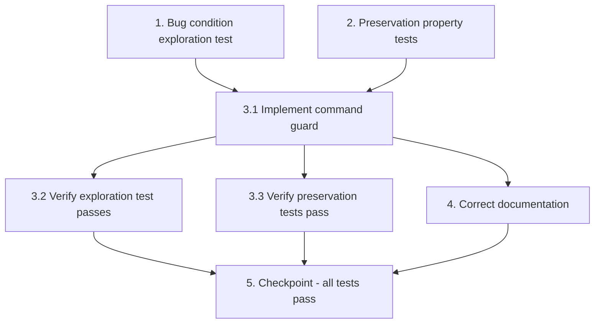

# Implementation Plan

## Overview

This plan fixes the DM catch-all handler so that bot (slash) commands are never treated as conversation. It follows the exploratory bugfix workflow: write a bug-condition exploration test (expected to FAIL on unfixed code) and preservation tests (expected to PASS on unfixed code) BEFORE applying the fix, then implement the command guard in `app/handlers/messages.py`, verify the tests, correct the documentation, and run a final checkpoint.

## Task Dependency Graph



```json
{
  "waves": [
    { "wave": 1, "tasks": ["1", "2"] },
    { "wave": 2, "tasks": ["3.1"] },
    { "wave": 3, "tasks": ["3.2", "3.3", "4"] },
    { "wave": 4, "tasks": ["5"] }
  ]
}
```

## Tasks

- [x] 1. Write bug condition exploration test
  - **Property 1: Bug Condition** - Bot commands are not treated as conversation
  - **CRITICAL**: This test MUST FAIL on unfixed code — failure confirms the bug exists
  - **DO NOT attempt to fix the test or the code when it fails**
  - **NOTE**: This test encodes the expected behavior — it will validate the fix when it passes after implementation
  - **GOAL**: Surface counterexamples that demonstrate the bug (the `F.text` catch-all enqueues unknown command text)
  - **Scoped PBT Approach**: Hypothesis is not a project dependency, so express the property as a loop/`pytest.mark.parametrize` over a generated set of command-like strings (e.g. `"/foo"`, `"/foo@ThinkMateBot"`, `"/" + random_word`). Keep the same `unittest.mock` style used in `tests/test_reactions.py`
  - Create a new test (e.g. `tests/test_command_skip.py`) that builds a mocked `Message` with `from_user` set and `text` = a bot command, patches `app.services.user_task_manager.user_task_manager.enqueue_message` (AsyncMock) and uses `message.answer = AsyncMock()`
  - Invoke `app.handlers.messages.handle_user_message(message, db)` and assert `enqueue_message` was NOT called and `message.answer` was NOT called (from Bug Condition in design)
  - Run test on UNFIXED code
  - **EXPECTED OUTCOME**: Test FAILS (proves the bug — `enqueue_message` IS called for `/foo`)
  - Document counterexamples found (e.g. `handle_user_message("/foo")` enqueues `/foo` instead of returning early)
  - Mark task complete when the test is written, run, and the failure is documented
  - _Requirements: 1.1, 1.2, 1.3_

- [x] 2. Write preservation property tests (BEFORE implementing fix)
  - **Property 2: Preservation** - Non-command handling unchanged
  - **IMPORTANT**: Follow observation-first methodology — observe behavior on UNFIXED code, then write tests capturing it
  - Observe: for non-command text (does not start with `/`), `handle_user_message` calls `enqueue_message(bot, user_id, text, message)` and does not answer
  - Observe: non-command text longer than `config.MAX_INPUT_CHARS` triggers `message.answer(<length-guard text>)` and is NOT enqueued
  - Observe: `message.from_user = None` returns early — neither answers nor enqueues
  - Write property-style tests (loop/parametrize over generated non-command strings within the length limit) asserting `enqueue_message` IS called with the text (from Preservation Requirements in design)
  - Add explicit tests for the length-guard and empty-sender cases
  - Run tests on UNFIXED code
  - **EXPECTED OUTCOME**: Tests PASS (confirms baseline behavior to preserve)
  - Mark task complete when tests are written, run, and passing on unfixed code
  - _Requirements: 3.1, 3.3, 3.4_

- [ ] 3. Fix: exclude bot commands from the DM catch-all handler

  - [~] 3.1 Implement the command guard in `handle_user_message`
    - In `app/handlers/messages.py`, after the existing empty-sender guard and before the length guard / enqueue, add an early-return when the message text is a bot command
    - Use the most robust aiogram-idiomatic detection: treat the message as a command when its first entity is of type `bot_command` at `offset == 0`, falling back to `message.text.startswith("/")` when entities are absent (handles `/foo` and `/foo@BotName`, does not misclassify `2/3`)
    - Return early (no reply, no enqueue) when the command guard matches
    - Leave the empty-sender guard, length guard, and enqueue for non-command text unchanged
    - _Bug_Condition: isBugCondition(message) = hasSender(message) AND isBotCommand(message.text) (from design)_
    - _Expected_Behavior: Property 1 — ignore command messages (no reply, no enqueue) (from design)_
    - _Preservation: Preservation Requirements — conversational reply+enqueue, length guard, empty-sender (from design)_
    - _Requirements: 2.1, 2.2, 2.3_

  - [~] 3.2 Verify bug condition exploration test now passes
    - **Property 1: Expected Behavior** - Bot commands are not treated as conversation
    - **IMPORTANT**: Re-run the SAME test from task 1 — do NOT write a new test
    - Run the bug condition exploration test from task 1
    - **EXPECTED OUTCOME**: Test PASSES (confirms commands are now ignored)
    - _Requirements: 2.1, 2.2, 2.3_

  - [~] 3.3 Verify preservation tests still pass
    - **Property 2: Preservation** - Non-command handling unchanged
    - **IMPORTANT**: Re-run the SAME tests from task 2 — do NOT write new tests
    - Run the preservation property tests from task 2
    - **EXPECTED OUTCOME**: Tests PASS (confirms no regressions to conversational, length-guard, or empty-sender behavior)
    - _Requirements: 3.1, 3.3, 3.4_

- [~] 4. Correct documentation
  - Update `docs/development/group_chat.md` "Behavior by chat type" table so the Private (DM) row clearly states bot commands are excluded / not treated as conversation (not replied to), rather than implying every message is answered
  - Keep the change minimal and consistent with the rest of the doc
  - _Requirements: 2.3_

- [~] 5. Checkpoint - Ensure all tests pass
  - Run the full test suite (`uv run pytest` or the project's configured command) and ensure all tests pass
  - Confirm the exploration test passes and preservation tests show no regressions
  - Ask the user if any questions arise

## Notes

- Write the exploration test (Task 1) and preservation tests (Task 2) BEFORE implementing the fix.
- Run Task 1 on the UNFIXED code first — it must FAIL to confirm the bug exists. Do not "fix" the failing test; it validates the fix once Task 3.1 is done.
- Run Task 2 on the UNFIXED code first — it must PASS to establish the baseline behavior being preserved.
- Hypothesis is not currently a project dependency; the property-based tests are expressed as loops/parametrize over generated inputs, consistent with the existing `pytest` + `unittest.mock` style in `tests/`.
