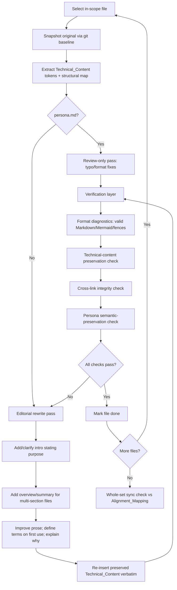

# Design Document: docs-rewrite

## Overview

This design describes how the ThinkMate documentation rewrite is carried out. The work is editorial, not feature development: no application code under `app/` changes. The deliverable is a clearer, more welcoming `Documentation_Set` that preserves every piece of `Technical_Content` and every `Formatting_Convention` already present.

The guiding rule is **"clarify, don't cut."** Prose is rewritten for readability, introductions and summaries are added, and terms are defined on first use — but Mermaid diagrams, tables, code blocks, configuration values, paths, and identifiers are carried through untouched. The rewrite also honors `.agents/rules/document_changes.md`, which governs open-source friendliness, navigation/cross-linking, and `README.md` ↔ docs synchronization through the `Alignment_Mapping`.

The design is organized as a per-file editorial pipeline plus a verification layer that mechanically checks the preservation invariants. Because the artifacts are Markdown, code-style examples in this document are expressed as **structured pseudocode** for the verification checks; the documentation edits themselves are prose work.

## Goals and Non-Goals

**Goals**
- Improve readability of every in-scope file while preserving meaning (R1).
- Preserve all `Technical_Content` verbatim (R2).
- Keep existing `Formatting_Convention`, including emoji headers, Mermaid, tables, code fences (R3).
- Keep all cross-links resolvable and never drop an existing valid link (R4).
- Keep `README.md` aligned with the mapped docs per `document_changes.md` (R5).
- Handle `persona.md` as review-only: typo/formatting fixes only (R6).
- Cover every in-scope file (R7).

**Non-Goals**
- No changes to application behavior, runtime, or the bot's persona semantics.
- No restructuring of the docs' formatting style or directory layout.
- No removal of technical depth in the name of brevity.

## In-Scope Files

| Group | Files | Alignment_Mapping anchor |
|---|---|---|
| Root entry | `README.md`, `changelog.md` | Root Readme & Entry |
| Top-level docs | `docs/architecture.md`, `docs/project_plan.md`, `docs/setup_guide.md` | Architecture; Env/Setup; Project Checklist |
| Development guides | `docs/development/configuration.md`, `database.md`, `group_chat.md`, `hardening_plan.md`, `llm_integration.md`, `memory_engine.md`, `observability.md`, `performance_and_scaling.md`, `telegram_bot.md`, `testing_guide.md` | Config; Database; Group; LLM; Memory; Observability; Telegram |
| Review-only | `persona.md` | — (runtime behavior file) |

`.env.example` is not rewritten but is referenced by the `Alignment_Mapping`: setup/config edits must stay consistent with it.

## Architecture

The rewrite runs as a repeatable, per-file pipeline. Each file passes through the same stages, and a verification layer validates the invariants after each file and again across the whole set.



### Stage detail

1. **Snapshot original.** The pre-rewrite content is the baseline for every preservation check. The committed `git` version of each file is the reference; checks compare the working copy against it.
2. **Extract tokens + structural map.** Before editing, build an inventory of the file's `Technical_Content` and structure (see Data Models). This inventory is the contract the rewrite must satisfy.
3. **Editorial rewrite (non-persona).** Improve prose, add an intro that states the file's purpose, add an overview for multi-section files, define terms on first use, and explain the "why" behind decisions. Preserved `Technical_Content` is reinserted verbatim — never retyped from memory.
4. **Review-only pass (persona).** Only typographical and formatting corrections; the meaningful token sequence is held identical.
5. **Verification layer.** Run the mechanical checks (below). On failure, return to the rewrite stage for that file.
6. **Whole-set sync check.** After all files pass, validate `README.md` ↔ docs alignment and global cross-link integrity.

## Per-File Rewrite Strategy

The same editorial moves apply to every non-persona file, tuned to the file's role:

- **`README.md`** — Primary entry point. Sharpen the opening hook, keep the 🌟 Key Features list and the 📂 File/Folder Structure code block intact, and ensure every feature bullet that references a doc keeps its cross-link. This file is the hub of the `Alignment_Mapping`, so its claims must match the linked docs.
- **`changelog.md`** — Improve section intros and phrasing; preserve version numbers, dates, and entry specifics verbatim.
- **`docs/architecture.md`** — Add/clarify the document intro and per-section overviews. Preserve the ASCII system-prompt box, every `mermaid` pipeline diagram, and identifiers like `chat_buffers`, `CHAT_BUFFER_MAX_CHARS`, `UserTaskManager`.
- **`docs/project_plan.md`** — Preserve checklist state (checked/unchecked items) and phase numbering exactly; improve surrounding narrative only.
- **`docs/setup_guide.md`** — Preserve every command, env-var name, and step ordering; clarify rationale. Must stay consistent with `.env.example`.
- **`docs/development/*`** — Each guide gets an intro stating what subsystem it covers and an overview orienting the reader, with terms defined on first use. Preserve all code blocks, schema snippets, config tables, and anchor targets (e.g., `memory_engine.md#-phase-11--periodic-consolidation-the-dreaming-pass-implemented`) because the README links to those anchors.

### Adding intros, summaries, and term definitions without disturbing format

- **Intros** are inserted as the first prose block immediately under the existing H1, above the first `---`/`##` boundary. The H1 text is not changed.
- **Overviews/summaries** for multi-section files are added as a short orienting paragraph or a bulleted "what's in this doc" list, using the same Markdown elements already present.
- **Term definitions** are woven into prose on first use (inline clause or parenthetical), matching the existing voice — not added as a separate glossary unless the file already has one.
- **Rationale** ("why") is added as prose near the decision it explains; it never replaces or reworks a diagram or table.
- Emoji-prefixed headers are kept exactly, including the emoji and spacing, so anchor slugs remain stable and existing cross-links keep resolving.

## Technical_Content Preservation Approach

`Technical_Content` is treated as an immutable payload that the rewrite wraps with better prose. Preservation is enforced by extraction-and-comparison rather than trust:

- **Fenced code blocks** (```` ``` ````-delimited, including language tags like ` ```python `, ` ```mermaid `): captured verbatim, fence-to-fence, and reinserted unchanged. Balanced fences are verified.
- **Mermaid diagrams**: captured as whole blocks; content must match the baseline byte-for-byte.
- **Tables**: every header row and body row preserved; column structure unchanged.
- **Inline identifiers**: backticked tokens — env-var names (`USER_MEMORY_BUDGET_CHARS`), class/method names (`UserTaskManager`, `build_memory_block`), file paths (`app/services/chat_manager.py`), and numeric config values (`4,000`, `≤ 80%`) — preserved verbatim.
- **ASCII diagrams / box art**: preserved as code-fenced or pre-formatted blocks exactly.

If any editorial change would remove or alter the meaning of a `Technical_Content` item, the item is kept unchanged (R2.3). The preservation check (below) is the gate that makes this concrete.

## Cross-Link Integrity Approach

Two distinct guarantees are enforced:

1. **Resolution (R4.1):** every Markdown link in the rewritten set points to a real target. For a relative file link, the target file exists on disk. For an anchored link (`file.md#section`), the section anchor exists in the target file, where anchors are computed with the standard GitHub slug rule (lowercase, spaces→hyphens, punctuation stripped, emoji handled per existing slugs).
2. **Preservation (R4.4):** the set of valid link targets present before the rewrite is a subset of the targets after. No existing valid navigation path is dropped.

When the prose references another in-scope document, a cross-link is added (R4.3), using the relative-path style already used in the docs (e.g., `[memory_engine.md](docs/development/memory_engine.md)`), consistent with `document_changes.md` guidance on navigation and the `file://`-scheme convention used in the rules file.

## README ↔ Docs Synchronization Approach

Synchronization follows the `Alignment_Mapping` in `.agents/rules/document_changes.md`:

- The `README.md` Key Features and structure sections are the high-level mirror of the detailed guides. After rewriting a guide, its summary in `README.md` is checked for consistency (feature names, phase labels, defaults).
- Mapping-specific rules are honored: architecture/data-flow wording aligns with `architecture.md`; setup/env wording aligns with `setup_guide.md` and `.env.example`; completed plan items align with `project_plan.md`; subsystem details align with their `docs/development/*` guide.
- Because this is a documentation-only rewrite (no code changed), synchronization means **internal consistency** across the set, not reconciling docs against new code. The reviewer performs a mapping checklist; automated checks cover the verifiable parts (link existence to mapped docs, file-path validity).

## Review-Only Handling of persona.md

`persona.md` influences runtime bot behavior, so it is quarantined from editorial rewriting:

- Permitted: fixing typos, spelling, and Markdown formatting glitches (e.g., a broken list marker, an unbalanced emphasis).
- Forbidden: rewording any sentence that defines tone, rules, traits, communication style, memory rules, or boundaries.
- Decision rule: if a candidate edit changes the meaningful token sequence (beyond whitespace/punctuation normalization), it is excluded.
- This is enforced by the persona semantic-preservation check, which compares a normalized token stream of the before/after versions.

## Data Models

These are the in-memory structures the verification layer builds per file. Expressed as structured pseudocode.

```
FileInventory:
    path: string
    h1_title: string
    intro_present: boolean          # non-empty prose between H1 and first '## '/'---'
    heading_count: int
    headings: list<Heading>
    emoji_headers: set<string>      # header texts whose first glyph is an emoji
    code_blocks: list<string>       # verbatim fenced blocks, including fences
    mermaid_blocks: list<string>    # verbatim ```mermaid blocks
    table_rows: list<string>        # every table row line
    inline_tokens: multiset<string> # backticked identifiers, paths, env vars, numbers
    links: list<Link>

Heading:
    level: int
    text: string
    slug: string                    # GitHub anchor slug

Link:
    raw: string
    target_file: string | null      # resolved relative path, null for pure-anchor
    anchor: string | null
    is_external: boolean            # http(s) / mailto — not resolution-checked on disk

PreservationResult:
    file: string
    missing_tokens: multiset<string>
    missing_code_blocks: list<string>
    missing_mermaid: list<string>
    missing_table_rows: list<string>
    dropped_emoji_headers: set<string>
    dropped_links: list<Link>
    ok: boolean
```

## Components and Interfaces

The verification layer is a small set of pure-ish functions over file text. They have clear inputs/outputs, which makes them directly testable.

```
extract_inventory(text: string, path: string) -> FileInventory
    # Parse Markdown into the FileInventory structure above.

extract_technical_tokens(text: string) -> TechnicalContent
    # Returns { code_blocks, mermaid_blocks, table_rows, inline_tokens }.

check_preservation(original: FileInventory, rewritten: FileInventory) -> PreservationResult
    # Asserts every technical token / block / emoji header / valid link in
    # `original` is present in `rewritten`. Populates the *_missing fields.

resolve_links(inventory: FileInventory, repo_root: path) -> list<LinkResult>
    # For each non-external link, confirm target_file exists and (if anchor)
    # the anchor matches a heading slug in the target file.

check_markdown_validity(text: string) -> list<Diagnostic>
    # Balanced code fences, parseable tables, parseable mermaid blocks.

normalize_persona(text: string) -> list<string>
    # Lowercase-insensitive token stream with whitespace/punctuation collapsed,
    # used to compare persona semantics before/after.

check_persona_preserved(original: string, rewritten: string) -> bool
    # normalize_persona(original) == normalize_persona(rewritten)
```

## Verification Approach

Verification is layered and runs after each file and once across the whole set. It maps directly to the properties below.

1. **Format diagnostics (R3.4).** Run a Markdown linter and a Mermaid parse over each rewritten file; assert balanced code fences and well-formed tables. Use IDE format diagnostics on the `.md` files plus `check_markdown_validity`.
2. **Technical-content preservation (R2).** For each file, `check_preservation` confirms the baseline's code blocks, mermaid blocks, table rows, and inline tokens all appear in the rewrite. Any non-empty `missing_*` field fails the file.
3. **Emoji-header preservation (R3.2).** `dropped_emoji_headers` must be empty.
4. **Intro presence (R1.2).** `intro_present` must be true for every non-persona file; multi-section files additionally carry an overview.
5. **Cross-link integrity (R4.1, R4.4).** `resolve_links` must report all links resolvable; the post-rewrite link-target set must be a superset of the baseline's valid targets.
6. **Persona semantic preservation (R6).** `check_persona_preserved` must return true for `persona.md`.
7. **Coverage (R7).** Confirm each in-scope file was processed (present in the change set).
8. **Sync check (R5).** Reviewer mapping checklist against `document_changes.md`, supported by the automated link/path checks for the mapped documents.

Practical tooling notes: comparisons are made against the `git` baseline of each file; the checks operate on text and are deterministic, so they can be run repeatedly during the rewrite. No application tests are affected, since `app/` is untouched.

## Error Handling

- **Missing technical token detected:** stop, reinsert the exact baseline token, re-run the check. Never paraphrase a token to satisfy prose flow.
- **Broken cross-link:** if a target genuinely moved, fix the link to the real target; if the rewrite dropped a link, restore it. Never delete a link to clear the check.
- **Invalid Markdown/Mermaid:** revert the offending edit to the baseline block; mermaid/code blocks are preserved verbatim, so failures here indicate accidental edits.
- **Persona semantic drift:** discard the edit; only whitespace/typo/formatting deltas are allowed.
- **Ambiguous alignment:** when README and a guide disagree, treat the detailed guide as the source of truth for subsystem facts and reconcile the README summary to it.

## Correctness Properties

*A property is a characteristic or behavior that should hold true across all valid executions of a system — essentially, a formal statement about what the system should do. Properties serve as the bridge between human-readable specifications and machine-verifiable correctness guarantees.*

### Property 1: Intro presence

For all in-scope non-persona files in the `Documentation_Set`, after the rewrite there exists a non-empty introductory prose block between the top-level H1 and the first subsequent section boundary.

**Validates: Requirements 1.2, 1.3**

### Property 2: Technical_Content preservation

For any in-scope file, every item of `Technical_Content` present before the rewrite — each fenced code block, environment-variable name, class name, method name, file path, and numeric configuration value — appears verbatim in the rewritten file.

**Validates: Requirements 2.1, 2.3, 2.4**

### Property 3: Diagram and table preservation

For any in-scope file, every Mermaid diagram block and every table row present before the rewrite appears verbatim in the rewritten file.

**Validates: Requirements 2.2**

### Property 4: Emoji-header preservation

For any header that was emoji-prefixed before the rewrite, the corresponding header in the rewritten file is still prefixed with the same emoji.

**Validates: Requirements 3.2**

### Property 5: Valid Markdown rendering

For any rewritten in-scope file, all fenced code blocks are balanced and all Mermaid diagrams and tables parse as valid Markdown/Mermaid syntax.

**Validates: Requirements 3.4**

### Property 6: Cross-link resolution

For any cross-link in the rewritten `Documentation_Set`, the link resolves to an existing file and, when it includes an anchor, to an existing section within that file.

**Validates: Requirements 4.1**

### Property 7: Cross-link preservation

For any cross-link that was valid before the rewrite, that link target is still present and valid after the rewrite.

**Validates: Requirements 4.4**

### Property 8: Persona semantic preservation

For the `Persona_File`, the normalized meaningful token sequence (ignoring whitespace, punctuation, and typo-level formatting) is identical before and after the rewrite.

**Validates: Requirements 6.1, 6.2, 6.3, 7.4**

## Testing Strategy

The verification layer combines mechanical property checks with human review for the subjective editorial criteria.

**Property tests** (minimum 100 iterations each, run over generated and real document inputs):
- Properties 2, 3, 4, 6, 7, 8 are preservation/validity invariants ideal for property-based testing. Generators produce synthetic Markdown documents containing random code blocks, mermaid blocks, tables, backticked identifiers, emoji headers, and cross-links; the rewrite transformation under test must preserve them. Real in-scope files are also fed as fixed cases.
- Property 5 is validated by generating documents with balanced/unbalanced fences and asserting the validator classifies them correctly, plus running the real files.
- Tag format for each property test: **Feature: docs-rewrite, Property {number}: {property_text}**.

**Example / edge-case tests**:
- Property 1 (intro presence) is checked per real file as concrete examples, since "multi-section" and intro placement are structural one-shot checks.
- Anchor-slug generation edge cases: emoji-prefixed headers, duplicate headings, punctuation in headings.

**Reviewer checklist (non-automatable criteria):**
- R1.1 readability and meaning preservation, R1.4 term definitions, R1.5 rationale, R3.3 prose-only improvement, R4.3 reference-implies-link, R5.1/R5.2 README↔docs semantic consistency, R5.3 full `document_changes.md` compliance.

**Coverage check (R7):** confirm `README.md`, `changelog.md`, the three top-level docs, all ten `docs/development/*` files were revised, and `persona.md` received review-only handling.
