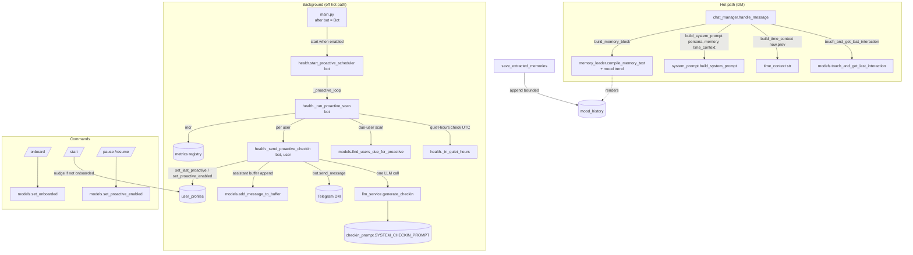
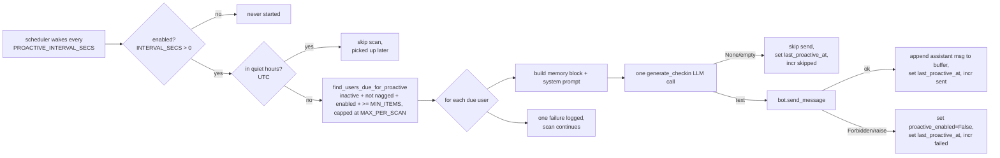

# Design — Phase 12: Engagement & UX

## Overview

Phase 12 adds four small, additive engagement features and documents two deferred roadmap items. Everything is built on top of patterns already proven in the codebase, so it adds almost no new machinery and is **off by default** wherever it could change behavior:

- **Feature A — Temporal context.** `build_system_prompt` gains an optional `time_context: str = ""` parameter rendered as a `## ⏰ TIME CONTEXT` section. `chat_manager.handle_message` (DM path) computes a concise UTC date/time + "last talked" gap from a new `last_interaction_at` timestamp, recorded in a single combined read-then-set round-trip.
- **Feature B — Emotional continuity.** A bounded `mood_history` list (capped at `MAX_MOOD_HISTORY`) is appended whenever `save_extracted_memories` writes a new `emotional_state`, and `compile_memory_text` renders a short mood trend in the `=== CURRENT MOOD ===` section.
- **Feature C — Onboarding.** A static, persona-consistent `/onboard` command seeds memory faster, sets an `onboarded` flag, and `/start` nudges only un-onboarded users.
- **Feature D — Proactive check-ins.** A background scheduler `start_proactive_scheduler(bot)` (mirroring `start_consolidation_scheduler`, but taking the aiogram `bot`) occasionally sends a one-LLM-call, memory-grounded nudge to inactive users — opt-outable (`/pause`/`/resume`), quiet-hours aware, rate-limited, bounded per scan, never fabricated/empty, and **disabled by default** (`PROACTIVE_INTERVAL_SECS = 0`).

Reused patterns:

- **Scheduler** ≅ `health.start_consolidation_scheduler` / `_consolidation_loop` / `_run_consolidation_scan` — one background loop, no-op when interval ≤ 0, self-healing, bounded per scan, lazy imports. The proactive variant additionally takes `bot`.
- **Per-user run** ≅ `memory_compressor.compress_user_memory` shape — open a session, build the profile block, one LLM call, defensive `try/except`, `metrics.incr`.
- **LLM call** ≅ `llm_service.generate_reply_bundle` — one `chat.completions.create`, `_with_retries`, `_fire_log` audit, `metrics.record_llm`; returns `None`/empty on decline/failure instead of raising.
- **Due-user query** ≅ `models.find_users_due_for_consolidation` — time predicate in the query, count threshold in Python, bounded iteration, mongomock-friendly.
- **Single-write apply / setters** ≅ `models.apply_consolidation` / `upsert_chat_member` — single `$set`, additive `$setOnInsert`, defensive reads.
- **Commands** ≅ `commands.py` `/quiet` `/chatty` — aiogram `Command`, DB via DI, DM/group awareness.
- **Config** ≅ `_env_*` helpers — optional, safe defaults, no new required config.

Guiding principle (perf-doc priority order): **responsiveness → robustness → minimize LLM calls.** The hot path gains at most one combined Mongo round-trip and a default-empty prompt section; the proactive feature touches none of the hot path and costs at most one LLM call per due user per cadence.

## Architecture

### Component map



### New & changed modules

| Module | Change |
|---|---|
| `app/config.py` | Add `MAX_MOOD_HISTORY`, `PROACTIVE_INTERVAL_SECS`, `PROACTIVE_INACTIVITY_SECS`, `PROACTIVE_MIN_INTERVAL_SECS`, `PROACTIVE_MAX_PER_SCAN`, `PROACTIVE_MIN_ITEMS`, `PROACTIVE_QUIET_START_HOUR`, `PROACTIVE_QUIET_END_HOUR` (all optional, safe defaults; proactive OFF by default). |
| `app/prompts/checkin_prompt.py` | **New.** `SYSTEM_CHECKIN_PROMPT` — persona-consistent instruction to write a short, memory-grounded opener or **nothing** if there's no genuine detail. |
| `app/prompts/system_prompt.py` | `build_system_prompt(persona_content, active_memory_text, time_context: str = "")` — additive param, renders `## ⏰ TIME CONTEXT` only when non-empty. |
| `app/services/memory_loader.py` | `compile_memory_text` renders a short mood-trend line in `=== CURRENT MOOD ===` from `mood_history` (defensive). Pure, additive. |
| `app/services/llm_service.py` | Add `generate_checkin(user_id, system_prompt, memory_text) -> str | None` — one chat call, `_fire_log`/`record_llm` with `call_type="proactive_checkin"`, `None`/empty on decline/failure (never raises into the scheduler). |
| `app/database/models.py` | Add fields + CRUD: `ensure_user` inits `mood_history: []` / `onboarded: False`; `save_extracted_memories` appends bounded `mood_history`; `touch_and_get_last_interaction`, `set_proactive_enabled`, `set_onboarded`, `set_last_proactive`, `find_users_due_for_proactive`. |
| `app/services/chat_manager.py` | DM path: combined `touch_and_get_last_interaction`, compute `time_context` via a pure `build_time_context(now, prev)`, pass it to `build_system_prompt`. Group path unchanged (empty `time_context`). |
| `app/handlers/commands.py` | Add `/onboard`, `/pause`, `/resume`; enhance `/start` (nudge if not onboarded) and `/help` (list new commands). |
| `app/services/health.py` | Add `start_proactive_scheduler(bot)`, `_proactive_loop(bot, scan_interval)`, `_run_proactive_scan(bot)`, `_send_proactive_checkin(bot, user_id)`, `_in_quiet_hours(hour, start, end)`. Lazy imports inside the scan. |
| `main.py` | Start `start_proactive_scheduler(bot)` **after** `bot = Bot(...)` is created; log when enabled, no-op when disabled. |
| `docs/development/{configuration,observability,memory_engine,telegram_bot}.md`, `.env.example`, `docs/project_plan.md`, `README.md` | Documentation, incl. the two **deferred** roadmap items (#3, #6). |

## Data Models

### `user_profiles` additions (additive, no migration)

```jsonc
{
  "_id": 12345,
  "profile_summary": "...",
  "communication_style": "...",
  "emotional_state": { "mood": "stressed", "intensity": 0.7, "trigger": "exams", "detected_at": "..." },
  "facts":   [ /* unchanged */ ],
  "beliefs": [ /* unchanged */ ],
  "events":  [ /* unchanged */ ],
  "insights":[ /* Phase 11, unchanged */ ],

  // --- Phase 12 additions ---
  "last_interaction_at": "2024-06-01T14:30:00Z",   // absent on profiles never seen on the DM hot path
  "mood_history": [                                // bounded to MAX_MOOD_HISTORY (default 10)
    { "mood": "calm",     "intensity": 0.5, "trigger": "",      "detected_at": "2024-05-20T..." },
    { "mood": "stressed", "intensity": 0.7, "trigger": "exams", "detected_at": "2024-06-01T..." }
  ],
  "onboarded": false,                              // set true by /onboard
  "last_proactive_at": "2024-05-29T09:00:00Z",     // absent until first check-in attempt
  "proactive_enabled": true,                       // absent => eligible; false => opted out

  "created_at": "...", "updated_at": "..."
}
```

All new fields are read defensively (`doc.get("mood_history") or []`, `doc.get("last_interaction_at")`, `doc.get("proactive_enabled")`). `ensure_user` adds `mood_history: []` and `onboarded: False` via `$setOnInsert`; `last_interaction_at`, `last_proactive_at`, and `proactive_enabled` are intentionally left unset on insert (a fresh user is "enabled" by virtue of `proactive_enabled != False`, but is never *due* until they accumulate interaction + memory).

### `mood_history` entry shape

```python
{ "mood": str, "intensity": float, "trigger": str, "detected_at": datetime }
```
Mirrors the `emotional_state` shape so the append path is symmetric; `detected_at` reuses the same `now` written to `emotional_state`.

### Config keys (`app/config.py`, all optional)

```python
# --- Engagement / mood history (Phase 12) ---
MAX_MOOD_HISTORY: int                 # cap on stored mood entries; default 10

# --- Proactive check-ins (Phase 12) ---
PROACTIVE_INTERVAL_SECS: float        # scheduler scan period; default 0.0 = DISABLED (master switch)
PROACTIVE_INACTIVITY_SECS: float      # inactivity before due; default 172800 (2 days)
PROACTIVE_MIN_INTERVAL_SECS: float    # min time between nudges/user; default 259200 (3 days)
PROACTIVE_MAX_PER_SCAN: int           # max check-ins per scan; default 20
PROACTIVE_MIN_ITEMS: int              # min facts+beliefs+events to ground; default 3
PROACTIVE_QUIET_START_HOUR: int       # quiet window start (UTC hour); default 22
PROACTIVE_QUIET_END_HOUR: int         # quiet window end (UTC hour); default 7
```

No new *required* config; with the defaults the proactive scheduler never starts and behavior is identical to Phase 11. `MAX_MOOD_HISTORY` only ever bounds a tiny list, so it is safe at any positive value.

### Fixed metric set (reusing the Phase 10 registry)

| Metric name | Type | Recorded at | Meaning |
|---|---|---|---|
| `proactive.runs` | counter | start of each scan | How often the scheduler wakes and scans. |
| `proactive.sent` | counter | after a successful `bot.send_message` | Check-ins actually delivered. |
| `proactive.skipped` | counter | empty/declined generation | Eligible users for whom nothing genuine was produced. |
| `proactive.failed` | counter | send raised (e.g. `Forbidden`) | Delivery failures (user opted out automatically). |
| `llm.proactive_checkin.*` | counter/timer | inside `generate_checkin` | LLM volume/latency for check-ins (free via `record_llm`). |

## Feature A — Temporal context

### Pure gap helper (`chat_manager`)

```python
def build_time_context(now: datetime, last_interaction_at: datetime | None) -> str:
    """Concise UTC time context for the system prompt. Pure (unit-testable)."""
    lines = [f"Current date/time (UTC): {now:%Y-%m-%d %A, %H:%M} UTC"]
    if last_interaction_at is not None:
        delta = now - last_interaction_at
        secs = max(0, int(delta.total_seconds()))
        if secs < 3600:
            human = f"{secs // 60} minute(s) ago"
        elif secs < 86400:
            human = f"{secs // 3600} hour(s) ago"
        else:
            human = f"{secs // 86400} day(s) ago"
        lines.append(f"Last talked: {human}")
    return "\n".join(lines)
```

Coarse units (minutes/hours/days), never raw seconds (Req 1.6). First-ever interaction (`prev is None`) renders only the date/time, no fabricated gap (Req 1.4).

### System prompt (`system_prompt.py`)

```python
def build_system_prompt(persona_content: str, active_memory_text: str, time_context: str = "") -> str:
    time_section = ""
    if time_context.strip():
        time_section = f"\n\n---\n\n## ⏰ TIME CONTEXT\n{time_context}\n"
    return DEFAULT_SYSTEM_PROMPT_TEMPLATE.format(
        persona_content=persona_content,
        active_memory_text=active_memory_text or "No memories recorded yet. Start chatting to build a profile!",
    ) + time_section
```

The section is appended only when `time_context` is non-empty, so existing two-argument calls and the empty default produce the prior prompt byte-for-byte (Req 1.1, 1.2). (Implementation may instead thread `{time_section}` into the template literal; the invariant is "empty ⇒ unchanged".)

### Hot-path wiring (`chat_manager.handle_message`, DM branch only)

```python
if not is_group:
    now = datetime.now(timezone.utc)
    prev = await models.touch_and_get_last_interaction(db, chat_id, now=now)  # one combined round-trip
    time_context = build_time_context(now, prev)
else:
    time_context = ""   # groups unchanged (Req 1.5)
...
system_prompt = build_system_prompt(persona, memory_block, time_context=time_context)
```

`touch_and_get_last_interaction` is a single `find_one_and_update` returning the previous value and setting the new one — so the gap read and the write are one round-trip, not two (Req 2.2, 2.4). It does **not** upsert (Req 2.3), and runs only on the DM path (Req 2.5).

> **Optional, deferred micro-enhancement (not a task):** `compile_memory_text` could annotate event recency relative to `now`. It is intentionally left out to keep the change minimal; the temporal section already gives the model "now" and "last talked".

## Feature B — Emotional continuity (mood history)

### Append on write (`models.save_extracted_memories`)

When `extraction.emotional_state` is present and the code builds `set_fields["emotional_state"] = {...}`, it also appends to `mood_history`:

```python
if extraction.emotional_state:
    mood_entry = {
        "mood": extraction.emotional_state.mood,
        "intensity": extraction.emotional_state.intensity,
        "trigger": extraction.emotional_state.trigger or "",
        "detected_at": now,
    }
    set_fields["emotional_state"] = mood_entry          # unchanged overwrite
    history = list(profile.get("mood_history") or [])   # defensive read
    history.append(mood_entry)
    set_fields["mood_history"] = history[-config.MAX_MOOD_HISTORY:]   # bounded, oldest dropped
```

Same single `$set` write as today (Req 3.2, 3.3, 10.3). `ensure_user` initializes `mood_history: []` (Req 3.1, 10.1).

### Render trend (`memory_loader.compile_memory_text`)

Within the `=== CURRENT MOOD ===` section, after the current-mood line:

```python
mood_history = doc.get("mood_history") or []
if mood_history:
    recent = [m.get("mood", "?") for m in mood_history[-config.MAX_MOOD_HISTORY:]]
    lines.append(f"Recent mood trend (oldest→newest): {', '.join(recent)}")
```

Defensive: a profile with no `mood_history` renders exactly as before, no extra line, no raise (Req 3.4, 3.5).

### Budget interaction

`mood_history` is its own bounded list and is **not** part of the `_enforce_budget` shedding order (events → beliefs → facts). Because the rendered trend is just a comma-joined list of ≤ `MAX_MOOD_HISTORY` short mood words, its contribution to `compile_memory_text` length is tiny and capped; the enforcer never needs to (and never does) drop it (Req 3.6).

## Feature C — Onboarding

### `/onboard` (static, no LLM)

```python
@router.message(Command("onboard"))
async def cmd_onboard(message: Message, db: AsyncIOMotorDatabase):
    if not message.from_user:
        return
    user = message.from_user
    await models.ensure_user(db, user.id, user.username or "", user.first_name or "")
    await models.set_onboarded(db, user.id, True)
    await message.answer(
        "hey, glad you're here. i'm ThinkMate — think of me less like an app and more "
        "like a friend who actually remembers your stuff. the more we talk, the better i get at it.\n\n"
        "to kick things off, tell me a little about you whenever you feel like it — "
        "what should i call you? what do you spend your days doing? and what's something "
        "you're into lately that you could talk about forever?\n\n"
        "no rush, no forms. just talk to me like you would anyone else."
    )
```

Plain text, conversational, 3 light starter questions in one message, no markdown/bullets (Req 4.1, 4.2). It seeds the profile and sets `onboarded` (Req 4.3) but does **not** gate normal chat; the user's answers are captured by the ordinary extraction pipeline (Req 4.4).

### `/start` nudge (only if not onboarded)

```python
doc = await db["user_profiles"].find_one({"_id": user.id})
already = bool(doc and doc.get("onboarded"))
base = (f"Hi {html.bold(user.first_name or 'there')}! 👋\n\n"
        "I'm ThinkMate, an AI companion who remembers our past chats.\n")
if already:
    msg = base + "Use /profile to see what I remember, or /help for everything I can do."
else:
    msg = base + "New here? Try /onboard and I'll get to know you faster. "\
                 "Or use /profile and /help anytime."
await message.answer(msg, parse_mode="HTML")
```

(Req 4.5.) `/help` is extended to list `/onboard`, `/pause`, `/resume` (Req 4.6, 8.4).

## Feature D — Proactive check-ins

### Quiet-hours helper (pure)

```python
def _in_quiet_hours(hour: int, start: int, end: int) -> bool:
    if start == end:
        return False                      # no quiet window (Req 6.6)
    if start < end:
        return start <= hour < end        # same-day window
    return hour >= start or hour < end    # window wraps midnight
```

UTC only; documented limitation (Req 6.7).

### Scheduler (`health.py`, mirrors consolidation but takes `bot`)

```python
def start_proactive_scheduler(bot) -> "asyncio.Task | None":
    """Start the proactive check-in scheduler when enabled; no-op (None) when disabled.

    Enabled only when config.PROACTIVE_INTERVAL_SECS > 0 (master switch, Req 5.2). Takes the
    aiogram bot because the loop must SEND messages. Mirrors start_consolidation_scheduler.
    """
    if config.PROACTIVE_INTERVAL_SECS <= 0:
        return None
    try:
        return asyncio.get_running_loop().create_task(
            _proactive_loop(bot, config.PROACTIVE_INTERVAL_SECS)
        )
    except RuntimeError:
        return None


async def _proactive_loop(bot, scan_interval: float) -> None:
    while True:
        try:
            await asyncio.sleep(scan_interval)
            await _run_proactive_scan(bot)
        except asyncio.CancelledError:
            break
        except Exception as e:        # never crash the loop (Req 5.6)
            logger.debug(f"proactive scan iteration failed: {e}")


async def _run_proactive_scan(bot) -> None:
    from datetime import datetime, timezone
    from app.database.connection import db_session
    from app.database import models

    metrics.incr("proactive.runs")                          # Req 11.1
    now = datetime.now(timezone.utc)
    if _in_quiet_hours(now.hour, config.PROACTIVE_QUIET_START_HOUR, config.PROACTIVE_QUIET_END_HOUR):
        logger.info("[proactive] within quiet hours; skipping scan.")   # Req 6.6
        return

    async with db_session() as db:
        due = await models.find_users_due_for_proactive(
            db,
            inactivity_secs=config.PROACTIVE_INACTIVITY_SECS,
            min_interval_secs=config.PROACTIVE_MIN_INTERVAL_SECS,
            limit=config.PROACTIVE_MAX_PER_SCAN,
            now=now,
        )
    sent = skipped = failed = 0
    for user_id in due:
        try:
            result = await _send_proactive_checkin(bot, user_id, now=now)
            if result == "sent":      sent += 1
            elif result == "skipped": skipped += 1
            else:                     failed += 1
        except Exception as e:        # one user can't abort the scan (Req 5.5)
            failed += 1
            logger.warning(f"Proactive check-in failed for user {user_id}: {e}")
    metrics.incr("proactive.sent", sent)
    metrics.incr("proactive.skipped", skipped)
    metrics.incr("proactive.failed", failed)
    logger.info(f"[proactive] scan: {len(due)} due, {sent} sent, {skipped} skipped, {failed} failed.")  # Req 11.3
```

Lazy imports inside the scan mirror `_run_consolidation_scan` and avoid a startup import cycle (`health` is imported by `main`/`commands`; the senders pull in `chat_manager`/`llm_service`/`models`).

### Sender (`health._send_proactive_checkin`)

```python
async def _send_proactive_checkin(bot, user_id: int, *, now) -> str:
    """Return 'sent' | 'skipped' | 'failed'. Always sets last_proactive_at (attempt holds the window)."""
    from app.database.connection import db_session
    from app.database import models
    from app.services.chat_manager import _load_persona
    from app.services.llm_service import llm_service
    from app.services.memory_loader import build_memory_block
    from app.prompts.system_prompt import build_system_prompt

    async with db_session() as db:
        memory_text, _ = await build_memory_block(db, user_id)
        system_prompt = build_system_prompt(_load_persona(), memory_text)
        text = await llm_service.generate_checkin(user_id, system_prompt, memory_text)  # one LLM call

        # Always hold the rate-limit window, even on empty/declined (Req 7.7).
        await models.set_last_proactive(db, user_id, now=now)

        if not text or not text.strip():
            return "skipped"                                  # never send empty/fabricated (Req 7.3)

        try:
            await bot.send_message(chat_id=user_id, text=text)   # DM: chat_id == user_id (Req 7.5)
        except Exception as e:                                   # e.g. Forbidden / blocked (Req 7.8)
            logger.warning(f"Proactive send failed for user {user_id}: {e}; disabling proactive for them.")
            await models.set_proactive_enabled(db, user_id, False)
            return "failed"

        # Append to the buffer (no memory_lock — not memory work; matches reply append) (Req 7.6, 12.6).
        await models.add_message_to_buffer(db, user_id, "assistant", text, sender_id=0, sender_name="ThinkMate")
        return "sent"
```

### `generate_checkin` (`llm_service.py`)

```python
async def generate_checkin(self, user_id: int, system_prompt: str, memory_text: str) -> str | None:
    """One memory-grounded check-in opener, or None when there's nothing genuine to say.

    Mirrors generate_reply_bundle's audit/metrics shape but returns None on decline/failure
    (never raises into the scheduler). The model is told to return an empty/decline sentinel
    when it cannot ground the message in a real detail.
    """
    if not memory_text or not memory_text.strip():
        return None                                  # ungroundable: send nothing (Req 7.3)
    messages = [
        {"role": "system", "content": f"{system_prompt}\n\n{SYSTEM_CHECKIN_PROMPT}"},
        {"role": "user", "content": "Write the check-in opener now (or reply with NOTHING)."},
    ]
    inputs = {"system_prompt": system_prompt, "messages": messages}
    start = time.perf_counter()
    try:
        response = await self._with_retries(
            lambda: self.client.chat.completions.create(
                model=config.LLM_MODEL, messages=messages,
                temperature=config.REPLY_TEMPERATURE,
                max_tokens=(config.MAX_RESPONSE_CHARS // config.CHARS_PER_TOKEN) + 40,
                timeout=30.0,
            ),
            what=f"checkin u{user_id}",
        )
        raw = (response.choices[0].message.content or "").strip()
        self._fire_log(user_id, "proactive_checkin", inputs, {"raw_text": raw, "parsed_json": None}, "success")
        metrics.record_llm("proactive_checkin", ok=True, latency=time.perf_counter() - start)
        cleaned = raw.strip().strip('"')
        if not cleaned or cleaned.lower() in {"nothing", "none", "n/a", "(nothing)"}:
            return None                              # decline sentinel (Req 7.3)
        return cleaned
    except Exception:
        metrics.record_llm("proactive_checkin", ok=False, latency=time.perf_counter() - start)
        self._fire_log(user_id, "proactive_checkin", inputs, status="failed", error=traceback.format_exc())
        logger.error(f"Check-in generation failed for user {user_id}.")
        return None                                  # never raise into the scheduler (Req 7.4)
```

`call_type="proactive_checkin"` flows through `metrics.record_llm`, which maps unknown call types to their own prefix, so `llm.proactive_checkin.*` appears for free (Req 11.4).

### `checkin_prompt.py` (new)

`SYSTEM_CHECKIN_PROMPT` is a short, persona-consistent instruction (plain text, no markdown — same anti-formatting rules as the persona): the model is told it is reaching out first to someone it hasn't heard from in a while; it must reference one genuine detail it already knows (an upcoming/recent event, a recent mood, a known interest), keep it to a line or two, sound like a friend texting first, and **return the single word NOTHING** if there is no real, specific detail worth reaching out about (no generic "hey, how are you?" filler). This realizes the never-fabricate rule (Req 7.1, 7.3).

### Opt-out commands (`commands.py`)

```python
@router.message(Command("pause"))
async def cmd_pause(message: Message, db: AsyncIOMotorDatabase):
    if not message.from_user:
        return
    await models.set_proactive_enabled(db, message.from_user.id, False)
    await message.answer("Got it — I won't reach out on my own anymore. Message me anytime and I'm here. 🙂")

@router.message(Command("resume"))
async def cmd_resume(message: Message, db: AsyncIOMotorDatabase):
    if not message.from_user:
        return
    await models.set_proactive_enabled(db, message.from_user.id, True)
    await message.answer("Okay! I'll check in now and then if it's been a while. 🌱")
```

DM-oriented; in a group they harmlessly toggle the caller's own flag (or could explain), consistent with `/quiet` `/chatty` (Req 8.1–8.4).

### `main.py` wiring (after `bot` is created)

```python
bot = Bot(token=config.TELEGRAM_BOT_TOKEN)
dp = Dispatcher()
...
# Proactive check-ins (Phase 12). Needs the bot to SEND, so it starts AFTER bot creation.
# No-op unless config.PROACTIVE_INTERVAL_SECS > 0 (master switch, disabled by default).
if start_proactive_scheduler(bot) is not None:
    logger.info(
        f"Proactive check-in scheduler started (scan every {config.PROACTIVE_INTERVAL_SECS}s, "
        f"inactivity {config.PROACTIVE_INACTIVITY_SECS}s, min-interval {config.PROACTIVE_MIN_INTERVAL_SECS}s, "
        f"quiet {config.PROACTIVE_QUIET_START_HOUR}->{config.PROACTIVE_QUIET_END_HOUR} UTC)."
    )
```

The metrics logger and consolidation scheduler keep their current placement (before `bot`); only the proactive scheduler must move below `bot = Bot(...)` because it needs the instance (Req 5.3).

## Components and Interfaces

New parameters are additive; existing functions keep their signatures.

### `app/database/models.py`

```python
async def touch_and_get_last_interaction(db, user_id: int, *, now=None) -> "datetime | None":
    """Single find_one_and_update: return the previous last_interaction_at and set it to now.

    No upsert (Req 2.3): a user without a profile is a no-op returning None.
    """
    now = now or _utcnow()
    doc = await db["user_profiles"].find_one_and_update(
        {"_id": user_id},
        {"$set": {"last_interaction_at": now}},
        projection={"last_interaction_at": 1},
        return_document=ReturnDocument.BEFORE,
    )
    return (doc or {}).get("last_interaction_at")


async def set_proactive_enabled(db, user_id: int, enabled: bool):
    await db["user_profiles"].update_one({"_id": user_id}, {"$set": {"proactive_enabled": enabled, "updated_at": _utcnow()}})

async def set_onboarded(db, user_id: int, value: bool = True):
    await db["user_profiles"].update_one({"_id": user_id}, {"$set": {"onboarded": value, "updated_at": _utcnow()}})

async def set_last_proactive(db, user_id: int, *, now=None):
    now = now or _utcnow()
    await db["user_profiles"].update_one({"_id": user_id}, {"$set": {"last_proactive_at": now, "updated_at": now}})


async def find_users_due_for_proactive(
    db, *, inactivity_secs: float, min_interval_secs: float, limit: int, now=None
) -> list[int]:
    """Return up to `limit` user ids due for a proactive check-in.

    Due = last_interaction_at present AND < (now - inactivity_secs)         [inactive, Req 6.2]
        AND (last_proactive_at null/absent OR < (now - min_interval_secs))  [rate-limit, Req 6.3]
        AND proactive_enabled != False                                       [opt-out, Req 6.5]
        AND facts+beliefs+events count >= config.PROACTIVE_MIN_ITEMS         [grounding, Req 6.4, Python]
    Stops once `limit` qualifying users are collected (bounded; mongomock-friendly).
    """
    now = now or _utcnow()
    inactive_cutoff = now - timedelta(seconds=inactivity_secs)
    nudge_cutoff = now - timedelta(seconds=min_interval_secs)
    query = {
        "last_interaction_at": {"$lt": inactive_cutoff},          # implies present
        "proactive_enabled": {"$ne": False},
        "$or": [
            {"last_proactive_at": {"$exists": False}},
            {"last_proactive_at": None},
            {"last_proactive_at": {"$lt": nudge_cutoff}},
        ],
    }
    due: list[int] = []
    projection = {"facts": 1, "beliefs": 1, "events": 1}
    async for doc in db["user_profiles"].find(query, projection):
        count = len(doc.get("facts") or []) + len(doc.get("beliefs") or []) + len(doc.get("events") or [])
        if count >= config.PROACTIVE_MIN_ITEMS:
            due.append(doc["_id"])
            if len(due) >= limit:
                break
    return due
```

The min-items threshold reads `config.PROACTIVE_MIN_ITEMS` directly (the spec'd signature omits `min_items`), keeping the signature exactly as required while remaining bounded and mongomock-friendly (no `$size`/`$where`). `ensure_user` gains `mood_history: []` and `onboarded: False` in `$setOnInsert`.

### `app/services/chat_manager.py`

`_load_persona()` is reused by the proactive sender via a lazy import; it stays module-level and unchanged. The DM branch adds the `touch_and_get_last_interaction` + `build_time_context` calls and threads `time_context` into `build_system_prompt`. The group branch passes the default empty `time_context`.

### `app/services/health.py`

Adds the five proactive functions above. Mirrors the consolidation scheduler's structure (sleep → guarded scan → swallow errors → continue; break on cancel) and lazy-import discipline; the only structural difference is the `bot` parameter threaded through `start_* → _proactive_loop → _run_proactive_scan → _send_proactive_checkin`.

## The proactive flow



## Error Handling

- **Disabled is inert.** `PROACTIVE_INTERVAL_SECS <= 0` ⇒ `start_proactive_scheduler` returns `None`; nothing else changes (Req 5.2, 9.2, 12.1).
- **Never fabricate / never send empty.** `generate_checkin` returns `None` on an ungroundable profile, a decline sentinel, or any error; the sender treats `None`/empty as "send nothing" (Req 7.3).
- **Generation never raises into the scheduler.** `generate_checkin` catches all, logs, records a failure metric, returns `None` (Req 7.4).
- **Send failure is contained.** A `Forbidden`/blocked error is caught, logged, sets `proactive_enabled=False`, and never crashes the scan (Req 5.7, 7.8).
- **One user can't abort a scan.** `_run_proactive_scan` wraps each send in `try/except` and continues (Req 5.5).
- **Loop self-heals.** `_proactive_loop` swallows per-iteration errors and continues; cancellation breaks cleanly (Req 5.6), exactly like `_consolidation_loop`.
- **Rate-limit window always holds.** `set_last_proactive` is called on every *attempt* (sent, skipped, or failed), so a declined user isn't re-selected next scan (Req 7.7).
- **Bounded work + bounded state.** ≤ `PROACTIVE_MAX_PER_SCAN` users per wake; `mood_history` ≤ `MAX_MOOD_HISTORY`; `find_users_due_for_proactive` stops at `limit` (Req 5.4, 3.3, 6.1).
- **Hot-path safety.** The DM path adds exactly one combined `find_one_and_update` and a default-empty prompt section; no LLM call, same return contract (Req 2.4, 12.2). The buffer append after a check-in runs without `memory_lock`, matching reply appends, and is off the hot path entirely (Req 7.6, 12.6).
- **Defensive reads.** Missing `last_interaction_at`/`mood_history`/`onboarded`/`last_proactive_at`/`proactive_enabled` are handled with `.get(...)`/`or []`, so legacy profiles need no migration (Req 12.5).
- **Metrics never break a run.** All `metrics.incr`/`record_llm` go through the Phase 10 registry whose mutators swallow their own errors (Req 11.4).

## Correctness Properties

These are the testable invariants the implementation must satisfy.

### Property 1: Proactive disabled is a no-op
When `PROACTIVE_INTERVAL_SECS <= 0`, `start_proactive_scheduler(bot)` returns `None`, no scan runs, no check-in LLM call is made, and no message is sent.
**Validates: Requirements 5.2, 9.2, 12.1**

### Property 2: Time context is additive and backward-compatible
`build_system_prompt(persona, memory)` and `build_system_prompt(persona, memory, time_context="")` produce identical output (the prior prompt); a non-empty `time_context` adds exactly one `## ⏰ TIME CONTEXT` section.
**Validates: Requirements 1.1, 1.2**

### Property 3: Gap is coarse, correct, and absent for first contact
`build_time_context(now, prev)` reports the gap in minutes/hours/days for a real `prev`, and reports only the date/time (no gap) when `prev is None`.
**Validates: Requirements 1.4, 1.6**

### Property 4: Hot path records last_interaction in one combined round-trip
A DM message updates `last_interaction_at` via a single `find_one_and_update` that returns the previous value; no LLM call is added and the reply/reaction contract is unchanged; group messages do not touch it.
**Validates: Requirements 2.2, 2.4, 2.5, 12.2**

### Property 5: Mood history is appended and bounded
Each new `emotional_state` write appends one `mood_history` entry; the list never exceeds `MAX_MOOD_HISTORY`; `ensure_user` initializes it to `[]`; `compile_memory_text` renders the trend and behaves as before when absent.
**Validates: Requirements 3.1, 3.2, 3.3, 3.4, 3.5**

### Property 6: Mood history survives budget enforcement
`_enforce_budget` never drops `mood_history`; with the cap, the profile stays ≤ `USER_MEMORY_BUDGET_CHARS` and the trend persists.
**Validates: Requirements 3.6**

### Property 7: Onboarding is static, idempotent-ish, and non-blocking
`/onboard` sends static plain-text copy, sets `onboarded=True`, makes no LLM call, and does not alter normal chat; `/start` nudges only when not onboarded.
**Validates: Requirements 4.1, 4.2, 4.3, 4.5**

### Property 8: Due selection is correct and bounded
`find_users_due_for_proactive` returns exactly the users that are inactive ≥ `inactivity_secs`, not nudged within `min_interval_secs`, not opted out, and with ≥ `PROACTIVE_MIN_ITEMS` items — never more than `limit`.
**Validates: Requirements 6.1, 6.2, 6.3, 6.4, 6.5, 10.5**

### Property 9: Quiet hours suppress sending
`_in_quiet_hours` is correct for same-day and midnight-wrapping windows and `start == end` (no window); during quiet hours a scan sends nothing.
**Validates: Requirements 6.6, 6.7**

### Property 10: Check-in is grounded and never empty/fabricated
A successful send produces non-empty text from exactly one `generate_checkin` call; an empty/declined/ungroundable result sends nothing.
**Validates: Requirements 7.1, 7.2, 7.3**

### Property 11: Delivery side effects are correct
A sent check-in calls `bot.send_message(chat_id=user_id, ...)`, appends an assistant message to the buffer, and sets `last_proactive_at`; a skipped/declined result still sets `last_proactive_at`; a `Forbidden` send sets `proactive_enabled=False` and still sets `last_proactive_at`.
**Validates: Requirements 7.5, 7.6, 7.7, 7.8**

### Property 12: Opt-out reliably stops nudges
`/pause` sets `proactive_enabled=False` and such a user is excluded from `find_users_due_for_proactive`; `/resume` re-enables.
**Validates: Requirements 8.1, 8.2, 8.5**

### Property 13: Scheduler is resilient
A single user's failure does not abort the scan; an exception inside one loop iteration does not kill the loop; at most `PROACTIVE_MAX_PER_SCAN` users are processed per wake.
**Validates: Requirements 5.4, 5.5, 5.6, 5.7**

### Property 14: Backward compatibility
With proactive disabled (default), every previously passing test passes unmodified; legacy profiles without the new fields work without migration.
**Validates: Requirements 12.1, 12.5, 13.6**

## Testing Strategy

All tests use **mongomock + pytest-asyncio** per `tests/conftest.py` (async mock wrappers, autouse DB patch, reactions disabled). No real LLM or network; the LLM is patched with `AsyncMock` (as in `tests/test_batching_and_concurrency.py`). Config overrides use the save/restore pattern (as in `tests/test_hardening.py`). Where metrics are asserted, a `metrics.reset()` fixture isolates state (as in `tests/test_metrics_instrumentation.py`). Background tasks are cancelled/awaited in `finally` so none leak (as in `tests/test_metrics_logger.py`). Commands use a mocked aiogram `Message` (as in `tests/test_command_skip.py`); the proactive sender/scheduler use a mocked `Bot` with `send_message = AsyncMock()`.

### Temporal context (Requirements 1, 2)
- `build_system_prompt` identical for 2-arg vs `time_context=""`; renders the section when non-empty.
- `build_time_context(now, prev)` returns coarse minutes/hours/days and only date/time when `prev is None`.
- `touch_and_get_last_interaction` returns the previous value and sets the new one in one call; no upsert when the profile is absent.
- A DM `handle_message` (LLM patched) records `last_interaction_at` and adds no LLM call beyond the reply; a group message does not touch it.

### Mood history (Requirement 3)
- `save_extracted_memories` with an `emotional_state` appends one bounded `mood_history` entry; repeated writes never exceed `MAX_MOOD_HISTORY` (oldest dropped); `ensure_user` initializes `[]`.
- `compile_memory_text` renders the trend with history and omits it without; a profile with no `mood_history` key does not raise.
- `_enforce_budget` over an over-budget profile keeps `mood_history` intact and ends ≤ budget.

### Onboarding & opt-out commands (Requirements 4, 8)
- `/onboard` sets `onboarded`, sends static plain-text copy (assert no markdown/bullets), makes no LLM call, and leaves chat handling untouched.
- `/start` nudges `/onboard` only when not onboarded.
- `/pause` / `/resume` toggle `proactive_enabled`; `/help` lists the new commands.

### Check-in generation & delivery (Requirements 7, 11)
- `generate_checkin` returns text on a normal LLM result, `None` on empty/decline-sentinel/ungroundable memory, and `None` (no raise) when the LLM raises; asserts `call_type="proactive_checkin"` audit/metrics.
- `_send_proactive_checkin`: sent path calls `bot.send_message`, appends the buffer message, sets `last_proactive_at`, increments `proactive.sent`; skipped path sends nothing but sets `last_proactive_at`; `Forbidden` path sets `proactive_enabled=False` and increments `proactive.failed`.

### Scheduler & due selection (Requirements 5, 6)
- `start_proactive_scheduler(bot)` returns `None` when `PROACTIVE_INTERVAL_SECS <= 0`.
- `find_users_due_for_proactive` selects inactive + not-recently-nudged + enabled + ≥ `PROACTIVE_MIN_ITEMS` users, excludes recent/active/opted-out/item-poor users, and respects `limit`.
- `_in_quiet_hours` correctness for same-day, midnight-wrapping, and `start == end`.
- With the scheduler enabled and `_send_proactive_checkin` patched, a scan processes at most `PROACTIVE_MAX_PER_SCAN`, continues past a user whose send raises, and skips entirely within quiet hours; `_proactive_loop` self-heals when `_run_proactive_scan` raises once.

### Final checkpoint (Requirement 13.6)
- Full suite (`uv run pytest`) green, no warnings, no external services — same bar as Phases 8–11 — with proactive disabled by default and all pre-existing tests unmodified.

### Deferred roadmap (documentation only, Requirement 13.7)
- `docs/project_plan.md` records **#3 Relevance-ranked memory selection** and **#6 Semantic retrieval over trimmed conversation history** as explicit future items, clearly not implemented in Phase 12. No code or tests are produced for them.
