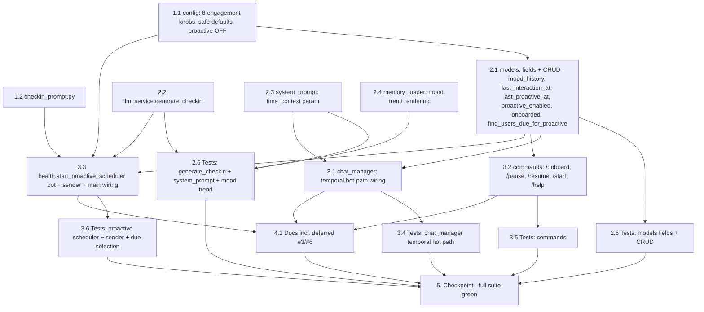

# Implementation Plan

## Overview

This plan delivers Phase 12 (Engagement & UX) as four additive features plus two documented-but-deferred roadmap items, built on the existing hot-path, memory, scheduler, and command patterns. Work proceeds bottom-up so disjoint files parallelize: first the leaf primitives (config knobs, the check-in prompt), then the data/LLM/rendering layer across four disjoint files (`models.py`, `llm_service.py`, `system_prompt.py`, `memory_loader.py`) with their tests, then the composing edits (the temporal hot path in `chat_manager.py`, the onboarding/opt-out commands in `commands.py`, and the proactive scheduler/sender in `health.py` + `main.py`) with their tests, then docs (including the deferred #3/#6 items), then a full-suite checkpoint. Every implementation task is paired with a test task using **mongomock + pytest-asyncio** per `tests/conftest.py` (LLM patched with `AsyncMock`, config save/restore as in `tests/test_hardening.py`, `metrics.reset()` isolation as in `tests/test_metrics_instrumentation.py`, background tasks cancelled/awaited in `finally` as in `tests/test_metrics_logger.py`, mocked aiogram `Message`/`Bot` with `send_message=AsyncMock` as in `tests/test_command_skip.py`). The proactive feature is **disabled by default** (`PROACTIVE_INTERVAL_SECS = 0.0`) and every new field/config is additive with defensive reads and safe defaults, so the existing suite passes unmodified.

## Task Dependency Graph



```json
{
  "waves": [
    { "wave": 1, "tasks": ["1.1", "1.2"] },
    { "wave": 2, "tasks": ["2.1", "2.2", "2.3", "2.4"] },
    { "wave": 3, "tasks": ["2.5", "2.6", "3.1", "3.2", "3.3"] },
    { "wave": 4, "tasks": ["3.4", "3.5", "3.6"] },
    { "wave": 5, "tasks": ["4.1"] },
    { "wave": 6, "tasks": ["5"] }
  ]
}
```

## Tasks

- [ ] 1. Foundations — config & check-in prompt (disjoint leaf files)

  - [ ] 1.1 Add optional engagement config knobs
    - In `app/config.py`, add eight optional keys via the existing `_env_int`/`_env_float` helpers, each with a safe default and **no new required config**: `MAX_MOOD_HISTORY: int` (default `10`), `PROACTIVE_INTERVAL_SECS: float` (default `0.0` = disabled master switch), `PROACTIVE_INACTIVITY_SECS: float` (default `172800.0`), `PROACTIVE_MIN_INTERVAL_SECS: float` (default `259200.0`), `PROACTIVE_MAX_PER_SCAN: int` (default `20`), `PROACTIVE_MIN_ITEMS: int` (default `3`), `PROACTIVE_QUIET_START_HOUR: int` (default `22`), `PROACTIVE_QUIET_END_HOUR: int` (default `7`)
    - Place `MAX_MOOD_HISTORY` under a new `# --- Engagement / mood history (Phase 12) ---` section and the `PROACTIVE_*` keys under a `# --- Proactive check-ins (Phase 12) ---` section, consistent with the existing field style; ensure the bot starts and behaves identically when all are unset (proactive disabled by default)
    - _Requirements: 9.1, 9.2, 9.3_

  - [ ] 1.2 Add the check-in system prompt
    - Create `app/prompts/checkin_prompt.py` with `SYSTEM_CHECKIN_PROMPT`, a short persona-consistent, plain-text instruction (no markdown/bullets, honoring `persona.md`'s anti-formatting rules): the model is reaching out first to someone it hasn't heard from in a while; it must reference one genuine detail it already knows (a known upcoming/recent event, a recent mood, a real interest), keep it to a line or two, and sound like a friend texting first
    - State explicitly that if there is no real, specific detail worth reaching out about, the model must return the single word `NOTHING` (no generic "hey, how are you?" filler), realizing the never-fabricate rule
    - _Requirements: 7.1, 7.3_

- [ ] 2. Data, LLM & disjoint rendering edits

  - [ ] 2.1 Add engagement fields + CRUD to `models.py`
    - In `app/database/models.py`, add `mood_history: []` and `onboarded: False` to `ensure_user`'s `$setOnInsert` (additive; `last_interaction_at`/`last_proactive_at`/`proactive_enabled` intentionally left unset on insert and read defensively elsewhere)
    - In `save_extracted_memories`, when `extraction.emotional_state` is present, append a `{mood, intensity, trigger, detected_at}` entry to a defensively-read `mood_history` (`profile.get("mood_history") or []`) inside the existing `$set` write, truncating to the last `config.MAX_MOOD_HISTORY` entries (oldest dropped); keep the `emotional_state` overwrite unchanged
    - Add `touch_and_get_last_interaction(db, user_id, *, now=None) -> datetime | None` (single `find_one_and_update`, `return_document=ReturnDocument.BEFORE`, projection `{last_interaction_at:1}`, **no upsert**), and the small setters `set_proactive_enabled(db, user_id, enabled)`, `set_onboarded(db, user_id, value=True)`, `set_last_proactive(db, user_id, *, now=None)` (each a single `$set` that doesn't clobber unrelated fields)
    - Add `find_users_due_for_proactive(db, *, inactivity_secs, min_interval_secs, limit, now=None) -> list[int]`: query for `last_interaction_at < now - inactivity_secs` AND `proactive_enabled != False` AND (`last_proactive_at` null/absent OR `< now - min_interval_secs`); iterate with a `{facts,beliefs,events}` projection, keep only users whose total count `>= config.PROACTIVE_MIN_ITEMS`, and stop once `limit` qualifying ids are collected (bounded, mongomock-friendly — no array-length query operators)
    - _Requirements: 2.1, 2.2, 2.3, 2.5, 3.1, 3.2, 3.3, 6.1, 6.2, 6.3, 6.4, 6.5, 10.1, 10.2, 10.3, 10.4, 10.5_

  - [ ] 2.2 Add `generate_checkin` to `LLMService`
    - In `app/services/llm_service.py`, add `async def generate_checkin(self, user_id, system_prompt, memory_text) -> str | None`: short-circuit to `None` when `memory_text` is empty/blank (ungroundable), otherwise make exactly **one** `chat.completions.create` call via `_with_retries` with `messages = [{"system": system_prompt + "\n\n" + SYSTEM_CHECKIN_PROMPT}, {"user": "Write the check-in opener now (or reply with NOTHING)."}]`, `temperature=config.REPLY_TEMPERATURE`, a small `max_tokens` budget, and `timeout=30.0`
    - Audit via `_fire_log` with `call_type="proactive_checkin"` and record `metrics.record_llm("proactive_checkin", ...)` (so `llm.proactive_checkin.*` appears for free); strip the result and return `None` when it is empty or a decline sentinel (`nothing`/`none`/`n/a`); on any exception, log + record failure and return `None` (never raise into the scheduler)
    - _Requirements: 7.2, 7.3, 7.4, 11.4_

  - [ ] 2.3 Add the `time_context` parameter to `build_system_prompt`
    - In `app/prompts/system_prompt.py`, change the signature to `build_system_prompt(persona_content, active_memory_text, time_context: str = "")` (additive, keyword-defaulted) and render a `## ⏰ TIME CONTEXT` section **only** when `time_context` is non-empty, so existing two-argument calls and the empty default produce the prior prompt byte-for-byte
    - Keep the section placement and formatting minimal (a single labelled block); do not otherwise change the template
    - _Requirements: 1.1, 1.2_

  - [ ] 2.4 Render the mood trend in `compile_memory_text`
    - In `app/services/memory_loader.py`, read `mood_history = doc.get("mood_history") or []` defensively and, within the `=== CURRENT MOOD ===` section (after the current-mood line), append a short `Recent mood trend (oldest→newest): ...` line listing the recent moods (capped to the last `config.MAX_MOOD_HISTORY`) when any exist
    - Keep the function pure and additive: a profile dict with no `mood_history` key must render exactly as before (no trend line) and must not raise; the rendered trend stays tiny so `_enforce_budget` (which recomputes `compile_memory_text`) accounts for it automatically and never needs to drop it
    - _Requirements: 3.4, 3.5, 3.6_

  - [ ] 2.5 Tests: engagement fields + CRUD
    - In a new `tests/test_engagement_models.py` (mongomock + pytest-asyncio, config save/restore): assert `ensure_user` initializes `mood_history: []` and `onboarded: False`; assert `save_extracted_memories` with an `emotional_state` appends one bounded `mood_history` entry and that repeated writes never exceed `MAX_MOOD_HISTORY` (oldest dropped) while `emotional_state` still overwrites
    - Assert `touch_and_get_last_interaction` returns the previous value and sets the new one in one call (and is a no-op returning `None` for an absent profile, no upsert); assert `set_proactive_enabled`/`set_onboarded`/`set_last_proactive` each write only their field; assert `find_users_due_for_proactive` selects inactive + not-recently-nudged + `proactive_enabled != False` + `>= PROACTIVE_MIN_ITEMS` users, excludes active/recent/opted-out/item-poor users, and never returns more than `limit`
    - _Requirements: 2.2, 2.3, 3.1, 3.2, 3.3, 6.2, 6.3, 6.4, 6.5, 10.1, 10.2, 10.5_

  - [ ] 2.6 Tests: `generate_checkin` + `time_context` + mood trend
    - In a new `tests/test_engagement_units.py`: assert `build_system_prompt(persona, mem)` equals `build_system_prompt(persona, mem, time_context="")` (backward-compat) and that a non-empty `time_context` adds exactly one `## ⏰ TIME CONTEXT` section; assert `compile_memory_text` renders the mood-trend line with history and omits it without (and does not raise on a missing key)
    - Patch the LLM client/`_with_retries` with `AsyncMock` and assert `generate_checkin` returns text on a normal result, `None` on empty/decline-sentinel output, `None` when `memory_text` is blank (no LLM call made), and `None` (no raise) when the call raises; assert the `call_type="proactive_checkin"` audit/metrics path is used (`metrics.reset()` fixture)
    - _Requirements: 1.1, 1.2, 3.4, 3.5, 7.2, 7.3, 7.4, 11.4_

- [ ] 3. Composition — temporal hot path, commands, proactive scheduler

  - [ ] 3.1 Wire temporal context into the DM hot path
    - In `app/services/chat_manager.py`, add a pure `build_time_context(now, last_interaction_at) -> str` (current UTC date/time always; a coarse `Last talked: N minute/hour/day(s) ago` line only when a previous timestamp exists — never raw seconds, never a fabricated gap for first contact)
    - In `handle_message`, on the **DM path only** (`not is_group`), compute `now`, call `await models.touch_and_get_last_interaction(db, chat_id, now=now)` (one combined round-trip), build `time_context`, and pass it to `build_system_prompt(persona, memory_block, time_context=time_context)`; on the group path pass the default empty `time_context` so multi-party behavior is unchanged; add no LLM call and keep the `(reply, reaction)` contract
    - _Requirements: 1.3, 1.4, 1.5, 1.6, 2.4, 2.5, 12.2_

  - [ ] 3.2 Add `/onboard`, `/pause`, `/resume` and enhance `/start` & `/help`
    - In `app/handlers/commands.py`, add `cmd_onboard` (`Command("onboard")`): `ensure_user` + `set_onboarded(..., True)` + send a single warm, persona-consistent **plain-text** message (no markdown/bullets) introducing ThinkMate and inviting 2–4 light starter shares — **no** LLM call, and it must not gate or alter normal chat handling
    - Add `cmd_pause`/`cmd_resume` toggling `proactive_enabled` to `False`/`True` via `set_proactive_enabled` with warm confirmations (DM-oriented, harmless in groups); enhance `cmd_start` to mention `/onboard` and auto-suggest it **only** when the profile is not yet `onboarded` (read `doc.get("onboarded")`); extend `/help` to list `/onboard`, `/pause`, `/resume`
    - _Requirements: 4.1, 4.2, 4.3, 4.4, 4.5, 4.6, 8.1, 8.2, 8.3, 8.4_

  - [ ] 3.3 Implement the proactive scheduler/sender + wire it in `main.py`
    - In `app/services/health.py`, add `_in_quiet_hours(hour, start, end)` (pure: `start==end` ⇒ no window; same-day vs midnight-wrapping), `start_proactive_scheduler(bot) -> asyncio.Task | None` (returns `None` when `config.PROACTIVE_INTERVAL_SECS <= 0`, else one task on the running loop — mirroring `start_consolidation_scheduler` but threading `bot`), `_proactive_loop(bot, scan_interval)` (sleep → guarded scan → swallow per-iteration errors → continue; break on `CancelledError`), `_run_proactive_scan(bot)` (lazy imports; `metrics.incr("proactive.runs")`; skip when in quiet hours; `find_users_due_for_proactive(...)`; dispatch each due user in a per-user `try/except`; tally + `metrics.incr` `proactive.sent`/`skipped`/`failed`; log a one-line summary), and `_send_proactive_checkin(bot, user_id, *, now)` (build memory block + system prompt via the lazily-imported `_load_persona`, one `generate_checkin` call, **always** `set_last_proactive`, send via `bot.send_message(chat_id=user_id, ...)` only on non-empty text, append the assistant message to the buffer on success **without** `memory_lock`, and on send failure catch+log+`set_proactive_enabled(..., False)`)
    - In `main.py`, start `start_proactive_scheduler(bot)` **after** `bot = Bot(token=...)` is created (it needs the instance to send), logging when enabled; it must be a no-op when disabled and must not change the placement of the metrics-logger/consolidation-scheduler starts
    - _Requirements: 5.1, 5.2, 5.3, 5.4, 5.5, 5.6, 5.7, 6.6, 6.7, 7.5, 7.6, 7.7, 7.8, 11.1, 11.2, 11.3, 12.3, 12.6_

  - [ ] 3.4 Tests: temporal hot path
    - In a new `tests/test_engagement_temporal.py` (mongomock + pytest-asyncio, LLM patched with `AsyncMock`): assert `build_time_context(now, prev)` returns coarse minutes/hours/days for a real `prev` and only the date/time (no gap) when `prev is None`
    - Seed a profile, run a DM `handle_message` and assert `last_interaction_at` is recorded via the combined helper with no extra LLM call beyond the reply, and that a group-path message does not touch `last_interaction_at`
    - _Requirements: 1.3, 1.4, 1.6, 2.4, 2.5_

  - [ ] 3.5 Tests: commands
    - In a new `tests/test_engagement_commands.py` using a mocked aiogram `Message` (as in `tests/test_command_skip.py`): assert `/onboard` sets `onboarded=True`, sends static plain-text copy (no markdown/bullets), makes no LLM call, and does not block chat; assert `/start` nudges `/onboard` only when not onboarded; assert `/pause`/`/resume` toggle `proactive_enabled`; assert `/help` lists the new commands
    - _Requirements: 4.1, 4.2, 4.3, 4.5, 4.6, 8.1, 8.2, 8.4_

  - [ ] 3.6 Tests: proactive scheduler, sender & due selection
    - In a new `tests/test_proactive_scheduler.py` (config save/restore + cancel/await background tasks in `finally`; `metrics.reset()` fixture; mocked `Bot` with `send_message=AsyncMock`): assert `start_proactive_scheduler(bot)` returns `None` when `PROACTIVE_INTERVAL_SECS <= 0`; assert `_in_quiet_hours` correctness for same-day, midnight-wrapping, and `start==end`; with `_send_proactive_checkin` patched and more due users than `PROACTIVE_MAX_PER_SCAN`, assert a scan processes at most that many, continues past a user whose send raises, and skips entirely within quiet hours; assert `_proactive_loop` self-heals when `_run_proactive_scan` is patched to raise once (task stays alive)
    - For the sender: assert the **sent** path calls `bot.send_message(chat_id=user_id, ...)`, appends the assistant buffer message, sets `last_proactive_at`, and increments `proactive.sent`; the **skipped** path (patched `generate_checkin` → `None`) sends nothing but still sets `last_proactive_at` and increments `proactive.skipped`; the **failed** path (`bot.send_message` raising `Forbidden`-like) sets `proactive_enabled=False`, still sets `last_proactive_at`, and increments `proactive.failed`
    - _Requirements: 5.2, 5.4, 5.5, 5.6, 5.7, 6.6, 7.5, 7.6, 7.7, 7.8, 11.1, 11.2, 11.3_

- [ ] 4. Documentation

  - [ ] 4.1 Document the engagement features and the deferred roadmap
    - Document the eight new config keys in `docs/development/configuration.md` and mirror them in `.env.example`; add the `proactive.*` and `llm.proactive_checkin.*` metrics to `docs/development/observability.md`; describe temporal context + mood history in `docs/development/memory_engine.md` and the `/onboard` `/pause` `/resume` commands in `docs/development/telegram_bot.md`, consistent with `.agents/rules/document_changes.md`
    - In `docs/project_plan.md`, add a Phase 12 section (the four implemented features) **and** record the two forward-looking/deferred items explicitly as not-yet-implemented: **#3 Relevance-ranked memory selection** (score facts by recency/relevance instead of dumping the whole profile, to avoid "lost in the middle") and **#6 Semantic retrieval over trimmed conversation history** (an embedding store of past segments for recall beyond extracted memory); cross-link from `README.md`
    - _Requirements: 9.4, 13.7_

- [ ] 5. Checkpoint - ensure the full suite passes
  - Run the full test suite (`uv run pytest` or the project's configured command) and confirm every test passes with no warnings and no external services, including all pre-existing tests unmodified, with proactive **disabled by default** (`PROACTIVE_INTERVAL_SECS = 0.0`)
  - Confirm the invariants still hold: the DM hot path adds only the single combined `last_interaction_at` round-trip and a default-empty `time_context` (no extra LLM call, same reply/reaction contract); proactive sending uses the `bot` only in the scheduler and never crashes it; all new fields read defensively (no migration); mood history stays bounded and survives budget enforcement
  - _Requirements: 12.1, 12.2, 12.3, 12.4, 12.5, 13.6_

## Notes

- **Proactive disabled by default is the top constraint.** With `PROACTIVE_INTERVAL_SECS = 0.0` (the default), `start_proactive_scheduler(bot)` returns `None`, no scan runs, no check-in LLM call is made, and no message is ever sent — behavior is identical to Phase 11. Task 5 enforces that the existing suite passes unmodified.
- **The scheduler needs the bot, so it starts after `bot = Bot(...)`.** Unlike the metrics logger and consolidation scheduler (which start before the bot), the proactive scheduler must be started **after** the aiogram `bot` is created and passed in, because it sends messages. This is the one ordering difference in `main.py`.
- **Reuses existing patterns, adds little machinery.** Scheduler ≅ `start_consolidation_scheduler`/`_consolidation_loop`/`_run_consolidation_scan` (plus a `bot` parameter); per-user check-in LLM call ≅ `generate_reply_bundle` (one `chat.completions.create`, `_with_retries`, `_fire_log`, `record_llm`); due-user query ≅ `find_users_due_for_consolidation` (time predicate in query, count threshold in Python, bounded iteration); setters ≅ `apply_consolidation`/`upsert_chat_member` (single `$set`, additive `$setOnInsert`); commands ≅ `/quiet` `/chatty` (DM/group aware).
- **Off the hot path except a single combined round-trip.** The DM path adds exactly one `find_one_and_update` (`touch_and_get_last_interaction`, which reads the previous value and writes the new one in one op) and an additive default-empty `time_context`; no LLM call is added and the `(reply, reaction)` contract is unchanged. Proactive sending and the post-send buffer append run only from the background scheduler.
- **Never fabricated, never spammy.** `generate_checkin` returns `None` on an ungroundable profile, a decline sentinel, or any error; the sender sends nothing in that case. Opt-out (`proactive_enabled`), per-user rate limit (`PROACTIVE_MIN_INTERVAL_SECS`), quiet hours (UTC), bounded per-scan dispatch, and the never-send-empty rule together prevent nagging.
- **Rate-limit window always holds.** `set_last_proactive` is called on every *attempt* (sent, skipped, or failed), so a declined or blocked user is not re-selected on the next scan.
- **Blocked users self-disable.** A `Forbidden`/raised `bot.send_message` is caught, sets `proactive_enabled=False`, increments `proactive.failed`, and never crashes the scan.
- **Mood history is its own bounded list.** Capped at `MAX_MOOD_HISTORY`, appended in the same `save_extracted_memories` write, rendered as a tiny trend line, and exempt from the budget enforcer's shedding order (events → beliefs → facts) — so it never needs to be dropped.
- **Quiet hours are UTC-only (documented limitation).** `_in_quiet_hours` is a pure function of the current UTC hour and the two bounds; per-user timezones are out of scope for this phase.
- **Disjoint files parallelize.** Wave 2 edits `models.py`, `llm_service.py`, `system_prompt.py`, and `memory_loader.py` (four disjoint files); wave 3 edits `chat_manager.py`, `commands.py`, and `health.py`+`main.py` (three disjoint surfaces), each composing the wave-2 primitives.
- **Test conventions.** mongomock + pytest-asyncio per `tests/conftest.py`; LLM patched with `AsyncMock`; config saved/restored (as in `tests/test_hardening.py`); a `metrics.reset()` fixture isolates metric state; background tasks cancelled/awaited in `finally` so none leak (as in `tests/test_metrics_logger.py`); commands use a mocked aiogram `Message` (as in `tests/test_command_skip.py`); the proactive scheduler/sender use a mocked `Bot` with `send_message=AsyncMock`.
- **No migration.** New `last_interaction_at` / `mood_history` / `onboarded` / `last_proactive_at` / `proactive_enabled` fields are read defensively (`doc.get(...) or default`), so profiles written before Phase 12 work unchanged.
- **Deferred roadmap, documented only.** #3 Relevance-ranked memory selection and #6 Semantic retrieval over trimmed history are recorded in `docs/project_plan.md` as future items; no code or tests are produced for them in this phase.
