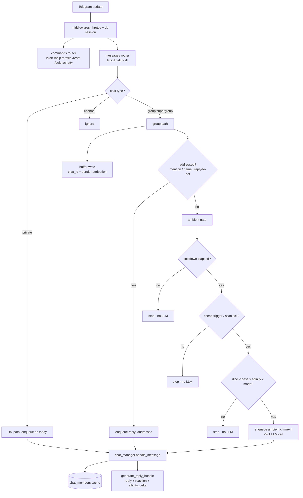
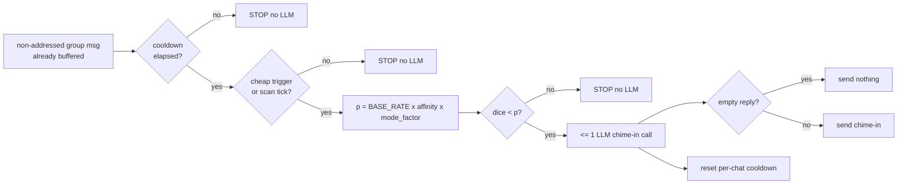
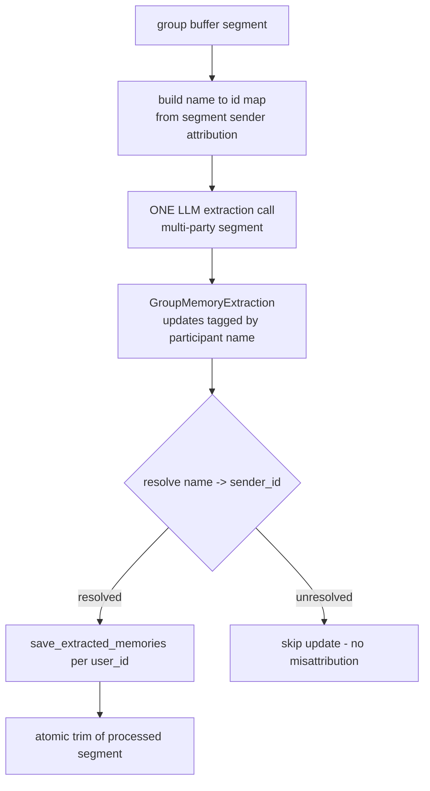

# Design — Phase 9: Group chat, ambient replies & affinity

## Overview

Phase 9 makes ThinkMate work in Telegram groups/supergroups while keeping DMs byte-for-byte identical. The strategy is **additive plumbing**: the hot path already keys most state by an integer id; we generalize that id from "user_id" to "chat_id for buffers, user_id for memory", thread sender identity through, and add a no-LLM ambient gate plus an affinity store. In a DM, `chat_id == user_id`, so the generalized path collapses to exactly today's behavior.

This design is grounded in:
- `docs/development/group_chat.md` — the authoritative behavior spec.
- `docs/development/database.md` — the `chat_buffers` (keyed by `chat_id`, with `sender_id`/`sender_name`) and `chat_members` schemas.
- `docs/development/performance_and_scaling.md` — the hot-path invariants and the "≤ ~1 ambient LLM call per active group per window" budget.

Guiding principle (from the perf doc priority order): **responsiveness → robustness → minimize LLM calls**. Every group message is buffered cheaply (one write), but the decision to *reply* is gated by a no-LLM funnel; the LLM is touched only for the few candidates that survive.

## Architecture

### Component map



### New & changed modules

| Module | Change |
|---|---|
| `app/services/group_gate.py` | **New.** Bot identity / addressed detection, the ambient funnel, per-chat cooldown state, cheap trigger scan, and the affinity in-memory cache helpers. Pure-Python, no aiogram imports where avoidable (takes plain values), so it is unit-testable. |
| `app/database/models.py` | Generalize buffer functions to `chat_id` + sender attribution; add `chat_members` CRUD. |
| `app/services/chat_manager.py` | `handle_message` gains chat context (chat_id, chat_type) and sender info; group branch renders multi-party history and folds `affinity_delta`. |
| `app/services/user_task_manager.py` | `enqueue_message` gains chat context + reason (addressed/ambient); batching keyed by `chat_id`; group extraction routing. |
| `app/services/llm_service.py` | `generate_reply_bundle` returns an optional `affinity_delta` for groups; a group extraction call returns name-tagged updates. |
| `app/services/schemas.py` | Extend `ReplyBundle` with optional `affinity_delta`; add `GroupMemoryExtraction` (name-tagged). |
| `app/handlers/messages.py` | Chat-type routing (private/group/channel), addressed-detection wiring, ambient-gate invocation. |
| `app/handlers/commands.py` | Add `/quiet` and `/chatty`. |
| `app/handlers/__init__.py` / `main.py` | Register new commands; ensure routers see group updates. |

## Backward-compatibility strategy

The single most important constraint: **DMs are unchanged**. The mechanisms:

1. **`chat_id == user_id` in DMs.** Buffers are keyed by `chat_id`; in a DM that equals `user_id`, so the on-disk `chat_buffers._id` is identical to today. Memory stays per `user_id` always.
2. **Additive, defaulted parameters.** New parameters on `handle_message` / `enqueue_message` are keyword arguments with DM-compatible defaults. Existing call sites and tests that pass `user_id` positionally keep working because, in a DM, the chat context is derived as `chat_id = user_id`, `chat_type = "private"`, `sender_id = user_id`.
3. **Early branch on chat type.** The very first decision in the message handler is the chat type. `private` takes the exact current code path (enqueue every conversational message); `channel` is ignored; only `group`/`supergroup` reaches the new group logic.
4. **Sender attribution is invisible in DMs.** Buffer messages gain `sender_id`/`sender_name`, but DM history rendering remains single-party `{role, content}`, so the reply call sees the same input it sees today.
5. **No `chat_members` in DMs.** The affinity store and ambient gate are never consulted for private chats.

A regression gate (Requirement 1.6) requires the full existing suite to pass unmodified.

## Data Models

### Augmented buffer message (`chat_buffers`)

Keyed by `chat_id` (DM: `chat_id == user_id`). Each message gains sender attribution:

```json
{
  "_id": -1001234567890,
  "messages": [
    { "role": "user", "sender_id": 111, "sender_name": "Alice", "content": "happy birthday Bob!", "created_at": "..." },
    { "role": "user", "sender_id": 222, "sender_name": "Bob",   "content": "thanks!",             "created_at": "..." },
    { "role": "assistant", "sender_id": 0, "sender_name": "ThinkMate", "content": "🎉 many happy returns, Bob!", "created_at": "..." }
  ],
  "updated_at": "..."
}
```

- DM messages also carry `sender_id`/`sender_name` (both the single user), but the rendered history stays single-party.
- The atomic `$slice` cap and `$pull`-on-cutoff trim are unchanged (they operate on the array regardless of the new fields).

### `chat_members` collection (affinity & mode)

```json
{
  "_id": "-1001234567890:222",
  "chat_id": -1001234567890,
  "user_id": 222,
  "affinity": 0.62,
  "mode": "auto",
  "updated_at": "..."
}
```

- `affinity` ∈ [0, 1], default `AFFINITY_DEFAULT`.
- `mode` ∈ {`auto`, `quiet`, `chatty`}, default `auto`.
- Read-through in-memory cache; write-through on change. No hot-path DB read after warm-up. Cache entries are bounded by the same idle-eviction philosophy as `UserState`.

## Components and Interfaces

The following are the exact intended interfaces. New parameters are keyword-only with DM-safe defaults to preserve existing call sites.

### `app/services/chat_manager.py`

```python
async def handle_message(
    db,
    chat_id: int,
    user_text: str,
    *,
    chat_type: str = "private",          # "private" | "group" | "supergroup"
    sender_id: int | None = None,         # defaults to chat_id in DMs
    sender_name: str = "",
    reason: str = "reply",                # "reply" (DM/addressed) | "ambient"
    participants: dict[int, str] | None = None,  # sender_id -> name, for group rendering
) -> tuple[str, str | None]:
    ...
```

- DM call `handle_message(db, user_id, text)` is unchanged in meaning (`chat_type="private"`, `sender_id=chat_id`).
- Group branch: appends with sender attribution, renders multi-party history, and after the reply call applies any `affinity_delta` to the speaker's member record.

### `app/services/user_task_manager.py`

```python
async def enqueue_message(
    self,
    bot,
    chat_id: int,
    text: str,
    message,
    *,
    user_id: int | None = None,          # defaults to chat_id in DMs
    chat_type: str = "private",
    sender_name: str = "",
    reason: str = "reply",               # "reply" | "ambient"
):
    ...
```

- Batching/coalescing state keys on `chat_id` (so a group batches per chat, a DM per user as today).
- `reason="ambient"` selects the chime-in prompt and the ambient post-processing (cooldown reset).

### `app/database/models.py`

```python
async def add_message_to_buffer(
    db, chat_id: int, role: str, content: str,
    *, sender_id: int | None = None, sender_name: str = "",
) -> list[dict]: ...

# chat_members CRUD
async def get_chat_member(db, chat_id: int, user_id: int) -> dict | None: ...
async def upsert_chat_member(
    db, chat_id: int, user_id: int,
    *, affinity: float | None = None, mode: str | None = None,
) -> dict: ...
```

- `reset_user` and the trim/count helpers keep operating by id; their `chat_id`/`user_id` meaning is documented.

### `app/services/group_gate.py` (new)

```python
def is_addressed(*, text: str, entities, reply_to_bot: bool,
                 bot_username: str, bot_name: str) -> bool: ...

def scan_cheap_triggers(text: str) -> bool: ...   # regex/keywords, no LLM

def scan_negative_signal(text: str) -> bool: ...  # "stop/quiet/spam/annoying/shut up"

class AmbientGate:
    """Per-chat cooldown + scan-tick state, bounded & self-pruning."""
    def should_chime(self, chat_id: int, *, affinity: float, mode: str,
                     triggered: bool, now: float) -> bool: ...
    def mark_chimed(self, chat_id: int, now: float) -> None: ...
    def prune(self, now: float) -> None: ...

class AffinityCache:
    """Read-through/write-through in-memory cache over chat_members."""
    async def get(self, db, chat_id, user_id) -> dict: ...
    async def bump(self, db, chat_id, user_id, delta: float) -> float: ...
    async def set_mode(self, db, chat_id, user_id, mode: str) -> None: ...
```

### `app/services/schemas.py`

```python
class ReplyBundle(BaseModel):
    reply: str
    reaction: Optional[str] = None
    affinity_delta: Optional[float] = None   # groups only; ignored/None in DMs

class GroupMemoryUpdate(BaseModel):
    participant: str            # sender_name as seen in the segment
    extraction: MemoryExtraction

class GroupMemoryExtraction(BaseModel):
    updates: list[GroupMemoryUpdate] = Field(default_factory=list)
```

`generate_reply_bundle` keeps returning `(reply, reaction)` for the DM path; a thin group variant (or an added return position guarded by `reason`) surfaces `affinity_delta`. The DM bundle's parsing/fallback behavior is untouched — `affinity_delta` is parsed only when present and defaults to `None`.

## The ambient-gate funnel



Funnel rules:
1. **Cooldown** (`GROUP_AMBIENT_COOLDOWN_SECS`, in-memory per chat) — at most one ambient chime-in per window. Cheapest check, runs first.
2. **Cheap trigger scan** (regex/keywords, no LLM) — birthdays, congrats, laughter, group questions, greetings, strong sentiment. Hybrid: additionally, once per cooldown window of activity, a single affinity-gated context-scan tick (`GROUP_CONTEXT_SCAN_EVERY`) may pass even without a keyword hit, to catch subtler moments.
3. **Affinity-weighted dice roll** — `p = GROUP_AMBIENT_BASE_RATE × affinity × mode_factor`. `mode_factor`: `quiet → 0`, `auto → 1`, `chatty → >1` (e.g. 1.5). `quiet` always yields `p = 0`.
4. **One LLM call** — craft a short chime-in from recent multi-party context; empty → send nothing. Either way, the cooldown is reset (Requirement 3.7) so the next window is enforced.

This guarantees ≤ ~1 ambient LLM call per active group per cooldown window (Requirement 3.8), regardless of volume. The per-chat cooldown map is bounded via `AmbientGate.prune` (drop entries whose cooldown has long elapsed), mirroring the throttle-map pruning policy.

## Affinity signals

| Signal | Direction | Cost | Mechanism |
|---|---|---|---|
| Mention / reply-to-bot | up | none | detected during routing |
| Engages right after a chime-in | up | none | next message from same sender within a short window |
| "stop/quiet/spam/annoying/shut up" | down | none | `scan_negative_signal` keyword check |
| `affinity_delta` from reply JSON | either | none (piggyback) | folded from the reply bundle |
| `/quiet` / `/chatty` | mode | none | sets `mode`, not affinity directly |

All updates clamp to [0, 1] and write through to `chat_members` via `AffinityCache`.

## Multi-party memory extraction



- One LLM call over the multi-party segment (Requirement 5.1), not one per participant.
- The segment carries `sender_id`/`sender_name` on every message, so the **name→id map** is built locally and used to route each tagged update to the right `user_id` (Requirement 5.2–5.3).
- Unresolved names are skipped (Requirement 5.4). DM extraction is unchanged (Requirement 5.5).
- Trim uses the existing atomic `$pull`-on-cutoff behavior (Requirement 5.6).

## Hot-path & bounded-state compliance

- The hot reply path keeps **one** LLM call (`generate_reply_bundle`) and ≤3 Mongo round-trips; `affinity_delta` rides inside that one call's JSON (no extra call).
- Affinity reads come from the in-memory cache after warm-up — no extra hot-path DB read.
- The ambient funnel does all cheap checks (cooldown, regex, dice) **before** any LLM call.
- In-memory structures are bounded: per-chat cooldown map self-prunes; affinity cache uses idle eviction; these mirror the existing throttle/state policies in `performance_and_scaling.md`.

## Correctness Properties

These properties are the testable invariants the implementation must satisfy; the testing strategy and tasks validate each.

### Property 1: DM invariance
For any private-chat input, the fixed system produces the same buffer document `_id`, the same single-party history seen by the reply call, and the same `(reply, reaction)` behavior as the current system.

**Validates: Requirements 1.1, 1.2, 1.5, 1.6, 1.7**

### Property 2: Addressed always replies
For any group message that is addressed (mention / name-token / reply-to-bot), the system generates a reply.

**Validates: Requirements 2.2, 2.3, 2.4**

### Property 3: Channels ignored
For any channel update, the system performs no buffer write, no reply, and no memory work.

**Validates: Requirements 2.6**

### Property 4: Ambient budget bound
For any burst of N non-addressed messages within one cooldown window in a group, the system makes at most one ambient LLM call, and all cooldown/scan/dice checks occur before any LLM call.

**Validates: Requirements 3.1, 3.3, 3.4, 3.8**

### Property 5: Quiet suppresses
For any member whose mode is `quiet`, the ambient probability is 0 and no ambient chime-in is made.

**Validates: Requirements 3.5, 6.1**

### Property 6: Affinity clamped and free
Every affinity update (mention, keyword, `affinity_delta`) keeps the stored value within [0, 1] and adds no extra LLM call.

**Validates: Requirements 4.4, 4.5, 4.6, 4.7**

### Property 7: Correct attribution
For any multi-party segment, extraction is a single LLM call and each tagged update is saved to the correct participant's `user_id` profile (or skipped if unresolved).

**Validates: Requirements 5.1, 5.2, 5.3, 5.4**

### Property 8: Bounded state
The per-chat cooldown map and affinity cache stay bounded under unbounded distinct chats/members via pruning/eviction.

**Validates: Requirements 3.10, 4.2**

## Error Handling

- Addressed detection failures (missing entities, no username configured) degrade to "not addressed" → ambient gate, never a crash.
- A failed ambient LLM call logs and sends nothing; the cooldown is still reset so a failing endpoint cannot be hammered.
- Affinity/`chat_members` read or write failures degrade to the default (`AFFINITY_DEFAULT`, `auto`) and never block a reply.
- Group extraction failure falls back to bounded trim (consistent with the existing extractor's all-fail-still-trim contract), and unresolved participants are skipped rather than guessed.

## Testing strategy

All tests use **mongomock + pytest-asyncio** per `tests/conftest.py` conventions (async mock wrappers, autouse DB patch, reactions disabled). No real LLM or network. LLM calls are patched with `AsyncMock` exactly as in `tests/test_batching_and_concurrency.py`.

### DM preservation (Requirement 1)
- Re-run the entire existing suite unmodified; it must stay green.
- New explicit tests: a DM conversational message still enqueues and replies; `chat_id == user_id` keeps the same `chat_buffers._id`; DM history renders single-party even though sender fields are stored.

### Routing & identity (Requirement 2)
- Mention, name-token, and reply-to-bot messages classify as addressed (unit tests on `is_addressed`).
- Non-addressed group message is buffered and routed to the gate, not replied to directly.
- Channel updates are ignored (no buffer write).
- Multi-party history rendering produces "Name: content" lines.

### Ambient gate (Requirement 3)
- Cooldown blocks a second chime-in within the window (no LLM call — assert the patched LLM mock is not called).
- Trigger scan: a birthday/question string passes step 2; an inert string with no scan tick stops.
- Dice roll: patch the RNG to force pass/fail and assert the LLM is called / not called accordingly; `quiet` mode forces `p = 0` (never called).
- After a chime-in, cooldown is reset; assert ≤1 LLM call across a burst of N messages in one window.
- `AmbientGate.prune` drops stale entries (bounded-state test).

### Affinity (Requirement 4)
- `chat_members` upsert/read round-trips on mongomock; defaults applied on first read.
- Read-through cache: second read does not hit the DB (spy/patch the model function).
- Up signal (mention), down signal (keyword), and `affinity_delta` all clamp to [0, 1] and write through.
- DMs never create `chat_members`.

### Multi-party extraction (Requirement 5)
- A two-speaker segment yields one extraction call; updates tagged "Alice"/"Bob" save to the right `user_id` profiles.
- An unresolved participant name is skipped (no misattribution, no crash).
- Processed segment is trimmed atomically; concurrently appended messages survive.

### Commands (Requirement 6)
- `/quiet` sets `mode="quiet"` and suppresses ambient (gate returns False for that member).
- `/chatty` sets `mode="chatty"` and boosts probability (mode_factor > 1).
- In a DM, `/quiet` / `/chatty` respond gracefully without creating group state.

### Config & observability (Requirement 7)
- Funnel honors `GROUP_AMBIENT_COOLDOWN_SECS`, `GROUP_AMBIENT_BASE_RATE`, `GROUP_CONTEXT_SCAN_EVERY`, `AFFINITY_DEFAULT` (override via config in tests, assert behavior changes).
- Drop-stage logging is emitted (capture via loguru/caplog where practical).

### Final checkpoint
- Full suite (`uv run pytest`) green, no warnings, no external services — same bar as Phase 8.
