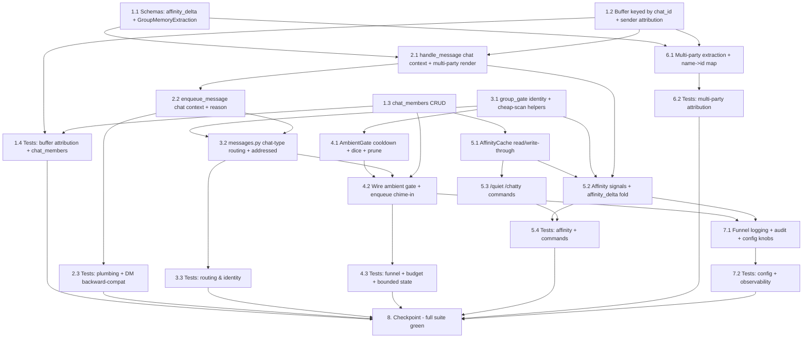

# Implementation Plan

## Overview

This plan delivers Phase 9 (group chat, ambient replies & affinity) as additive plumbing over the existing DM bot, keeping DMs byte-for-byte identical. Work proceeds bottom-up: data model + schema changes first, then chat-context plumbing through `chat_manager`/`user_task_manager`, then group routing + identity, the no-LLM ambient gate, the affinity store + `/quiet` `/chatty` commands, multi-party memory extraction, and finally observability and a full-suite checkpoint. Every implementation task is paired with or followed by a test task using **mongomock + pytest-asyncio** per `tests/conftest.py` conventions. Tasks are ordered into parallelizable waves where dependencies allow.

## Task Dependency Graph



```json
{
  "waves": [
    { "wave": 1, "tasks": ["1.1", "1.2", "1.3", "3.1"] },
    { "wave": 2, "tasks": ["1.4", "2.1", "4.1", "5.1", "6.1"] },
    { "wave": 3, "tasks": ["2.2", "5.2", "5.3", "6.2"] },
    { "wave": 4, "tasks": ["2.3", "3.2", "5.4"] },
    { "wave": 5, "tasks": ["3.3", "4.2"] },
    { "wave": 6, "tasks": ["4.3", "7.1"] },
    { "wave": 7, "tasks": ["7.2"] },
    { "wave": 8, "tasks": ["8"] }
  ]
}
```

## Tasks

- [x] 1. Data model & schema foundation

  - [x] 1.1 Extend reply/extraction schemas for groups
    - In `app/services/schemas.py`, add an optional `affinity_delta: Optional[float] = None` field to `ReplyBundle` (groups only; `None`/ignored in DMs, so DM parsing is unaffected)
    - Add `GroupMemoryUpdate` (`participant: str`, `extraction: MemoryExtraction`) and `GroupMemoryExtraction` (`updates: list[GroupMemoryUpdate]`) models for name-tagged multi-party extraction
    - Keep all existing schema fields and defaults unchanged
    - _Requirements: 4.6, 5.1, 5.2_

  - [x] 1.2 Generalize the buffer to `chat_id` + sender attribution
    - In `app/database/models.py`, change `add_message_to_buffer(db, chat_id, role, content, *, sender_id=None, sender_name="")` to persist `sender_id` and `sender_name` on each pushed message (default `sender_id` to `chat_id` when omitted, preserving DM behavior)
    - Keep `_id == chat_id`, the `$push`+`$slice` hard cap, the monotonic timestamp, and the post-update array return exactly as today (DM `chat_id == user_id` keeps the on-disk doc identical)
    - Document that `delete_oldest_buffer_messages`, `get_chat_buffer`, and count helpers operate by `chat_id`; leave their atomic `$pull`-on-cutoff trim logic unchanged
    - _Requirements: 1.2, 1.7, 2.1, 2.7_

  - [x] 1.3 Add `chat_members` CRUD
    - In `app/database/models.py`, add `get_chat_member(db, chat_id, user_id)` and `upsert_chat_member(db, chat_id, user_id, *, affinity=None, mode=None)` against a `chat_members` collection keyed `_id="{chat_id}:{user_id}"` with fields `chat_id`, `user_id`, `affinity` (default `config.AFFINITY_DEFAULT`), `mode` (default `"auto"`), `updated_at`
    - Clamp `affinity` writes to the inclusive range [0.0, 1.0]; validate `mode` ∈ {`auto`, `quiet`, `chatty`}
    - Use a single read-modify-write `$set` (no per-field DB loop), consistent with existing models
    - _Requirements: 4.1, 4.3, 4.7_

  - [x] 1.4 Tests: buffer attribution + chat_members CRUD
    - Using mongomock + pytest-asyncio (per `tests/conftest.py`), assert `add_message_to_buffer` stores `sender_id`/`sender_name`, defaults them to `chat_id` when omitted, and that a DM (`chat_id == user_id`) buffer doc is unchanged in shape
    - Assert `chat_members` upsert/read round-trips, applies `AFFINITY_DEFAULT` and `mode="auto"` on first read, clamps affinity to [0,1], and rejects/normalizes invalid modes
    - _Requirements: 1.2, 1.7, 2.1, 4.1, 4.3, 4.7_

- [ ] 2. Chat-context plumbing through orchestrator & task manager

  - [x] 2.1 Add chat context to `handle_message` + multi-party rendering
    - In `app/services/chat_manager.py`, extend `handle_message(db, chat_id, user_text, *, chat_type="private", sender_id=None, sender_name="", reason="reply", participants=None)` with DM-safe defaults (`sender_id` defaults to `chat_id`)
    - Append the user message with sender attribution; for groups, render the active history as multi-party (`"{sender_name}: {content}"`); for DMs keep the existing single-party `{role, content}` rendering
    - Parse the optional `affinity_delta` from the reply bundle without changing DM `(reply, reaction)` behavior or the JSON fallback path
    - _Requirements: 1.1, 1.2, 1.5, 2.7, 4.6_

  - [~] 2.2 Add chat context + reason to `enqueue_message`
    - In `app/services/user_task_manager.py`, extend `enqueue_message(self, bot, chat_id, text, message, *, user_id=None, chat_type="private", sender_name="", reason="reply")`; key batching/coalescing state on `chat_id` (DM `chat_id == user_id` keeps current per-user batching)
    - Thread `chat_type`, `sender_id`/`sender_name`, and `reason` into `_process_batch` → `handle_message`; `reason="ambient"` selects the chime-in path
    - Preserve typing loop, queue cap, batch delay, and hard deadline behavior unchanged
    - _Requirements: 1.1, 1.5, 2.1_

  - [~] 2.3 Tests: plumbing + DM backward-compat
    - Using mongomock + pytest-asyncio, assert a DM call `handle_message(db, user_id, text)` behaves exactly as before (one reply call, same buffer `_id`, single-party history) by patching `generate_reply_bundle` with `AsyncMock`
    - Assert `enqueue_message` batches by `chat_id` and that the existing batching/deadline/queue tests still pass with the new defaulted signature
    - _Requirements: 1.1, 1.2, 1.5, 1.6, 1.7, 2.7_

- [ ] 3. Group routing & bot identity

  - [x] 3.1 Implement `group_gate` identity + cheap-scan helpers
    - Create `app/services/group_gate.py` with pure helpers: `is_addressed(*, text, entities, reply_to_bot, bot_username, bot_name)` (mention / name-token / reply-to-bot), `scan_cheap_triggers(text)` (regex/keywords: birthdays, congrats, laughter, questions, greetings, strong sentiment — no LLM), and `scan_negative_signal(text)` ("stop/quiet/spam/annoying/shut up")
    - Keep these functions free of aiogram/DB imports (accept plain values) so they are directly unit-testable
    - _Requirements: 2.2, 2.3, 2.4, 3.2, 4.5_

  - [~] 3.2 Chat-type routing + addressed wiring in `messages.py`
    - In `app/handlers/messages.py`, branch first on chat type: `private` → existing DM enqueue path unchanged; `channel` → ignore entirely (no buffer write); `group`/`supergroup` → group path
    - In the group path, always buffer the message (with `sender_id`/`sender_name`), then use `is_addressed(...)` to decide: addressed → `enqueue_message(reason="reply")`; otherwise hand off to the ambient gate (wired in 4.2)
    - Ensure registered commands (incl. `/quiet` `/chatty`) are still routed to handlers and never treated as conversation or ambient triggers
    - _Requirements: 1.5, 2.1, 2.2, 2.3, 2.4, 2.5, 2.6, 2.8_

  - [~] 3.3 Tests: routing & identity
    - Using pytest-asyncio + mocked aiogram `Message` (per `tests/test_command_skip.py` style), assert mention, name-token, and reply-to-bot messages classify as addressed and enqueue a reply
    - Assert a non-addressed group message is buffered but not directly replied to; assert channel updates are ignored (no buffer write); assert multi-party history renders `"Name: content"`
    - _Requirements: 2.2, 2.3, 2.4, 2.5, 2.6, 2.7_

- [ ] 4. Ambient gate (no-LLM funnel)

  - [x] 4.1 Implement `AmbientGate` (cooldown → scan tick → affinity dice → prune)
    - In `app/services/group_gate.py`, add `AmbientGate` with per-chat in-memory cooldown + scan-tick counters; `should_chime(chat_id, *, affinity, mode, triggered, now)` returns True only when the cooldown elapsed, a trigger/scan-tick passed, and a single dice roll beats `GROUP_AMBIENT_BASE_RATE × affinity × mode_factor` (`quiet`→0, `auto`→1, `chatty`→>1)
    - Add `mark_chimed(chat_id, now)` (reset cooldown) and `prune(now)` (drop stale entries so the map is bounded); read all knobs from `config`
    - _Requirements: 3.1, 3.3, 3.4, 3.5, 3.7, 3.8, 3.9, 3.10, 7.1_

  - [~] 4.2 Wire the ambient gate into the group path
    - In the group non-addressed branch, fetch the speaker's affinity/mode (via `models.get_chat_member`, defaulting to `AFFINITY_DEFAULT`/`auto`), run `AmbientGate.should_chime(...)`, and on pass `enqueue_message(reason="ambient")`; on any drop, stop with no LLM call
    - After an ambient chime-in is dispatched, call `mark_chimed` so the cooldown holds; ensure an empty model reply sends nothing
    - _Requirements: 2.5, 3.2, 3.6, 7.4_

  - [~] 4.3 Tests: funnel, budget, bounded state
    - Using pytest-asyncio with the LLM patched via `AsyncMock` and the RNG patched deterministically, assert: cooldown blocks a second chime-in within the window (no LLM call); an inert message with no scan tick stops; `quiet` mode forces no call; a burst of N messages in one window yields ≤1 ambient LLM call; `prune` drops stale cooldown entries
    - _Requirements: 3.1, 3.3, 3.4, 3.5, 3.6, 3.7, 3.8, 3.10_

- [ ] 5. Affinity store, signals & commands

  - [x] 5.1 Implement `AffinityCache` (read-through / write-through)
    - In `app/services/group_gate.py` (or a small `affinity.py`), add `AffinityCache` over `chat_members`: `get(db, chat_id, user_id)` serves from an in-memory cache, falling back to one DB read + default creation on miss; `bump(db, chat_id, user_id, delta)` and `set_mode(db, chat_id, user_id, mode)` write through and update the cache
    - Bound the cache with the same idle-eviction philosophy as `UserState`; never consult/create records for private chats
    - _Requirements: 4.2, 4.3, 4.8_

  - [~] 5.2 Affinity signals + `affinity_delta` fold
    - Apply affinity-up on mention/reply-to-bot and on engagement right after a chime-in; affinity-down on `scan_negative_signal` hits; fold the reply bundle's optional `affinity_delta` into the speaker's affinity
    - Clamp every update to [0,1] via `AffinityCache.bump`; log signal type + resulting affinity at debug level; no extra LLM call for any signal
    - _Requirements: 4.4, 4.5, 4.6, 4.7, 7.5_

  - [~] 5.3 Add `/quiet` and `/chatty` commands
    - In `app/handlers/commands.py`, add `/quiet` (set member `mode="quiet"`, suppress ambient) and `/chatty` (set `mode="chatty"`, boost) via `AffinityCache.set_mode`, with an acknowledgement reply; register them in the commands router / `main.py` command list
    - In a private chat, respond gracefully (explanatory message) without creating any group affinity state
    - _Requirements: 6.1, 6.2, 6.3, 6.4, 6.5_

  - [~] 5.4 Tests: affinity cache, signals, commands
    - Using mongomock + pytest-asyncio, assert the cache serves a second read without a DB hit (spy the model fn), defaults apply on miss, and all signals clamp to [0,1] and write through; assert DMs never create `chat_members`
    - Assert `/quiet` sets `quiet` and suppresses ambient (gate returns False), `/chatty` sets `chatty` and boosts probability, and both respond gracefully in a DM
    - _Requirements: 4.2, 4.4, 4.5, 4.6, 4.7, 4.8, 6.1, 6.2, 6.3_

- [ ] 6. Multi-party group memory extraction

  - [~] 6.1 Implement multi-party extraction + name→id mapping
    - Add a group extraction path (in `app/services/memory_extractor.py` and a `group`-aware `llm_service` call returning `GroupMemoryExtraction`) that makes a single LLM call over the multi-party segment, builds a name→id map from the segment's `sender_id`/`sender_name`, and saves each participant's updates to their per-`user_id` profile via `save_extracted_memories`
    - Skip updates whose tagged participant name cannot be resolved (no misattribution); trim the processed segment with the existing atomic `$pull`-on-cutoff behavior; keep the DM single-party extraction path unchanged
    - _Requirements: 5.1, 5.2, 5.3, 5.4, 5.6_

  - [~] 6.2 Tests: multi-party attribution
    - Using mongomock + pytest-asyncio with the extraction LLM patched (`AsyncMock` returning a `GroupMemoryExtraction`), assert a two-speaker segment yields one extraction call and saves Alice's/Bob's updates to the correct `user_id` profiles
    - Assert an unresolved participant name is skipped (no crash, no misattribution) and the processed segment is trimmed without clobbering concurrently appended messages
    - _Requirements: 5.1, 5.2, 5.3, 5.4, 5.6_

- [ ] 7. Configuration & observability

  - [~] 7.1 Funnel logging + ambient audit + config knobs
    - Emit a log record at each funnel drop stage (cooldown, trigger scan, dice roll, empty reply) identifying the stage; route the ambient chime-in LLM call through the existing `llm_audit_log` fire-and-forget path
    - Ensure all group behavior reads `GROUP_AMBIENT_COOLDOWN_SECS`, `GROUP_AMBIENT_BASE_RATE`, `GROUP_CONTEXT_SCAN_EVERY`, `AFFINITY_DEFAULT` from `config` (no hardcoded literals)
    - _Requirements: 7.1, 7.2, 7.3, 7.4, 7.5_

  - [~] 7.2 Tests: config overrides + observability
    - Using pytest-asyncio, override config knobs (as existing tests do) and assert behavior changes (e.g. a larger cooldown blocks more, a higher base rate admits more under a fixed RNG); assert drop-stage log records are emitted (capture via caplog/loguru where practical)
    - _Requirements: 7.1, 7.2, 7.4_

- [~] 8. Checkpoint - ensure the full suite passes
  - Run the full test suite (`uv run pytest` or the project's configured command) and confirm every test passes with no warnings and no external services, including all pre-existing DM tests unmodified
  - Confirm the hot-path invariants hold: one reply LLM call per batch, ≤ ~1 ambient LLM call per active group per cooldown window, cheap scans before any LLM call, and bounded in-memory state
  - _Requirements: 1.6_

## Notes

- **DM preservation is the top constraint.** Every new parameter on `handle_message`/`enqueue_message` is keyword-only with DM-safe defaults so existing call sites and the entire current test suite keep working unmodified (Task 8 enforces this).
- **No LLM in the gate.** Cooldown → cheap regex/keyword scan → affinity-weighted dice roll all run with zero LLM calls; only survivors trigger a single chime-in call, preserving the "≤ ~1 ambient LLM call per active group per window" budget from `performance_and_scaling.md`.
- **Affinity rides for free.** `affinity_delta` is folded into the existing reply JSON (no extra call); keyword up/down signals and `/quiet` `/chatty` are also LLM-free.
- **Bounded state.** The per-chat cooldown map and the affinity cache must self-prune / evict, mirroring the throttle-map and `UserState` policies.
- **Test conventions.** All tests use mongomock + pytest-asyncio per `tests/conftest.py`; LLM and RNG are patched with `unittest.mock` (no Hypothesis dependency), consistent with `tests/test_batching_and_concurrency.py` and `tests/test_command_skip.py`.
- This is a coding-only plan; documentation already exists in `docs/development/group_chat.md` and `docs/project_plan.md` and is the source of truth.
