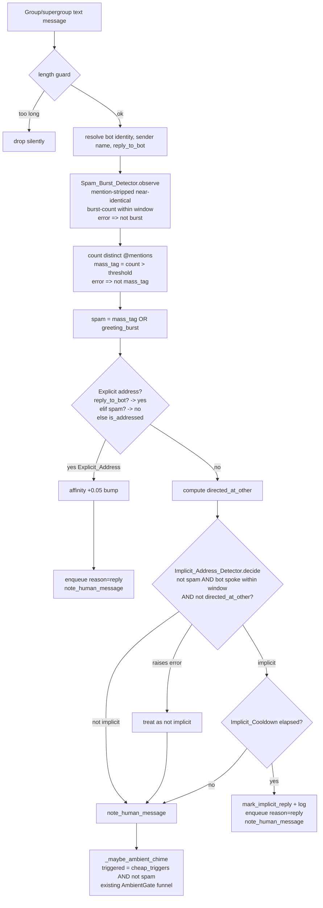
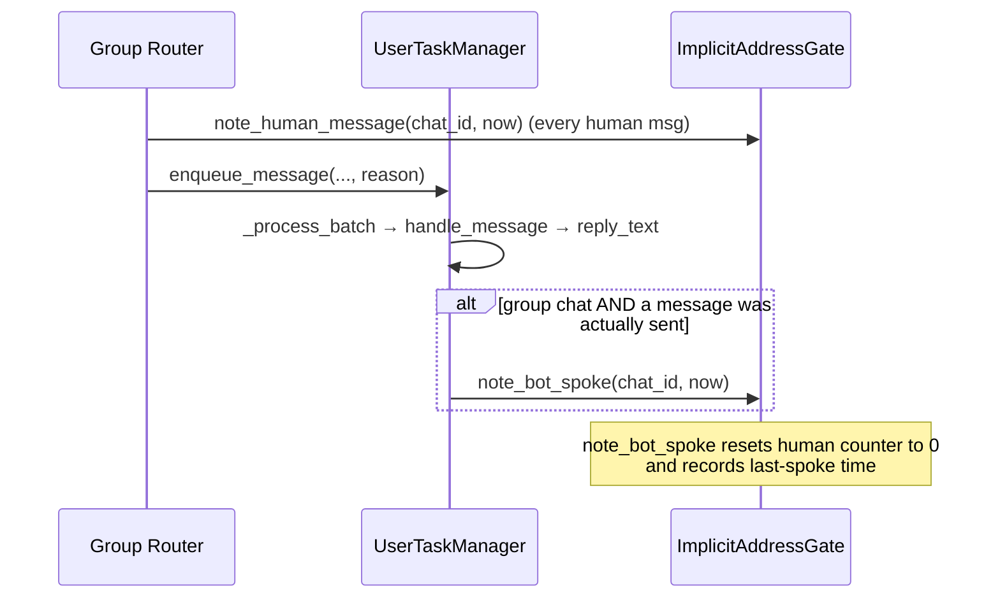
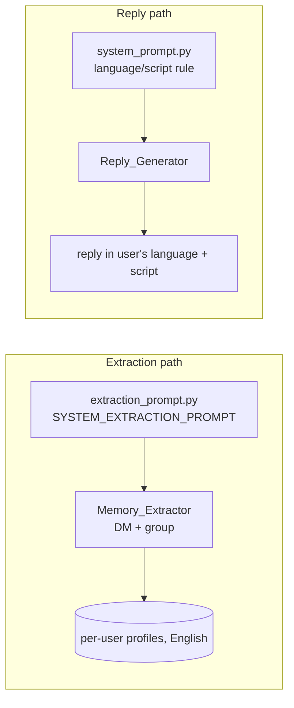

# Design Document

## Overview

This feature adds two independent behaviors to ThinkMate. They share a goal — making the bot feel
like a natural conversational partner — but touch different parts of the system and ship as
separate, low-coupling changes.

**Part A — Implicit (natural) bot-addressing in group chats.** Today a group message reaches the
bot's direct-reply path only when it is an *Explicit_Address* (an @mention of the bot, the bot's
name as a word, or a Telegram reply to the bot). Everything else falls through to the probabilistic
`AmbientGate`, which usually stays silent. In real conversations the message right after the bot
speaks is frequently a direct answer to it, even without a tag. Part A inserts a new no-LLM
**Implicit_Address_Detector** between the explicit-addressed check and the ambient gate. The
detector treats a non-explicitly-addressed message as a direct reply when (a) the bot spoke
recently in that chat — within a configurable time window *and* intervening-human-message count —
and (b) the message is not clearly aimed at someone else (a reply to another user or an @mention of
another user). A per-chat **Implicit_Cooldown** keeps the bot from dominating bursts of follow-ups.

**Part A-spam — Mass-tagging / spam protection (Requirement 9).** Group chats are a target for
userbots that @mention every member with a short greeting ("hi", "good morning") to farm attention.
Such a broadcast can sweep up the bot's own @mention in its bulk list and trip a greeting
cheap-trigger, which would make the bot either reply (as if explicitly addressed) or chime in (as if
the greeting were genuine) — wasting resources and amplifying the spam. Part A-spam adds a second
no-LLM detector, **Mass_Tag_Spam**, that counts the distinct @mentions in a message and classifies
it as spam when the count exceeds a configurable threshold. A spam message is never an
Implicit_Address (even within the recency window), its cheap-trigger keywords never fire the ambient
gate, and a bare @mention of the bot buried in the bulk list does **not** make it an
Explicit_Address. The one signal automated mass-tagging cannot fake — a deliberate Telegram
*reply* to one of the bot's own messages — still counts as an explicit address, so a real person
quoting the bot is never silenced. The detector is defensive: any error degrades to "not spam" so a
classification bug can never suppress a legitimate reply.

**Part A-burst — Greeting-burst spam protection over time (Requirement 10).** A single bulk-mention
message is one spam shape; the other is a *time-distributed* burst — a userbot that tags members
one-by-one in rapid succession with near-identical low-content greetings ("hi @a", "hi @b", "hi @c",
…). No single message trips the Mass_Tag_Spam mention-count threshold, so Part A-burst adds a third,
**stateful** no-LLM detector, **Spam_Burst_Detector**, that tracks recent per-chat message content
and arrival times in memory. It strips @mention tokens before comparing messages (so greetings
tagging different people compare as the same content — Req 10.1), measures near-identical similarity
against a configurable threshold (Req 10.2), and classifies messages as **Greeting_Burst_Spam** once
the count of near-identical messages within a configurable time window reaches a configurable
burst-count threshold (Req 10.3). Greeting_Burst_Spam is treated exactly like Mass_Tag_Spam for
routing purposes: never an Implicit_Address even inside the recency window (Req 10.4), its
cheap-trigger keywords never fire the ambient gate (Req 10.5), and a bare bot @mention inside it is
not an Explicit_Address (Req 10.6) — while a deliberate reply-to-bot still is (Req 10.7). A lone
greeting that is not part of a burst is never flagged (Req 10.8). Like the other detectors it is
no-LLM (Req 10.10), defensive (errors degrade to "not burst" — Req 10.14), and its per-chat state is
pruned by the existing idle sweep (Req 10.13).

Part A is built to mirror the existing `AmbientGate`: pure/stateful deterministic decision helpers
holding a small amount of bounded in-memory per-chat state, with injectable `now` for tests, living
in `app/services/group_gate.py`. They plug into the same router (`_handle_group_message`) and
preserve every existing invariant — the single-write buffer rule, the ambient cooldown, affinity
signals, and byte-for-byte DM behavior.

**Part B — Memory English normalization and reply language/script matching.** Two prompt-level
changes that are independent of Part A and of each other:

- *Memory in English (Requirement 7):* the `Memory_Extractor` must store every fact/belief/event in
  English regardless of the conversation language, while preserving proper nouns, names, and quoted
  identifiers in their original form. This is a change to the extraction prompt(s) only.
- *Reply language/script matching (Requirement 8):* the bot's *replies* must match the language and
  script the user is currently using, judged from recent conversation context — including the Hindi
  case where the user may write in Devanagari Hindi or in Hinglish (Hindi in Latin letters). This is
  a change to the system prompt only, and is explicitly independent of the English-memory rule.

### Research notes

- The codebase already establishes the pattern Part A should follow. `AmbientGate` keeps per-chat
  state in plain `dict[int, ...]` maps keyed by `chat_id`, exposes a `decide()` that returns
  `(bool, stage)` plus a thin boolean wrapper, separates the *decision* from the *commit*
  (`mark_chimed`), takes an injectable `now`/`rng`, and is pruned by an idle sweep in
  `UserTaskManager._evict_idle`. The new detector reuses this shape exactly, so it inherits the same
  testing story (`tests/test_ambient_gate.py` is pure, synchronous, deterministic) and the same
  pruning hook.
- The single-write buffer invariant is enforced in `_handle_group_message` by *path*: addressed
  messages are enqueued and `enqueue_message → handle_message` writes them; non-addressed dropped
  messages are written by `_maybe_ambient_chime`; non-addressed passed messages are written by the
  enqueue path. The implicit-reply path is, for buffer purposes, identical to the addressed path:
  enqueue with `reason="reply"` and do not write in the router.
- The bot's outgoing group message is sent in `UserTaskManager._process_batch` via
  `last_message.answer(reply_text)`. That is the one place that knows a bot message actually went
  out (it also implements ambient empty-reply suppression), so it is the correct place to record
  "bot last spoke."
- The extraction prompt is a single shared constant (`SYSTEM_EXTRACTION_PROMPT`) used by both the
  DM and group extraction paths; the group path appends `_GROUP_EXTRACTION_NOTE`. A language rule
  added to the shared constant therefore covers Requirement 7.1–7.4 in one edit.
- The system prompt already contains a language-mirroring bullet; Requirement 8 strengthens it for
  the Hinglish/Devanagari distinction and the "use recent context, not one isolated message" rule.
- `is_addressed` already inspects `mention` / `text_mention` entities via the internal
  `_has_mention_entity` scan, and the router already computes `reply_to_bot` separately. Requirement
  9 needs the *count* of distinct mentions (a new pure scan) and a spam-aware explicit decision that
  keeps `reply_to_bot` as the one signal that survives a spam classification (Req 9.5). Rather than
  fold spam logic into `is_addressed` (which several tests pin), spam-awareness is layered in the
  router: `reply_to_bot → explicit; elif spam → not explicit; else is_addressed(...)`. This leaves
  the pure `is_addressed` contract untouched.
- Telegram represents both `@username` mentions (`mention` entities) and inline name-links
  (`text_mention` entities, which carry a `user` object) — counting both, de-duplicated by handle
  text or user id, gives the true distinct-participant count for the spam threshold.
- Requirement 10 needs a *stateful* detector, unlike the single-message Mass_Tag_Spam scan. The
  natural model is the same per-chat in-memory map pattern, but holding a short, bounded, time-windowed
  history of recent mention-stripped message contents per chat (a `deque` of `(arrival_time, content)`
  pruned to the burst window and a hard length cap). Similarity is computed with the standard-library
  `difflib.SequenceMatcher.ratio()` over the mention-stripped, case-folded, whitespace-collapsed
  content — deterministic, dependency-free, and bounded in cost by the small history size. Both
  Mass_Tag_Spam and Greeting_Burst_Spam funnel into a single combined `spam` flag in the router, so
  the Requirement 9 and Requirement 10 routing rules (suppress implicit, suppress ambient trigger,
  don't promote a bulk/own @mention to explicit, but honor reply-to-bot) are expressed once and shared.
- Mention stripping for the similarity comparison reuses the same entity model as the count scan: the
  `@token` slices (`mention` entities) and the `text_mention` slices are removed from the text before
  comparison, so "hi @alice" and "hi @bob" both reduce to "hi" and compare as identical (Req 10.1).

## Architecture

### Part A: where the detector sits in the group router



The detector is invoked **only** on non-explicitly-addressed group messages, strictly between the
explicit-address check and the ambient gate (Requirement 1.1). DMs never reach this function
(Requirement 5.1); explicit addresses return before it (Requirement 5.2). The two spam scans run
once, up front: `Spam_Burst_Detector.observe` must see **every** group message (to build its
time-windowed history), and the Mass_Tag_Spam mention count is a pure per-message scan. Their results
are combined into a single `spam` flag (`spam = mass_tag OR greeting_burst`) that feeds three
decisions shared by Requirements 9 and 10: the spam-aware explicit check (Req 9.4/9.5, 10.6/10.7),
the implicit detector (Req 9.2, 10.4), and the ambient trigger suppression (Req 9.3, 10.5).

### Part A: recording "bot last spoke"



`note_bot_spoke` is called from `_process_batch` after a successful `last_message.answer(...)` for a
group chat. It is **not** called when an ambient chime-in produced an empty/declined reply (nothing
was sent), so the recency window only opens when the bot genuinely spoke.

### Part B: prompt-only changes



These two prompts are the entire surface area of Part B. No control flow changes.

## Components and Interfaces

### A0. Pure helper: `count_distinct_mentions` / `is_mass_tag_spam` (new, in `group_gate.py`)

A no-LLM, side-effect-free scan that counts how many **distinct** participants a message @mentions,
then thresholds it. Both `mention` entities (`@username`, compared by the sliced handle text,
case-folded) and `text_mention` entities (which carry a `user` object, compared by `user.id`)
contribute, de-duplicated so tagging the same person twice counts once.

```python
def count_distinct_mentions(text, entities) -> int:
    """Count distinct @mentioned participants in a message.

    - mention entities: distinct by the case-folded handle text sliced from `text`.
    - text_mention entities: distinct by the carried user id (getattr(entity.user, 'id')).
    Tolerant of None/empty/malformed entities (skips what it cannot read). Never raises;
    returns 0 on total failure.
    """

def is_mass_tag_spam(text, entities, *, threshold: int) -> bool:
    """True when count_distinct_mentions(...) > threshold (Req 9.1).

    Fully defensive: any internal error degrades to False ("not spam") so a
    classification bug can never suppress a legitimate reply (Req 9.6).
    """
```

The threshold comparison is strict `>` (Req 9.1: "more than a configurable threshold"), so a
threshold of 5 marks the 6th-and-beyond distinct mention as spam. The bot's own mention is *not*
excluded from the count — a bulk tag that happens to include the bot is exactly the spam case
Requirement 9.4 targets.

### A0b. `SpamBurstDetector` (new stateful class, in `group_gate.py`)

A no-LLM, **stateful** detector for time-distributed greeting bursts (Requirement 10). Unlike the
single-message `is_mass_tag_spam` scan, it remembers a short, bounded, time-windowed history of recent
mention-stripped message contents per chat and flags a message as Greeting_Burst_Spam once enough
near-identical messages have arrived within the window. It mirrors `AmbientGate`'s shape: per-chat
`dict` state keyed by `chat_id`, injectable `now`, a `prune` method wired into the idle sweep, and a
fully defensive contract.

State (keyed by `chat_id`):

| Map | Meaning |
|---|---|
| `_recent: dict[int, deque[tuple[float, str]]]` | Recent `(arrival_time, mention_stripped_content)` pairs for the chat, evicted when older than `GROUP_SPAM_BURST_WINDOW_SECS` and hard-capped at `GROUP_SPAM_BURST_TRACK_MAX` entries. |
| `_last_seen: dict[int, float]` | Most recent `now` observed for the chat; used by `prune`. |

Interface:

```python
class SpamBurstDetector:
    def observe(self, chat_id: int, text: str, entities, now: float) -> bool:
        """Record a message and classify it as Greeting_Burst_Spam (True) or not (False).

        Steps (no LLM, Req 10.10):
        1. Strip @mention tokens (mention + text_mention entity slices) from `text`, then
           case-fold and whitespace-collapse the remainder -> `content` (Req 10.1).
        2. Evict this chat's history entries older than GROUP_SPAM_BURST_WINDOW_SECS (now-anchored).
        3. Count how many retained entries are near-identical to `content`, i.e. have
           difflib.SequenceMatcher ratio >= GROUP_SPAM_BURST_SIMILARITY (Req 10.2).
        4. Append (now, content) to the history (hard-capped at GROUP_SPAM_BURST_TRACK_MAX).
        5. Including the just-added message, if the near-identical count within the window
           reaches GROUP_SPAM_BURST_COUNT -> classify as Greeting_Burst_Spam, return True
           (Req 10.3). A lone or sub-threshold greeting returns False (Req 10.8).

        Fully defensive: any internal error degrades to False ("not burst") so a classification
        bug can never suppress a legitimate reply (Req 10.14). Updates `_last_seen`."""

    def prune(self, now: float, max_idle: float | None = None) -> int:
        """Drop per-chat history idle beyond max_idle; return count pruned (Req 10.13)."""
```

Mention stripping reuses the entity model from `count_distinct_mentions`: the `@token` slices and the
`text_mention` slices are removed from `text` before comparison, so "hi @alice" and "hi @bob" both
reduce to "hi" and compare as identical (Req 10.1). When entities are absent or malformed, a
defensive regex fallback strips `@\w+` tokens so the comparison still excludes obvious mentions.

The similarity metric is `difflib.SequenceMatcher(None, a, b).ratio()` (standard library,
deterministic, in `[0, 1]`); two contents are *near-identical* when the ratio meets or exceeds
`GROUP_SPAM_BURST_SIMILARITY` (Req 10.2). The count threshold and time window are both read live from
config (Req 10.11), and the config loader supplies defaults for any unset value (Req 10.12).

`observe` is the single entry point and is **stateful by design** (it both reads the history to
classify and appends the current message). It is still deterministic given `now`, so it is unit- and
property-testable with a fresh instance and an injected clock, exactly like `AmbientGate`. A
module-level singleton `spam_burst_detector = SpamBurstDetector()` is exposed for the hot path.

### A1. Pure helper: `is_directed_at_other` (new, in `group_gate.py`)

A no-LLM, side-effect-free predicate mirroring `is_addressed`. Because it is only consulted for
messages that already failed `is_addressed`, any mention entity present must reference a non-bot
participant, and any reply present must be to a non-bot message.

```python
def is_directed_at_other(*, entities, reply_to_other: bool) -> bool:
    """True when a non-explicitly-addressed message clearly targets another participant.

    - reply_to_other: the message replies to a non-bot message (computed by the router
      from reply_to_message.from_user.id != bot id).
    - entities: a mention / text_mention entity present means an @mention of another user
      (the bot's own mention would have been caught by is_addressed first).

    Fully defensive: malformed input degrades to False (never raises).
    """
```

Covers Requirement 2.2 (reply-to-other) and 2.3 (@mention-other). The router supplies
`reply_to_other`; the helper reuses the existing `_has_mention_entity` scan for the @mention signal.

### A2. `ImplicitAddressGate` (new class, in `group_gate.py`)

Per-chat, no-LLM component holding the bot's recent-activity tracking and the implicit-reply
throttle. It mirrors `AmbientGate`'s shape: bounded in-memory maps keyed by `chat_id`, injectable
`now`, decision separated from commit, and a `prune` method wired into the existing idle sweep.

State (all keyed by `chat_id`):

| Map | Meaning |
|---|---|
| `_bot_last_spoke: dict[int, float]` | `now` when the bot last sent a message in the chat. Absent = bot has never spoken. |
| `_human_since_bot: dict[int, int]` | Count of human messages observed since the bot's most recent message (reset to 0 by `note_bot_spoke`). |
| `_last_implicit_reply: dict[int, float]` | `now` when the bot last issued an implicit direct reply (for the Implicit_Cooldown). Absent = never. |
| `_last_seen: dict[int, float]` | Most recent `now` observed for the chat; used by `prune`. |

Interface:

```python
class ImplicitAddressGate:
    def note_bot_spoke(self, chat_id: int, now: float) -> None:
        """Record that the bot just spoke: set last-spoke time, reset human counter to 0."""

    def note_human_message(self, chat_id: int, now: float) -> int:
        """Record a human message; increment & return the since-bot counter. Updates last_seen.
        Only counts once the bot has spoken (no counter before the window can open)."""

    def decide(self, chat_id: int, *, directed_at_other: bool,
               is_spam: bool, now: float) -> tuple[bool, str]:
        """Classify a non-explicitly-addressed message. Returns (is_implicit, reason).

        `is_spam` is the combined spam flag (Mass_Tag_Spam OR Greeting_Burst_Spam) computed by
        the router; it is rejected first so neither spam shape is ever implicit, even inside the
        recency window (Req 9.2, Req 10.4).

        reason is one of:
          - "spam": the message is Mass_Tag_Spam or Greeting_Burst_Spam (Req 9.2, 10.4) —
            checked first, so spam is never implicit even inside the recency window
          - "no_bot_activity": the bot has never spoken in this chat (Req 1.4)
          - "directed_at_other": clearly aimed at another participant (Req 2.1)
          - "out_of_window": bot's last message is outside the Bot_Recency_Window (Req 1.3)
          - "implicit": within window and not directed at other (Req 1.2)

        Reads the since-bot counter as-of-now (the current message is NOT yet counted).
        Pure: no state mutation, never raises (malformed input degrades to (False, ...))."""

    def cooldown_elapsed(self, chat_id: int, now: float) -> bool:
        """True when the Implicit_Cooldown has elapsed for the chat (or never replied)."""

    def mark_implicit_reply(self, chat_id: int, now: float) -> None:
        """Record that an implicit direct reply was dispatched (resets the Implicit_Cooldown)."""

    def prune(self, now: float, max_idle: float | None = None) -> int:
        """Drop per-chat state idle beyond max_idle; return count pruned (Req 6.4)."""
```

Window check inside `decide` (Requirement 1.2/1.3): spam is rejected first
(`is_spam → (False, "spam")`, Req 9.2 / Req 10.4), then the bot's last message is "within the
Bot_Recency_Window" when **both** bounds hold —

```
elapsed   = now - _bot_last_spoke[chat_id]            <= GROUP_IMPLICIT_RECENCY_SECS
intervening = _human_since_bot.get(chat_id, 0)        <= GROUP_IMPLICIT_RECENCY_MAX_MSGS
```

Using AND (not OR) is the conservative reading of "elapsed time and/or intervening count": the
follow-up must be both *soon* and *not buried* under other people's chatter. A chat with no
`_bot_last_spoke` entry short-circuits to `(False, "no_bot_activity")` (Requirement 1.4).

Decision/commit split (mirrors `AmbientGate.decide` vs `mark_chimed`): `decide` is a pure predicate;
the router commits the throttle with `mark_implicit_reply` *before* enqueueing so the cooldown holds
even if the eventual reply is empty/fails (Requirement 3.3), exactly as `mark_chimed` does for the
ambient path.

A module-level singleton `implicit_gate = ImplicitAddressGate()` is exposed for the hot path; tests
instantiate the class directly for isolated, deterministic state.

### A3. Router integration (`app/handlers/messages.py`, `_handle_group_message`)

Changes, in order:

1. Compute `now = time.time()` once.
2. Classify both spam shapes up front, each defended independently:
   - `try: is_burst = spam_burst_detector.observe(chat_id, user_text, message.entities, now)`
     `except Exception: is_burst = False` (Requirement 10.14). `observe` must run on **every** group
     message so the time-windowed history is complete regardless of which path the message takes.
   - `try: is_mass = is_mass_tag_spam(user_text, message.entities, threshold=config.GROUP_MASS_TAG_SPAM_THRESHOLD)`
     `except Exception: is_mass = False` (Requirement 9.6).
   - `spam = is_mass or is_burst` — the single combined flag used by every downstream decision.
3. Spam-aware explicit-address decision (replaces the bare `is_addressed` call):
   - `reply_to_bot` (computed as today) → **Explicit_Address** (Requirements 9.5 and 10.7: a
     deliberate reply-to-bot survives both spam shapes).
   - `elif spam` → **not** an Explicit_Address (Requirements 9.4 and 10.6: a bot @mention buried in a
     bulk tag list or in a greeting-burst message, or the bot's name appearing in spam, does not
     count).
   - `else` → existing `is_addressed(text, entities, reply_to_bot=False, bot_username, bot_name)`
     (Requirement 10.9: a genuine explicit address that is not burst uses the existing addressed path).
   If Explicit_Address: existing affinity `+0.05` bump and `enqueue_message(reason="reply")`
   (unchanged), then `implicit_gate.note_human_message(chat_id, now)`, then return.
4. If not addressed: compute `reply_to_other` (a reply whose `from_user.id` is present and is not the
   bot's id) and `directed_at_other = is_directed_at_other(entities=message.entities, reply_to_other=...)`.
5. `try: is_implicit, reason = implicit_gate.decide(chat_id, directed_at_other=directed_at_other,
   is_spam=spam, now=now)` `except Exception: is_implicit = False` (Requirement 1.6 —
   degrade to ambient).
6. If `is_implicit and implicit_gate.cooldown_elapsed(chat_id, now)`:
   `implicit_gate.mark_implicit_reply(chat_id, now)` (Requirement 3.3) → log the implicit-reply
   decision with the chat id (Requirement 3.2) → `implicit_gate.note_human_message(chat_id, now)` →
   `enqueue_message(reason="reply")` **without** writing the buffer (Requirement 3.4) → return.
7. Otherwise (`not is_implicit`, or cooldown not elapsed → Requirement 4.1):
   `implicit_gate.note_human_message(chat_id, now)` then
   `await _maybe_ambient_chime(..., is_spam=spam)` (existing path, which owns the buffer
   write on its drop branch — Requirement 5.3/5.4).

Counter ordering: `note_human_message` is called *after* `decide` on every path, so the current
message is never counted as one of its own "intervening" predecessors. The immediate follow-up to a
bot message therefore evaluates with `intervening == 0` (the strongest implicit candidate).

Affinity (Requirement 5.5): the explicit `+0.05` mention/reply-to-bot bump remains on the addressed
path only — an implicit address is not a mention or reply-to-bot, so it does not earn the routing
bump. The sentiment-based `affinity_delta` returned by the reply call still folds in for implicit
replies (they go through the same `reason="reply"` generation path), so affinity signals continue to
apply without adding new semantics.

### A4. Recency commit point (`app/services/user_task_manager.py`, `_process_batch`)

After a group reply is actually sent, record that the bot spoke:

- Import the new singletons: `from app.services.group_gate import ambient_gate, implicit_gate, spam_burst_detector`.
- In `_process_batch`, in the branch that calls `await last_message.answer(reply_text)` (i.e. not the
  suppressed ambient-empty case), when `chat_type in _GROUP_CHAT_TYPES`, call
  `implicit_gate.note_bot_spoke(chat_id, time.time())` (Requirement 6.1). Wrapped defensively so a
  tracking failure never breaks message delivery.

This is also the natural reset point: `note_bot_spoke` zeroes `_human_since_bot`, so the recency
window reopens from the bot's latest message.

### A5. Pruning hook (`app/services/user_task_manager.py`, `_evict_idle`)

Extend the existing prune block (which already prunes `ambient_gate` and `affinity_cache`) to also
call `implicit_gate.prune(now)` (Requirement 6.4) and `spam_burst_detector.prune(now)`
(Requirement 10.13), inside the same defensive `try/except` so a prune failure never breaks the
sweep.

### A6. Ambient trigger suppression for spam (`app/handlers/messages.py`, `_maybe_ambient_chime`)

`_maybe_ambient_chime` gains a keyword-only `is_spam: bool = False` parameter (the combined
Mass_Tag_Spam OR Greeting_Burst_Spam flag from the router). Inside, the cheap-trigger scan becomes
spam-aware:

```python
triggered = scan_cheap_triggers(user_text) and not is_spam
```

When the message is either spam shape, `triggered` is forced `False`, so greeting/laughter/etc.
keywords cannot fire the ambient gate (Requirements 9.3 and 10.5). The message still flows through
`AmbientGate.decide` so the single-write invariant is preserved exactly as today: the gate remains
the sole buffer writer on its drop branch, and a spam message with `triggered=False` simply drops at
the `"no_trigger"` stage (unless it independently lands on the rare periodic scan tick, which remains
affinity-and-dice gated — the requirement scopes suppression to *cheap-trigger keywords*, not the
context-scan mechanism). This keeps spam handling a one-line, low-risk change with no new buffer-write
paths.

### B1. Extraction prompt (`app/prompts/extraction_prompt.py`)

Add a top-level **LANGUAGE NORMALIZATION** rule to `SYSTEM_EXTRACTION_PROMPT`:

- Store every fact, belief, and event in English regardless of the conversation's language
  (Requirements 7.1, 7.2).
- Translate non-English content to natural English rather than transliterating it.
- Preserve proper nouns, personal names, place names, brand names, and quoted identifiers in their
  original form inside the English text (Requirement 7.3). Example guidance:
  Hindi "मुझे पुणे में नौकरी मिली" → fact `"Got a job in Pune"`.

Reinforce the rule in `_GROUP_EXTRACTION_NOTE` so multi-party extraction is unambiguous: each
participant's stored memory is in English while names stay original (Requirement 7.4). Because the
group note is appended to the shared system prompt, the base rule already applies; the note adds a
one-line reminder to keep per-participant updates English.

### B2. System prompt (`app/prompts/system_prompt.py`)

Strengthen the **Language** bullet in `DEFAULT_SYSTEM_PROMPT_TEMPLATE`:

- Reply in the same language the user is currently using (Requirement 8.1).
- For Hindi specifically: if the user writes in Hinglish (Hindi in Latin letters), reply in Hinglish;
  if the user writes in Devanagari Hindi, reply in Devanagari (Requirements 8.2, 8.3). Match the
  user's *script*, not just the language.
- Judge the current language/script from the recent conversation context, not a single isolated
  message, and switch when the user's recent usage shifts (Requirement 8.4).
- Add an explicit independence note: matching the user's language/script is about the *reply only*;
  it does not affect how memories are stored (Requirement 8.5).

## Data Models

Part A introduces no persistent schema changes. All new state is in-memory and bounded, mirroring
`AmbientGate`:

```python
# ImplicitAddressGate per-chat state (all keyed by chat_id: int)
_bot_last_spoke:      dict[int, float]   # now of bot's last sent message; absent => never spoke
_human_since_bot:     dict[int, int]     # human messages since bot last spoke; reset to 0 on note_bot_spoke
_last_implicit_reply: dict[int, float]   # now of last implicit direct reply (Implicit_Cooldown anchor)
_last_seen:           dict[int, float]   # most recent activity; used by prune()

# SpamBurstDetector per-chat state (keyed by chat_id: int)
_recent:    dict[int, deque[tuple[float, str]]]  # (arrival_time, mention_stripped_content), window+cap bounded
_last_seen: dict[int, float]                     # most recent activity; used by prune()
```

New configuration knobs (`app/config.py`), read live so tests can override:

| Knob | Type | Default | Purpose |
|---|---|---|---|
| `GROUP_IMPLICIT_RECENCY_SECS` | float | `120.0` | Bot_Recency_Window elapsed-time bound (Req 4.3). A follow-up within ~2 min of the bot speaking is recency-eligible. |
| `GROUP_IMPLICIT_RECENCY_MAX_MSGS` | int | `4` | Bot_Recency_Window intervening-human-message bound (Req 4.3). Up to 4 other human messages may intervene before the window closes. |
| `GROUP_IMPLICIT_COOLDOWN_SECS` | float | `30.0` | Implicit_Cooldown (Req 4.2). At most one implicit direct reply per chat per 30 s, so bursts of follow-ups don't let the bot dominate. Shorter than the 90 s ambient cooldown because implicit replies are wanted answers, not volunteered chime-ins. |
| `GROUP_MASS_TAG_SPAM_THRESHOLD` | int | `5` | Mass_Tag_Spam threshold (Req 9.7). A message @mentioning **more than** 5 distinct participants is spam. Picked above the size of a normal "hey @a @b @c, what do you think?" cluster but well below a member-list broadcast. |
| `GROUP_SPAM_BURST_SIMILARITY` | float | `0.85` | Greeting_Burst_Spam similarity threshold (Req 10.11). Two mention-stripped contents with a `difflib` ratio ≥ 0.85 are near-identical — high enough to catch "hi"/"hii"/"hi 👋" variants without conflating genuinely different short messages. |
| `GROUP_SPAM_BURST_COUNT` | int | `3` | Greeting_Burst_Spam burst-count threshold (Req 10.11). Once 3 near-identical messages arrive within the window, the burst is flagged. A single greeting (count 1) or a pair is never flagged (Req 10.8). |
| `GROUP_SPAM_BURST_WINDOW_SECS` | float | `60.0` | Greeting_Burst_Spam time window (Req 10.11). Near-identical messages are only counted toward a burst if they arrive within 60 s of each other, so normal, spaced-out greetings never trip it. |
| `GROUP_SPAM_BURST_TRACK_MAX` | int | `20` | Hard cap on per-chat retained recent-message entries, bounding `SpamBurstDetector` memory independent of traffic volume. |

Per Requirement 10.12, every burst knob has a default supplied by the config loader, so an unset
value is never an error. Defaults are deliberately conservative: short time window, small message
bound, and a cooldown that caps implicit replies to roughly two per minute per chat. They are tunable
per Requirements 4.2/4.3 and 10.11.

Persisted models (`chat_buffers`, `chat_members`, per-user profiles) are unchanged. The existing
`affinity` / `mode` fields continue to drive the ambient gate exactly as before.

## Correctness Properties

*A property is a characteristic or behavior that should hold true across all valid executions of a
system — essentially, a formal statement about what the system should do. Properties serve as the
bridge between human-readable specifications and machine-verifiable correctness guarantees.*

These properties cover **Part A**, **Part A-spam**, and **Part A-burst** — the pure/stateful,
deterministic `group_gate.py` logic (`ImplicitAddressGate`, `is_directed_at_other`,
`is_mass_tag_spam`, `SpamBurstDetector`). They are fully unit-testable with an injected `now` and
constructed entity/reply inputs, so each maps to a single property-based test.

**Part B is intentionally excluded.** Requirements 7 (English memory) and 8 (reply language/script
matching) are realized entirely as prompt-text changes whose behavior is produced by the LLM. There
is no deterministic "for all inputs X, P(X)" we own to assert, so PBT does not apply; these are
verified by prompt-assertion tests (and optional live smoke tests) described in the Testing Strategy.

### Property 1: Recency-window implicit classification

*For any* chat and *any* sequence of `note_bot_spoke` / `note_human_message` events, a
non-directed, non-spam message is classified as an Implicit_Address by `decide` **if and only if**
the bot has spoken in that chat AND the elapsed time since the bot's last message is within
`GROUP_IMPLICIT_RECENCY_SECS` AND the intervening human-message count is within
`GROUP_IMPLICIT_RECENCY_MAX_MSGS`; a chat where the bot has never spoken, or where either bound is
exceeded, is classified as not an Implicit_Address.

**Validates: Requirements 1.2, 1.3, 1.4, 6.1, 6.2**

### Property 2: Directed-at-other suppression

*For any* non-explicitly-addressed message that replies to a non-bot message OR carries an @mention
entity targeting another participant, `decide` classifies it as not an Implicit_Address
(`"directed_at_other"`), regardless of how recently the bot spoke.

**Validates: Requirements 2.1, 2.2, 2.3**

### Property 3: Implicit cooldown bounds direct replies

*For any* burst of Implicit_Address candidates arriving within a single `GROUP_IMPLICIT_COOLDOWN_SECS`
window, the router routes **at most one** as a direct reply and hands the remainder to the ambient
gate; once the cooldown has fully elapsed, a new candidate may again be routed as a direct reply.

**Validates: Requirements 3.1, 4.1, 4.4**

### Property 4: Cooldown reset on implicit reply

*For any* chat, after `mark_implicit_reply(chat_id, t)` is called, `cooldown_elapsed(chat_id, t')`
returns `False` for every `t'` with `t <= t' < t + GROUP_IMPLICIT_COOLDOWN_SECS` — so the throttle
holds for the full window even if the eventual reply is empty or fails.

**Validates: Requirements 3.3**

### Property 5: Mass-tag-spam classification and implicit suppression

*For any* message whose count of distinct @mentions (over `mention` and `text_mention` entities,
de-duplicated) exceeds `GROUP_MASS_TAG_SPAM_THRESHOLD`, `is_mass_tag_spam` returns `True`, and
`decide` classifies that message as not an Implicit_Address even when the bot spoke within the
recency window.

**Validates: Requirements 9.1, 9.2**

### Property 6: Spam suppresses cheap-trigger ambient firing

*For any* Mass_Tag_Spam message, the effective ambient trigger
(`scan_cheap_triggers(text) and not is_mass_tag_spam`) is `False` — so cheap-trigger keywords such
as greetings never count as an ambient trigger for a spam message.

**Validates: Requirements 9.3**

### Property 7: Spam-aware explicit address

*For any* Mass_Tag_Spam message, the router treats it as an Explicit_Address **if and only if** it
is a deliberate reply to one of the bot's own messages; a bare @mention of the bot buried in the
bulk mention list (with no reply-to-bot) does not make a spam message an Explicit_Address.

**Validates: Requirements 9.4, 9.5**

### Property 8: Recency and burst state pruning

*For any* set of chats with assorted last-activity timestamps, `prune(now, max_idle)` on each
in-memory tracker (`ImplicitAddressGate` and `SpamBurstDetector`) removes exactly the chats whose
tracking state has been idle longer than `max_idle` and leaves all recently-active chats' state
intact, keeping every in-memory map bounded.

**Validates: Requirements 6.4, 10.13**

### Property 9: Defensive degradation (never raise)

*For any* input — including malformed entities, non-string text, and `None` — `is_mass_tag_spam`,
`SpamBurstDetector.observe`, and `ImplicitAddressGate.decide` never raise: the spam classifiers
degrade to `False` ("not spam" / "not burst") and `decide` degrades to a not-implicit verdict. A
failure in any of these components therefore can never suppress a legitimate reply; it can only fall
through to the existing ambient path.

**Validates: Requirements 1.6, 9.6, 10.14**

### Property 10: Burst similarity excludes @mention tokens

*For any* base message content and *any* two sets of @mention tokens decorating it, the
`SpamBurstDetector` compares the two messages on their mention-stripped content — which are
identical — so their `difflib` similarity is maximal and they are treated as near-identical. Greeting
messages that tag different participants therefore compare as the same content regardless of who is
tagged.

**Validates: Requirements 10.1, 10.2**

### Property 11: Greeting-burst classification threshold within the window

*For any* sequence of near-identical (mention-stripped) messages arriving in a single chat, the
`SpamBurstDetector` classifies a message as Greeting_Burst_Spam **if and only if** the count of
near-identical messages within `GROUP_SPAM_BURST_WINDOW_SECS` reaches `GROUP_SPAM_BURST_COUNT`; a lone
greeting, a sub-threshold count, or messages spaced beyond the window are classified as not
Greeting_Burst_Spam.

**Validates: Requirements 10.3, 10.8**

### Property 12: Greeting-burst suppresses implicit classification and ambient triggers

*For any* message classified as Greeting_Burst_Spam, `decide` classifies it as not an
Implicit_Address even when the bot spoke within the recency window, and its effective ambient trigger
(`scan_cheap_triggers(text) and not is_spam`) is `False` — so greeting cheap-trigger keywords never
fire the ambient gate for a burst message.

**Validates: Requirements 10.4, 10.5**

### Property 13: Burst-aware explicit address

*For any* Greeting_Burst_Spam message, the router treats it as an Explicit_Address **if and only if**
it is a deliberate reply to one of the bot's own messages; a bare @mention of the bot inside a burst
message (with no reply-to-bot) does not make it an Explicit_Address, while a genuine explicit address
that is not classified as Greeting_Burst_Spam continues to use the existing addressed path.

**Validates: Requirements 10.6, 10.7, 10.9**

## Error Handling

The design follows the codebase's established "degrade on the hot path, never raise" contract
(mirrors `is_addressed`, `scan_cheap_triggers`, and the `_maybe_ambient_chime` gate-failure branch).

| Failure point | Handling | Resulting behavior |
|---|---|---|
| `is_mass_tag_spam` raises internally | `try/except` inside the function returns `False` | Treated as not spam; normal processing continues (Req 9.6). |
| `SpamBurstDetector.observe` raises internally | `try/except` inside `observe` returns `False` | Treated as not burst; normal processing continues (Req 10.14). |
| Router's burst classification raises | `try/except` in `_handle_group_message` sets `is_burst = False` | Message processed as non-burst; combined `spam` flag falls back to mass-tag only (Req 10.14). |
| Router's spam computation raises | `try/except` in `_handle_group_message` sets `spam = False` | Message processed as non-spam (Req 9.6). |
| `implicit_gate.decide` raises | `try/except` in the router sets `is_implicit = False` | Message falls through to the ambient gate (Req 1.6). |
| `is_directed_at_other` raises | Defensive internals return `False` | Message remains an implicit candidate (no crash); recency bounds still gate it. |
| `note_human_message` / `note_bot_spoke` raises | Wrapped at call sites in `try/except` (debug log) | Tracking may miss one update; message delivery and routing are unaffected. |
| `implicit_gate.prune` raises | Caught by the existing sweep `try/except` in `_evict_idle` | Sweep continues; stale state pruned on a later pass. |
| `spam_burst_detector.prune` raises | Caught by the existing sweep `try/except` in `_evict_idle` | Sweep continues; stale burst history pruned on a later pass. |
| Bot identity (`get_me`) unavailable | Existing behavior (`id=0`, empty username) | `reply_to_bot` is `False`; spam/implicit logic still runs; no crash. |

Key safety guarantee: every degradation path lands a message on the existing ambient gate (or, for a
spam classification failure, the normal explicit→implicit→ambient pipeline), so the
Single_Write_Invariant is preserved on every branch (Req 5.4) — no degradation introduces a second
buffer write or skips the single write.

Defaults are chosen so a misconfiguration is safe: a `0` recency window or `0` message bound closes
the implicit path entirely (everything falls to ambient), and a very large spam threshold simply
disables spam suppression rather than over-suppressing.

## Testing Strategy

Testing mirrors the existing `tests/test_ambient_gate.py` approach: the new `group_gate.py` logic is
pure/stateful and deterministic, so it is tested with plain synchronous functions using a fresh
`ImplicitAddressGate()` / `SpamBurstDetector()` per test for state isolation, an injected `now`, and
constructed entity/reply inputs. Config knobs are overridden with set/restore in `try/finally`.

### Property-based tests (Part A / A-spam / A-burst)

- Library: **Hypothesis** (already a project dependency — see `.hypothesis/` and existing tests).
- Each of the thirteen correctness properties is implemented as **exactly one** property-based test,
  configured to run a **minimum of 100 iterations** (`@settings(max_examples=100)` or higher).
- Each test is tagged with a comment referencing its design property, in the form:
  `# Feature: implicit-bot-addressing, Property {n}: {property text}`.
- Generators: `st.integers()` for chat ids and counters, `st.floats()` for elapsed times and arrival
  sequences, small lists of constructed mention/`text_mention` entity stand-ins (objects exposing
  `.type`, `.offset`, `.length`, and `.user.id`) for the spam/directed-at-other scans, short text
  contents with varying @mention decorations for the burst similarity/burst-count properties, and
  booleans for `directed_at_other` / `reply_to_bot` / `reply_to_other`. A deterministic clock is
  supplied via the injected `now` so no property depends on wall-clock time.
- Property 9 (never-raise) fuzzes deliberately malformed inputs (non-string text, `None`, entities
  missing attributes or with negative offsets) across `is_mass_tag_spam`, `SpamBurstDetector.observe`,
  and `decide`, and asserts no exception escapes and the verdict is the safe default.
- Properties 10–11 (burst) generate a base content plus per-message mention sets and arrival times,
  asserting mention-stripped equivalence (10) and the count/window threshold behavior (11) against
  overridden `GROUP_SPAM_BURST_*` knobs.

### Example / unit tests (router wiring & invariants)

Example-based tests cover the criteria that are about wiring and side effects rather than
input-varying logic:

- **Decision order (Req 1.1):** a non-explicit group message consults the detector before the
  ambient gate (spy/fake gate).
- **Single-write invariant (Req 3.4, 5.4):** the implicit-reply and explicit-reply paths do **not**
  call `add_message_to_buffer` (the enqueue path writes); the ambient drop path writes exactly once;
  the ambient pass path writes exactly once via enqueue.
- **DM unchanged (Req 5.1):** a DM never invokes the detector — assert the existing DM suite stays
  green (regression).
- **Explicit path unchanged (Req 5.2)** and **ambient fallthrough (Req 5.3)**.
- **Recency commit point (Req 6.1):** a sent group reply calls `note_bot_spoke`; a suppressed
  ambient empty-reply does **not**.
- **Implicit-reply logging (Req 3.2):** the implicit path logs the decision with the chat id.
- **Defensive fallthrough (Req 1.6, 9.6, 10.14):** a detector/classifier stub that raises results in
  the message reaching the ambient path.
- **Burst observed on every path (Req 10.3):** `spam_burst_detector.observe` is called for every
  group message (explicit, implicit, and ambient paths) so the time-windowed history is complete.
- **Burst reply-to-bot survives (Req 10.7):** a burst-classified message that is a reply to the bot
  still routes through the explicit addressed path.

### Configuration smoke tests (Req 4.2, 4.3, 9.7, 10.11, 10.12)

Single assertions that `GROUP_IMPLICIT_RECENCY_SECS`, `GROUP_IMPLICIT_RECENCY_MAX_MSGS`,
`GROUP_IMPLICIT_COOLDOWN_SECS`, `GROUP_MASS_TAG_SPAM_THRESHOLD`, `GROUP_SPAM_BURST_SIMILARITY`,
`GROUP_SPAM_BURST_COUNT`, `GROUP_SPAM_BURST_WINDOW_SECS`, and `GROUP_SPAM_BURST_TRACK_MAX` exist on
`config` with sensible defaults (Req 10.12) and are read live by the gates/detectors
(override-and-observe).

### Prompt-assertion tests (Part B — Req 7 & 8)

Because Part B is LLM-driven, it is verified by asserting the **prompt content**, not model output:

- `SYSTEM_EXTRACTION_PROMPT` contains the English-normalization rule and the proper-noun-preservation
  clause; `_GROUP_EXTRACTION_NOTE` reinforces English per participant (Req 7.1–7.4).
- `DEFAULT_SYSTEM_PROMPT_TEMPLATE` contains the language-and-script matching rule, explicitly names
  the Hinglish vs Devanagari distinction, the "judge from recent context" clause, and the
  independence-from-memory note (Req 8.1–8.5).
- Optional, opt-in **live LLM smoke tests** (gated like `tests/run_llm_live.py`) feed a Hinglish and
  a Devanagari prompt and sanity-check the reply script, and feed a non-English snippet and check the
  stored memory is English — run manually, not in the default suite.

### Regression

The full existing suite (group routing, ambient gate, affinity, multi-party extraction) must remain
green — the design adds a new branch and one shared prompt rule without altering existing public
contracts (`is_addressed`, `AmbientGate`, `enqueue_message`, `handle_message` signatures are
unchanged).
