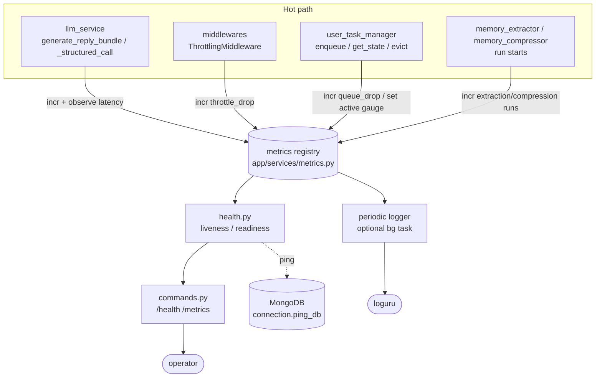

# Design — Phase 10: Observability & ops

## Overview

Phase 10 makes a running ThinkMate instance **measurable and operable** without adding infrastructure. The design is an **in-process, single-instance observability layer**: a dependency-free in-memory metrics registry, cheap hot-path instrumentation, liveness/readiness helpers, an admin `/health` command, an optional periodic metrics logger, and a runbook.

It is intentionally **not** a Prometheus/OTel server. The goal, straight from `docs/project_plan.md` Phase 10 and `docs/development/performance_and_scaling.md`, is to let an operator answer **"are we near the ceiling?"** — where the ceiling is almost always **LLM throughput**, not the event loop or MongoDB.

This design is grounded in:
- `docs/project_plan.md` — the Phase 10 metric list (LLM call counts/latency, hot-path round-trips, queue depth, active `UserState` count, throttle drops, extraction/compression runs, audit write lag; health/liveness; runbook).
- `docs/development/performance_and_scaling.md` — the hot-path invariants (one reply LLM call, ≤3 Mongo round-trips, nothing slow inline) and the documented saturation signals.
- The existing code to instrument: `llm_service.py`, `user_task_manager.py`, `middlewares.py`, `connection.py`, `commands.py`, `main.py`, `config.py`.

Guiding principle (the perf-doc priority order): **responsiveness → robustness → minimize LLM calls**. Instrumentation must therefore be cheap, must never fail the path it observes (Requirement 2.8), and must never add a DB/LLM round-trip on the hot path (Requirement 2.7).

## Architecture

### Component map



### New & changed modules

| Module | Change |
|---|---|
| `app/services/metrics.py` | **New.** Process-wide singleton `metrics` with counters, gauges, timers, `snapshot()`, `reset()`, and a `timer()` context manager. Stdlib only. |
| `app/services/health.py` | **New.** `liveness()` (no I/O) and async `readiness(db)` (Mongo ping, never raises); module-level process-start timestamp; optional `start_metrics_logger()` periodic task. |
| `app/services/llm_service.py` | Wrap each LLM call with a `metrics.timer(...)` and increment per-type + success/failure counters. Additive only. |
| `app/handlers/middlewares.py` | `metrics.incr("throttle.drops")` where a message is dropped past the rate limit. |
| `app/services/user_task_manager.py` | `metrics.incr("queue.drops")` on queue-cap drop; `metrics.set_gauge("conversations.active", len(self._states))` on state create/evict. |
| `app/services/memory_extractor.py` / `memory_compressor.py` | `metrics.incr("extraction.runs")` / `metrics.incr("compression.runs")` at run start (single-party + group). |
| `app/handlers/commands.py` | Add `/health` (and optional `/metrics`) admin command, authorization gate, text report. |
| `app/config.py` | Add optional `ADMIN_USER_IDS` (comma-separated → `set[int]`) and `METRICS_LOG_INTERVAL_SECS` (float, default 0 = off). |
| `main.py` | Optionally start the periodic metrics logger after `init_db()`; register the new command(s). |
| `docs/development/observability.md` | **New.** The runbook. |

## Non-behavioral / backward-compatibility strategy

The single most important constraint mirrors Phase 9's: **existing behavior is unchanged**. The mechanisms:

1. **Additive instrumentation.** Every instrumentation call is a side-effect-only statement added beside existing logic; no return value, signature, or control-flow branch changes (Requirement 2.9).
2. **Never-fail metrics.** All registry mutators are wrapped so an internal error is swallowed and logged at debug, never propagated (Requirement 2.8). The instrumented path behaves identically whether or not the metric succeeds.
3. **Zero hot-path I/O.** Instrumentation only touches in-memory dicts guarded by a lightweight lock; no DB/LLM call is added (Requirement 2.7), so the ≤3-round-trip / one-LLM-call invariants hold.
4. **Defaulted, optional config.** `ADMIN_USER_IDS` and `METRICS_LOG_INTERVAL_SECS` have safe defaults (empty / 0), so no new *required* configuration is introduced; the bot runs exactly as before if they are unset.
5. **DM-only admin default.** When `ADMIN_USER_IDS` is empty, `/health` answers only in private chats, so a report is never broadcast into a group.

## Data Models

The "data model" here is the **fixed metric set** held in memory. Names use a dotted namespace; the set is small and fixed (Requirement 1.9) so memory is bounded.

### Registry internal shape

```python
# app/services/metrics.py (conceptual)
_counters: dict[str, int]                      # name -> running total
_gauges:   dict[str, float]                    # name -> latest value
_timers:   dict[str, dict]                     # name -> {"count": int, "sum": float, "max": float}
_lock:     threading.Lock                      # cheap guard for atomic updates
```

### `snapshot()` output shape

```json
{
  "counters": { "llm.reply.calls": 12, "llm.reply.success": 11, "llm.reply.failure": 1,
                "throttle.drops": 3, "queue.drops": 0,
                "extraction.runs": 2, "compression.runs": 1 },
  "gauges":   { "conversations.active": 7 },
  "timers":   { "llm.reply.latency": { "count": 12, "sum": 18.4, "max": 3.1, "avg": 1.533 } }
}
```

### The fixed metric set

| Metric name | Type | Recorded at | Meaning / "near the ceiling?" signal |
|---|---|---|---|
| `llm.reply.calls` | counter | `llm_service.generate_reply_bundle` | Total reply-bundle LLM calls (the dominant cost). |
| `llm.reply.success` / `llm.reply.failure` | counter | same | Success vs. failure split; rising failures = endpoint stress. |
| `llm.reply.latency` | timer | wraps the reply call | Reply latency; rising avg/max = LLM endpoint saturating. |
| `llm.extraction.calls` / `.success` / `.failure` | counter | `_structured_call` (memory_extraction) | Extraction call volume/outcomes. |
| `llm.extraction.latency` | timer | wraps extraction call | Extraction latency. |
| `llm.group_extraction.calls` / `.success` / `.failure` | counter | `_structured_call` (group_memory_extraction) | Group extraction volume/outcomes. |
| `llm.group_extraction.latency` | timer | wraps group extraction call | Group extraction latency. |
| `llm.compression.calls` / `.success` / `.failure` | counter | `_structured_call` (memory_compression) | Compression call volume/outcomes. |
| `llm.compression.latency` | timer | wraps compression call | Compression latency. |
| `throttle.drops` | counter | `ThrottlingMiddleware.__call__` | Messages rejected by the rate limiter; high = flood/abuse. |
| `queue.drops` | counter | `UserTaskManager.enqueue_message` | Messages dropped at `MAX_QUEUED_MESSAGES`; high = a conversation can't drain in time. |
| `conversations.active` | gauge | `get_state` create + `_evict_idle` | Resident `UserState` count = active working set size. |
| `extraction.runs` | counter | `run_extractor` / `extract_and_trim*` start | Background extraction frequency. |
| `compression.runs` | counter | `run_compressor` / `compress_user_memory` start | Background compression frequency. |
| `audit.write.latency` | timer (optional) | `llm_service._log_llm_call` | Audit write lag; rising = Mongo write pressure (Phase 10 plan item). |

> Note on naming: per-type LLM counters are derived from each call's `call_type` so the four call sites (`chat_reply`, `memory_extraction`, `group_memory_extraction`, `memory_compression`) map cleanly to `llm.<type>.*`. A single small helper `metrics.record_llm(call_type, ok, latency)` centralizes the increment+observe so call sites stay one-liners.

## Components and Interfaces

The following are the exact intended interfaces. New parameters are additive; existing functions keep their signatures.

### `app/services/metrics.py` (new)

```python
class MetricsRegistry:
    def incr(self, name: str, n: int = 1) -> None: ...
    def set_gauge(self, name: str, value: float) -> None: ...
    def observe(self, name: str, value: float) -> None: ...      # count+1, sum+=value, max=max(..)
    def record_latency(self, name: str, seconds: float) -> None: # alias of observe
        ...
    def timer(self, name: str) -> "AbstractContextManager":      # records duration on __exit__
        ...
    def record_llm(self, call_type: str, *, ok: bool, latency: float) -> None:
        ...                                                       # convenience for the 4 LLM sites
    def snapshot(self) -> dict: ...                              # {counters, gauges, timers(+avg)}
    def reset(self) -> None: ...                                 # clear all (test isolation)

metrics = MetricsRegistry()   # process-wide singleton
```

- `timer()` is implemented with `contextlib.contextmanager` + `time.perf_counter()`; it records exactly once in a `finally`, so it records on exceptions too and re-raises unchanged (Requirement 1.5).
- All mutators take `_lock` (a `threading.Lock`) briefly; reads in `snapshot()` copy under the lock. The lock is uncontended on a single event loop and is only there to make a record atomic (Requirement 1.8). Each mutator body is wrapped in a `try/except` that logs at debug and returns (Requirement 2.8).
- Unknown names auto-create at zero/empty; the *callers* only ever use the fixed set, keeping memory bounded (Requirement 1.9).

### `app/services/health.py` (new)

```python
_PROCESS_START = time.time()        # captured once at import (Requirement 3.5)

def liveness() -> dict:
    # {"status": "ok", "uptime_secs": ..., "summary": {<compact metrics summary>}}
    # no I/O (Requirement 3.2)
    ...

async def readiness(db) -> dict:
    # success: {"ready": True, "mongo": "ok"}
    # failure: {"ready": False, "mongo": "error", "reason": "<str>"} ; never raises (3.3/3.4)
    ...

async def start_metrics_logger() -> asyncio.Task | None:
    # optional periodic snapshot logger (Requirement 5); no-op when interval <= 0
    ...
```

- `readiness` calls the existing connectivity probe (an `admin.command("ping")` against the injected db's client) inside a `try/except` that catches everything (including timeouts) and returns the degraded dict (Requirement 3.4, 3.6).
- `liveness().summary` pulls a compact view from `metrics.snapshot()` (e.g. total LLM calls, reply avg/max latency, throttle/queue drops, active conversations) so the command and the periodic logger share one formatter.

### `app/services/llm_service.py` (instrumentation)

- In `generate_reply_bundle`: wrap the `_with_retries(...)` reply call in `with metrics.timer("llm.reply.latency"):` and, on the success/except branches that already exist, call `metrics.record_llm("chat_reply", ok=..., latency=...)`. The existing `_fire_log(...)` calls and the `(reply, reaction[, affinity_delta])` return contract are untouched.
- In `_structured_call`: time the call and, on the existing success-return and `None`-return/`except` branches, call `metrics.record_llm(call_type, ok=..., latency=...)`. Because `call_type` is already a parameter (`memory_extraction` / `group_memory_extraction` / `memory_compression`), one line covers all three structured call types.
- Optional: wrap `_log_llm_call`'s insert in `metrics.timer("audit.write.latency")` to surface audit write lag (Phase 10 plan item) — still fire-and-forget, off the hot path.

### `app/handlers/middlewares.py` (instrumentation)

- In `ThrottlingMiddleware.__call__`, on the branch that returns early because `len(window) >= RATE_LIMIT_MAX_REQUESTS`, add `metrics.incr("throttle.drops")` before the `return`. The warn-once behavior and window bookkeeping are unchanged.

### `app/services/user_task_manager.py` (instrumentation)

- In `enqueue_message`, on the `len(state.pending_messages) >= MAX_QUEUED_MESSAGES` early-return branch, add `metrics.incr("queue.drops")`.
- In `get_state`, after creating a new `UserState`, and in `_evict_idle`, after deleting stale states, set `metrics.set_gauge("conversations.active", len(self._states))` (Requirement 2.5).
- In `run_extractor`, increment `extraction.runs` at the point a run actually proceeds (after the lock guard); in `run_compressor`, increment `compression.runs` after the cooldown/lock guards pass. (Placing it past the guards counts real runs, not skipped ones.)

### `app/handlers/commands.py` (new command)

```python
@router.message(Command("health"))
async def cmd_health(message: Message, db: AsyncIOMotorDatabase):
    if not _admin_allowed(message):      # ADMIN_USER_IDS gate, else DM-only default
        return
    live = liveness()
    ready = await readiness(db)
    await message.answer(_render_report(live, ready), parse_mode="HTML")
```

- `_admin_allowed(message)`: if `config.ADMIN_USER_IDS` is non-empty → membership test on `message.from_user.id`; else → `message.chat.type == "private"` (the documented safe default, Requirement 4.4).
- `/metrics` (optional) is the same gate + a raw snapshot summary.
- The report is built only from the in-memory snapshot + the single readiness ping — no LLM call (Requirement 4.7). Registered in the commands router and the `main.py` command list, consistent with the existing `/quiet`/`/chatty` style.

### `app/config.py` (additive, optional)

```python
ADMIN_USER_IDS: set[int]              # parsed from comma-separated "ADMIN_USER_IDS" (default empty)
METRICS_LOG_INTERVAL_SECS: float      # default 0.0 -> periodic logger disabled
```

A small `_env_int_set` parser splits on commas, ignores blanks, and coerces to `int`. No new *required* config (Requirement: "add no new required config unless necessary").

## The metrics-and-health flow

```mermaid
graph LR
    A[hot path event] --> B[metrics.incr / observe / set_gauge<br/>in-memory, lock-guarded, never raises]
    B --> C[(registry dicts)]
    C --> D[snapshot]
    D --> E[liveness summary]
    E --> F[/health command text]
    C --> G[periodic logger line]
    H[/health request/] --> I{admin allowed?}
    I -- no --> J[ignore / decline]
    I -- yes --> E
    F --> K[readiness: one Mongo ping<br/>degrade on failure]
```

## Error Handling

- **Metrics never break callers.** Every registry mutator wraps its body in `try/except Exception` → debug-log → return. A corrupt or unexpected value cannot fail a reply, a drop decision, or a background job (Requirement 2.8).
- **Timer records once.** The `timer()` context manager records the duration in a `finally`, so it counts even when the wrapped block raises, and the original exception propagates unchanged (Requirement 1.5).
- **Readiness never raises.** `readiness(db)` catches everything (including `ServerSelectionTimeoutError`) and returns a degraded dict (Requirements 3.4, 3.6).
- **Liveness is I/O-free.** `liveness()` only reads the in-memory snapshot; if the snapshot formatter somehow errors, it returns a minimal `{"status": "degraded"}` rather than raising (Requirement 3.6).
- **Command authorization fails closed.** If `from_user` is missing or not allowed, the command returns silently (no leakage); the DM-only default prevents broadcasting a report into a group (Requirement 4.4).
- **Periodic logger self-heals.** The loop wraps each iteration in `try/except` and continues; a logging error never crashes the process (Requirement 5.4). It is not started when the interval ≤ 0 (Requirement 5.3).
- **Unknown metric names** auto-create empty rather than raising (Requirement 1.10); callers stay within the fixed set so memory stays bounded.

## Correctness Properties

These are the testable invariants the implementation must satisfy; the testing strategy and tasks validate each.

### Property 1: Counter / gauge / timer correctness
For any sequence of `incr`/`set_gauge`/`observe` calls, `snapshot()` reflects the exact running total (counters), the latest value (gauges), and `count`/`sum`/`max`/derived `avg` (timers).

**Validates: Requirements 1.2, 1.3, 1.4, 1.6**

### Property 2: Timer records once, even on exception
For any block wrapped by `timer(name)`, the timer's `count` increases by exactly one whether the block returns or raises, and a raised exception propagates unchanged.

**Validates: Requirements 1.5**

### Property 3: Reset isolates
After `reset()`, `snapshot()` returns the empty-but-well-formed structure, so no metric state leaks between tests.

**Validates: Requirements 1.7, 1.10**

### Property 4: Instrumentation is additive
For any instrumented function, its return value and externally observable side effects are identical with metrics enabled or disabled, and a forced metrics failure does not change them.

**Validates: Requirements 2.8, 2.9**

### Property 5: Drops are counted
For any throttle drop, `throttle.drops` increases by one; for any queue-cap drop, `queue.drops` increases by one.

**Validates: Requirements 2.3, 2.4**

### Property 6: LLM calls are counted and timed
For any LLM call, the per-type call counter increases, the matching success/failure counter increases, and the per-type latency timer records exactly one observation.

**Validates: Requirements 2.1, 2.2**

### Property 7: Active-conversation gauge tracks state
The `conversations.active` gauge equals `len(_states)` after a state is created and after idle eviction.

**Validates: Requirements 2.5**

### Property 8: Readiness degrades gracefully
`readiness(db)` returns ready on a working mock DB and a degraded (non-raising) result when the ping fails.

**Validates: Requirements 3.3, 3.4, 3.6**

### Property 9: Health command authorization
`/health` replies for an authorized user (or in a DM under the default), is suppressed otherwise, and adds no LLM call.

**Validates: Requirements 4.1, 4.3, 4.4, 4.7**

## Testing Strategy

All tests use **mongomock + pytest-asyncio** per `tests/conftest.py` conventions (async mock wrappers, autouse DB patch, reactions disabled). No real LLM or network. LLM calls are patched with `AsyncMock` exactly as in `tests/test_batching_and_concurrency.py`. A fixture calls `metrics.reset()` before/after each metrics test for isolation.

### Metrics registry (Requirement 1)
- `incr` accumulates; default `n=1`; explicit `n` adds correctly.
- `set_gauge` replaces (not accumulates).
- `observe`/`record_latency` build `count`/`sum`/`max`; `snapshot()` derives `avg = sum/count`.
- `timer(name)` records one observation on normal exit; records and re-raises on exception (assert the exception propagates and `count == 1`).
- `snapshot()` shape has `counters`/`gauges`/`timers` sections; empty registry returns empty sections (no raise).
- `reset()` clears everything.

### Health & readiness (Requirement 3)
- `liveness()` returns `status="ok"`, a numeric `uptime_secs`, and a summary dict, with no DB access.
- `readiness(db)` returns ready on the mongomock client; patch the ping to raise and assert a degraded dict is returned (no exception).

### Admin command (Requirement 4)
- `/health` in a DM (default, no `ADMIN_USER_IDS`) replies with a report; assert `message.answer` called once and the LLM mock not called.
- Set `config.ADMIN_USER_IDS = {123}`: an allowed id gets a reply; a different id / a group chat is declined or ignored.
- Readiness failure path still yields a report (degraded), not an exception.

### Instrumentation (Requirement 2)
- Throttle: drive `ThrottlingMiddleware` past the limit (as in `test_throttling_middleware`) and assert `throttle.drops` incremented by the number of drops.
- Queue: drive `enqueue_message` past `MAX_QUEUED_MESSAGES` (as in `test_user_task_manager_queue_limit_guard`) and assert `queue.drops` incremented.
- LLM: patch `generate_reply_bundle`/`_structured_call` with `AsyncMock`, run `handle_message`, and assert the per-type counter and latency timer moved (and success/failure split correct on a forced raise).
- Active gauge: create a state via `get_state`, assert gauge == `len(_states)`; force eviction, assert it updates.
- Runs: trigger `run_extractor`/`run_compressor` (LLM patched) and assert `extraction.runs`/`compression.runs` incremented only when the run proceeds past its guard.

### Final checkpoint (Requirement 7.6)
- Full suite (`uv run pytest`) green, no warnings, no external services — same bar as Phases 8–9, and all pre-existing tests pass unmodified.
