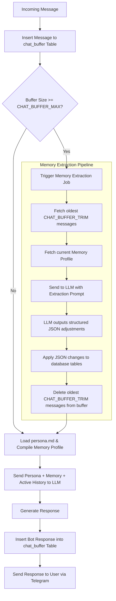
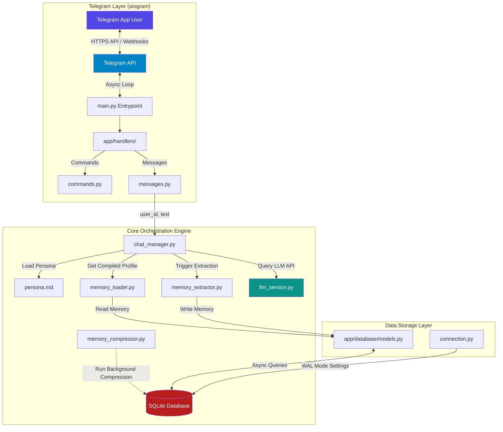

# System Architecture & Design

This document describes the high-level architecture and processing pipelines of the ThinkMate self-learning Telegram bot.

---

## 🧠 System Context & Core Mechanics

Unlike traditional vector-search RAG (Retrieval-Augmented Generation) systems that fetch arbitrary text chunks based on semantic similarity, ThinkMate builds a **structured memory profile** of the user over time. The core philosophy is to keep the LLM's context relevant, concise, and reflective of a real human friendship.

The LLM receives exactly **three components** to generate its responses:

```
┌──────────────────────────────────────────────────────────┐
│                   LLM SYSTEM PROMPT                      │
│                                                          │
│  ┌──────────────────────────────────────────────────┐    │
│  │ 1. Persona (loaded from persona.md)              │    │
│  │    Tone, style, humor, guidelines.              │    │
│  └──────────────────────────────────────────────────┘    │
│                                                          │
│  ┌──────────────────────────────────────────────────┐    │
│  │ 2. Memory Profile (compiled from SQLite DB)      │    │
│  │    ├─ User Details (name, occupation, style)     │    │
│  │    ├─ Core Facts (preferences, constraints)       │    │
│  │    ├─ Events (chronological life milestones)     │    │
│  │    └─ Current Mood (last detected emotion)       │    │
│  └──────────────────────────────────────────────────┘    │
│                                                          │
├──────────────────────────────────────────────────────────┤
│                                                          │
│  ┌──────────────────────────────────────────────────┐    │
│  │ 3. Active Chat History (from Chat Buffer Table)   │    │
│  │    [User]: I started learning piano today!       │    │
│  │    [Bot]: That's amazing! What song first?       │    │
│  │    ... (up to last N messages)                   │    │
│  └──────────────────────────────────────────────────┘    │
│                                                          │
└──────────────────────────────────────────────────────────┘
```

---

## 🔄 The Sliding Window Memory Engine

The bot maintains a sliding window buffer of the latest messages. Once this buffer exceeds a configured threshold (e.g., 20 messages), an asynchronous memory extraction process is triggered.



### Step-by-Step Processing Flow

1.  **Buffer Append**: Every message (both incoming User messages and outgoing Assistant responses) is immediately written to the database buffer.
2.  **Threshold Check**: The system counts the number of messages in the buffer for that user.
3.  **Extraction Trigger**: If the count matches or exceeds `CHAT_BUFFER_MAX` (default 20):
    *   The oldest `CHAT_BUFFER_TRIM` (default 10) messages are read.
    *   The current facts, events, and profile summary are retrieved.
    *   The system calls the extraction model (`LLM_EXTRACTION_MODEL`) requesting updates to the user profile.
    *   The returned JSON contains lists of:
        *   `new_facts`: Brand new pieces of information to store.
        *   `updated_facts`: Replaced or updated facts (e.g., job changes, new cities).
        *   `events`: Important occurrences to append to the event timeline.
        *   `emotional_state`: Shifts in user mood, intensity, and triggers.
    *   The changes are transactionally written to the database.
    *   The oldest `CHAT_BUFFER_TRIM` messages are removed from `chat_buffer`.
4.  **Memory Compression (Background Task)**: When compiling the memory profile, if its length exceeds `USER_MEMORY_BUDGET_CHARS` (default 10,000 characters), a non-blocking `compress_user_memory()` background task is spawned. This task sends all 4 memory components to the extraction LLM to compress them to ≤ 80% of the budget (8,000 characters), then replaces them atomically in the database without delaying the user's chat response.
5.  **Prompt Assembly**: The chat manager loads the personality from `persona.md` and reads the memory blocks to build a comprehensive system prompt.
6.  **Input/Output Guards**:
    *   *Input Guard*: User messages longer than `MAX_INPUT_CHARS` (default 1,000 characters) are ignored immediately to prevent essay/code abuse.
    *   *Output Guard*: Bot responses are capped by derived `max_tokens` (based on `MAX_RESPONSE_CHARS`, default 1,000 characters) to ensure concise conversation.
7.  **Generation**: The main chatbot model (`LLM_MODEL`) generates a response.
8.  **Response Handling**: The response is saved to the buffer and sent back to Telegram.

---

## 🧱 Component Breakdown



### 1. Presentation & Telegram Router (`app/handlers/`)
Built with `aiogram 3.x`, this layer registers routers and filters. It extracts Telegram message information, ensures async operation, and manages bot-side interactions (like displaying the typing state to users while waiting for the LLM).

### 2. Business Logic & Services (`app/services/`)
*   **[chat_manager.py](file:///d:/ThinkMate/app/services/chat_manager.py)**: The central transaction pipeline orchestrating the buffer checks, memory compilation, calling the LLM wrapper, and updating history.
*   **[memory_loader.py](file:///d:/ThinkMate/app/services/memory_loader.py)**: Compiles raw database tables (Facts, Events, Moods) into a human-readable text block formatted specifically for LLM context ingestion.
*   **[memory_extractor.py](file:///d:/ThinkMate/app/services/memory_extractor.py)**: Handles the structured parsing of past conversations, transforming text history into database modifications.
*   **[memory_compressor.py](file:///d:/ThinkMate/app/services/memory_compressor.py)**: Runs non-blocking background compression. When the total characters of compiled user memories exceed `USER_MEMORY_BUDGET_CHARS`, it triggers an LLM compression job to condense the user details, facts, and events into 80% of the budget.
*   **[llm_service.py](file:///d:/ThinkMate/app/services/llm_service.py)**: Low-level API connector. Handles retries, connection configurations, base URLs, API keys, and responses in JSON format.

### 3. Database Layer (`app/database/`)
Powered by `aiosqlite`. It manages connections, initializes database tables, and executes transactional updates. It ensures database locks are avoided by configuring SQLite to run in **WAL (Write-Ahead Logging)** mode.

---

## 🔒 Data Security & Multi-User Isolation

To support hundreds of concurrent users without data leakage, the database schema is strictly normalized. 

*   Every memory table (`facts`, `events`, `user_profiles`, `emotional_log`, and `chat_buffer`) uses the unique, system-level `user_id` provided by Telegram as a foreign key.
*   All queries executed by the backend are strictly parameterized and filtered by `user_id`:
    ```sql
    SELECT * FROM facts WHERE user_id = ? AND is_active = 1;
    ```
*   No global variables hold memory context, eliminating state bleeding between concurrent requests.

---

## 📈 Performance Considerations

*   **Asynchronous Processing**: The bot is fully asynchronous. While an LLM call or SQLite operation is taking place, other incoming Telegram messages are queued and handled concurrently by the asyncio event loop.
*   **WAL Mode**: SQLite normally locks the database file during writes. Running in Write-Ahead Log (WAL) mode enables concurrent reads while a write operation is occurring, speeding up operations.
*   **Separated Models**: Users can use a smaller, faster model (e.g., `gpt-4o-mini`, `Llama-3-8B-Instruct`) for the extraction and consolidation pipelines, saving costs and computing power, while utilizing a larger, highly creative model for the main chat interface.
