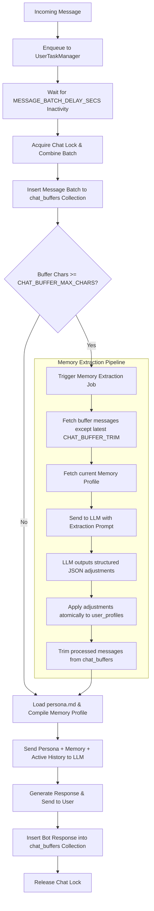
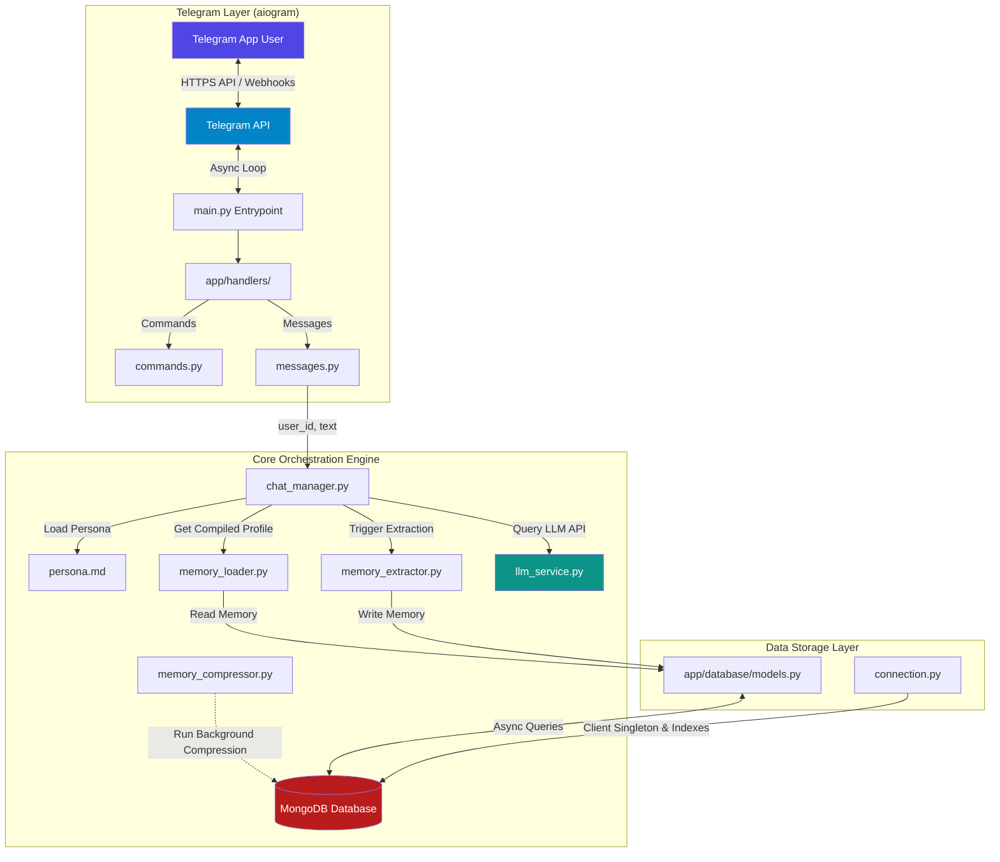

# System Architecture & Design

This document describes the high-level architecture, processing pipelines, and data flow of the ThinkMate self-learning Telegram bot.

---

## 🧠 System Context & Core Mechanics

Unlike traditional vector-search RAG (Retrieval-Augmented Generation) systems that fetch arbitrary text chunks based on semantic similarity, ThinkMate builds a **structured memory profile** of the user over time. The core philosophy is to keep the LLM's context relevant, concise, and reflective of a real human friendship.

The LLM receives exactly **three components** to generate its responses:

```
┌──────────────────────────────────────────────────────────┐
│                   LLM SYSTEM PROMPT                      │
│                                                          │
│  ┌──────────────────────────────────────────────────┐    │
│  │ 1. Persona (loaded from persona.md)              │    │
│  │    Tone, style, humor, guidelines.              │    │
│  └──────────────────────────────────────────────────┘    │
│                                                          │
│  ┌──────────────────────────────────────────────────┐    │
│  │ 2. Memory Profile (compiled from MongoDB)        │    │
│  │    ├─ User Details (name, occupation, style)     │    │
│  │    ├─ Core Facts (objective preferences)         │    │
│  │    ├─ Subjective Beliefs (values & thoughts)     │    │
│  │    ├─ Events (chronological life milestones)     │    │
│  │    └─ Current Mood (direct emotional state)      │    │
│  └──────────────────────────────────────────────────┘    │
│                                                          │
├──────────────────────────────────────────────────────────┤
│                                                          │
│  ┌──────────────────────────────────────────────────┐    │
│  │ 3. Active Chat History (from chat_buffers)        │    │
│  │    [User]: I started learning piano today!       │    │
│  │    [Bot]: That's amazing! What song first?       │    │
│  │    ... (up to last N messages)                   │    │
│  └──────────────────────────────────────────────────┘    │
│                                                          │
└──────────────────────────────────────────────────────────┘
```

---

## 🔄 The Sliding Window Memory Engine

The bot maintains a sliding window buffer of the latest messages in MongoDB's `chat_buffers` collection. Once the buffer's character count exceeds `CHAT_BUFFER_MAX_CHARS`, a background memory extraction process is triggered. Incoming messages are batched using `UserTaskManager` to handle rapid-fire messages and avoid redundant LLM calls.



### Step-by-Step Processing Flow

1.  **Enqueue & Coalescing**: When the user sends a message, it is enqueued. A batching timer (`MESSAGE_BATCH_DELAY_SECS`, default 1.5 seconds) runs. If the user sends another message before it expires, the timer resets. To prevent infinite postponement from spammers, a hard deadline (`MAX_BATCH_DELAY_SECS`, default 5.0 seconds) is enforced from the first message in the batch. Once this deadline is crossed, the batch is immediately forced to process. The bot sends a Telegram "typing..." action during this delay and the subsequent generation.
2.  **Lock Acquisition**: Once the batch delay expires or the deadline is hit, the system acquires the user's `chat_lock`. This serialized lock ensures that only one response pipeline runs at a time per user. Any messages sent by the user during LLM processing accumulate in the queue and are processed in the next batch.
3.  **Buffer Append**: The combined messages are written to the database buffer in the `chat_buffers` collection using `$push`.
4.  **Threshold Check**: The system computes the total character length of the messages in `chat_buffers` for that user.
5.  **Extraction Trigger**: If the character count matches or exceeds `CHAT_BUFFER_MAX_CHARS` (default 10,000 characters):
    *   All messages in the buffer **except** the latest `CHAT_BUFFER_TRIM` (default 10) messages are read (these constitute the older "queued" messages).
    *   The current facts, events, beliefs, and profile summary are retrieved.
    *   The system calls the extraction model (`LLM_EXTRACTION_MODEL`) requesting updates.
    *   The returned JSON conforms to the `MemoryExtraction` schema and contains:
        *   `profile_updates`: Dynamic updates to the user's `communication_style` preference.
        *   `new_facts` / `updated_facts` / `removed_facts`: Full CRUD operations to keep user facts synchronized.
        *   `new_beliefs` / `updated_beliefs` / `removed_beliefs`: Full CRUD operations to keep subjective beliefs synchronized.
        *   `new_events` / `updated_events` / `removed_events`: Full CRUD operations to keep timeline milestones updated.
        *   `emotional_state`: Shifts in user mood, intensity, and triggers.
    *   The changes are transactionally written to the user's profile document inside `user_profiles` using atomic `$set` operations, applying **hard deletes** for removals. Free-text matches are normalized (casefold + whitespace) and new items are de-duplicated so phrasing drift doesn't create duplicates.
    *   The processed segment (older messages) is trimmed from `chat_buffers` **atomically** via `$pull` on a `created_at` cutoff — so messages the user sends *during* the (slow) extraction call are never clobbered. Buffer timestamps are strictly monotonic at millisecond resolution to keep this ordering exact.
    *   **Resilience to extraction failure**: the extraction call is retried up to `MAX_EXTRACTION_ATTEMPTS` (3) times, **re-reading the buffer each attempt** so messages that arrive while a slow call is in flight are folded into the next attempt instead of being missed. A run is only treated as successful when the call returns a valid result (`extract_memory` returns `None` on failure, distinct from a legitimately *empty* extraction). If **every** attempt fails (e.g. an LLM outage), the oldest messages are trimmed anyway so the buffer can't grow without bound — a deliberate trade of a bounded amount of un-extracted memory for a healthy buffer. Memory is never written on a failed run.
6.  **Memory Compression (Background Task)**: When compiling the memory profile, if its length exceeds `USER_MEMORY_BUDGET_CHARS` (default 4,000 characters), a non-blocking background task is spawned. The `UserTaskManager` ensures a shared sequential lock (`memory_lock`) is acquired per user; concurrent extraction/compression tasks are skipped. This task sends all memory components to the LLM to compress them to ≤ 80% of the budget. It is the only phase where the high-level `profile_summary` is rewritten, as synthesizing a summary requires a bird's-eye view of all memories, which is not available to the localized extraction steps. The compressed profile, facts, beliefs, and events then atomically replace the old records in the user profile document. Because models can't count characters reliably, a **deterministic post-pass** then drops lowest-priority items (oldest events → beliefs → facts) until the profile actually fits the budget, and a per-user **cooldown** (`COMPRESSION_COOLDOWN_SECS`) prevents a re-trigger loop on every subsequent message.
7.  **Prompt Assembly**: The chat manager loads the personality from `persona.md` and reads the memory blocks from `user_profiles` to build a comprehensive system prompt.
8.  **Input/Output Guards**: Oversized inbound messages (`MAX_INPUT_CHARS`) are ignored before any LLM/database work; outbound length is bounded by `MAX_RESPONSE_CHARS` (via `max_tokens`); a sliding-window throttle (`RATE_LIMIT_*`) and a per-user queue cap (`MAX_QUEUED_MESSAGES`) protect against floods.
9.  **Generation & Send**: The main chatbot model (`LLM_MODEL`) generates the reply **and** an optional emoji reaction in a **single** `json_object` call (`generate_reply_bundle`). The reply is saved to the buffer and sent to Telegram, the reaction (normalized to Telegram's accepted set) is applied, and the `chat_lock` is released.

---

## 🧱 Component Breakdown



### 1. Presentation & Telegram Router (`app/handlers/`)
Built with `aiogram 3.x`, this layer registers routers and filters. It extracts Telegram message information, ensures async operation, and manages bot-side interactions (like displaying the typing state to users while waiting for the LLM).

### 2. Business Logic & Services (`app/services/`)
*   **[chat_manager.py](../app/services/chat_manager.py)**: The central transaction pipeline orchestrating the buffer checks, memory compilation, calling the LLM wrapper, and updating history.
*   **[memory_loader.py](../app/services/memory_loader.py)**: Compiles raw database documents (Facts, Beliefs, Events, Moods) into a human-readable text block formatted specifically for LLM context ingestion.
*   **[memory_extractor.py](../app/services/memory_extractor.py)**: Handles the structured parsing of past conversations, transforming text history into database modifications.
*   **[memory_compressor.py](../app/services/memory_compressor.py)**: Runs non-blocking background compression. When the total characters of compiled user memories exceed `USER_MEMORY_BUDGET_CHARS`, it triggers an LLM compression job to condense the user details, facts, beliefs, and events.
*   **[llm_service.py](../app/services/llm_service.py)**: Low-level API connector. Handles structured parsing with local fallback functionality and records centralized LLM call details to the `llm_audit_log` collection.

### 3. Database Layer (`app/database/`)
Powered by `motor` async MongoDB client. It manages connections, initializes indexes, and executes transactional updates.

---

## 🔒 Data Security & Multi-User Isolation

To support hundreds of concurrent users without data leakage, the database schema is strictly keyed.

*   Every collection (`user_profiles`, `chat_buffers`, `llm_audit_log`) uses the unique, system-level `user_id` provided by Telegram as the primary key (`_id`) or an indexed filter key.
*   All queries executed by the backend are strictly parameterized and filtered by `user_id`.
*   No global variables hold memory context, eliminating state bleeding between concurrent requests.

---

## ⚙️ Operational & Scaling Model

ThinkMate runs as a **single long-polling instance** with per-user state (locks, batch
timers, throttle counters) held in memory. This is deliberate and works well into the tens
of thousands of users; the practical ceiling is LLM throughput, not the Python event loop.

Hardening that keeps a single instance healthy at scale:

* **Bounded memory.** Idle per-user state is evicted after `USER_STATE_TTL_SECS`; the
  throttle map is pruned periodically; the chat buffer is hard-capped (`CHAT_BUFFER_HARD_CAP`).
* **Fewer, more robust LLM calls.** One combined reply+reaction call per batch; transient
  errors retried with backoff; the dead native-parse round-trip removed for non-OpenAI proxies.
* **Audit hygiene.** Audit writes are off the hot path and expire via a TTL index.

**Horizontal scaling is out of scope here.** Because state is in-process and polling is
single-consumer, running multiple replicas would require switching to webhooks and
externalizing state (e.g. Redis). The exact, mechanical migration path — and the efficiency
rules that keep one instance healthy at scale — live in
[performance_and_scaling.md](development/performance_and_scaling.md).

### Observability (Phase 10)

Operational visibility is built in-process, matching the single-instance model. A
dependency-free in-memory metrics registry (`app/services/metrics.py`) records LLM
volume/latency by call type, throttle and queue drops, the active-conversation gauge, and
extraction/compression run counts using only cheap, lock-guarded increments on (or beside) the
hot path — no added DB or LLM round-trip. Liveness/readiness helpers (`app/services/health.py`)
back an admin `/health` (and optional `/metrics`) command that reports uptime, a Mongo ping, and
a metrics summary, and an optional periodic logger emits that summary every
`METRICS_LOG_INTERVAL_SECS`. This is intentionally **not** a Prometheus/OTel server — that
remains an optional future sink. See [observability.md](development/observability.md) for the
full metric catalog and runbook.

---

## 👥 Group Chat (Phase 9, implemented)

In groups, the buffer is keyed by `chat_id` (a DM is just `chat_id == user_id`) and each
message carries `sender_id`/`sender_name` for multi-party context. The router
(`handlers/messages.py`) branches on chat type: private → the unchanged DM path, channel →
ignored, group/supergroup → the multi-party path. There it resolves the bot's identity (cached
`get_me()`) and uses `is_addressed` to decide engagement. The bot **always** replies when
addressed (mention, name, or reply-to-bot) and otherwise runs a **no-LLM ambient gate**
(`AmbientGate` in `services/group_gate.py`: per-chat cooldown → cheap keyword/scan-tick →
affinity-weighted dice roll) so it chimes in selectively without spamming or abusing the API —
at most ~1 ambient LLM call per active group per cooldown window. Per-(chat, user) affinity/mode
lives in `chat_members`, fronted by an in-memory read-through/write-through `AffinityCache`
(`services/affinity.py`); affinity moves on mentions, "back off" keywords, an optional
`affinity_delta` folded from the reply call, and the explicit `/quiet` `/chatty` commands. Memory
stays per `user_id`; group extraction (`extract_and_trim_group`) is multi-party in a single LLM
call, attributed back to each participant via the segment's own name→id map. The DM path is
byte-for-byte unchanged. Full design: [group_chat.md](development/group_chat.md).
