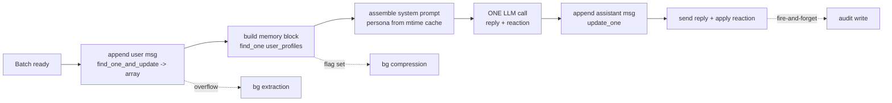

# Performance, Efficiency & Scaling

> The authoritative reference for how ThinkMate stays fast and cheap under load, the exact
> capacity ceiling of the single-instance design, and the ready-to-execute path to horizontal
> scale. Read this alongside [architecture.md](../architecture.md) and
> [hardening_plan.md](hardening_plan.md).

This guide is the performance, efficiency, and scaling reference for ThinkMate's
single-instance design. It explains how the bot keeps replies fast and LLM costs low, where the
one-process architecture tops out, and the concrete steps to scale horizontally when that day
comes. A few terms recur throughout: the **single-instance** design means the whole bot runs as
one process that holds per-user state in memory; the **hot path** is the short sequence of work
between receiving a user's message and sending the reply; and **horizontal scale** means running
several interchangeable copies (replicas) of the bot behind a load balancer.

New to the codebase? Skim the section list below to see how the document is laid out, then read
[architecture.md](../architecture.md) for the system-wide picture and
[hardening_plan.md](hardening_plan.md) for the reliability work that complements the performance
rules here. The sections move from goals, to the request hot path, to cost and efficiency rules,
to the data layer, and finally to where a single instance stops and how to grow past it.

## Table of Contents
1. [Design goals & priorities](#design-goals--priorities)
2. [The hot path (per message batch)](#the-hot-path-per-message-batch)
3. [Cost model & budgets](#cost-model--budgets)
4. [Efficiency rules (do / don't)](#efficiency-rules-do--dont)
5. [Database access patterns & indexes](#database-access-patterns--indexes)
6. [Bounded memory at 50k+ users](#bounded-memory-at-50k-users)
7. [LLM call minimization](#llm-call-minimization)
8. [Background work & locking](#background-work--locking)
9. [The single-instance ceiling](#the-single-instance-ceiling)
10. [Horizontal-scale migration path (future)](#horizontal-scale-migration-path-future)

---

## Design goals & priorities

These priorities are the tie-breaker for every performance decision in the system: when two
goals pull in opposite directions, the higher-ranked one wins. Listing them explicitly keeps the
trade-offs honest and consistent across the codebase.

In strict priority order (a tie is broken by the higher item):

1. **Responsiveness** — the user gets a reply fast; nothing slow runs on the reply path.
2. **Robustness of every API call** — retries, graceful degradation, no crash on bad output.
3. **Minimize LLM calls** — they are the dominant cost and the real throughput ceiling.
4. **Reply quality** — prompt, memory, and parameters tuned within the chosen model.
5. **Memory quality** — accurate, compact, de-duplicated structured memory.

Everything below serves these priorities. When a change trades one for another, the
higher-priority item wins and the trade is documented.

---

## The hot path (per message batch)

The hot path is everything between "a user's batch is ready" and "the reply is sent". A *batch*
is the set of rapid-fire messages from one user that are coalesced and answered together (see
[LLM call minimization](#llm-call-minimization)). Because the user is waiting during this window,
the hot path must stay minimal — anything that can run later is pushed off it. The target shape:

**Mandatory invariants for the hot path:**
- **Exactly one LLM call** (`generate_reply_bundle`, reply + reaction together).
- **≤ 3 MongoDB round-trips**: append-user (returns the post-update array → char count +
  active history in one shot), read profile (memory block), append-assistant.
- **No disk reads** — persona is cached and only re-read when its `mtime` changes.
- **No audit write inline** — audit is scheduled fire-and-forget.
- **No extraction/compression inline** — both are background tasks, only ever *triggered*
  from the hot path.

If a feature wants to add a hot-path round-trip or LLM call, it must justify it here first.

---

## Cost model & budgets

This table is the per-batch budget the hot path is held to. It makes the cost of answering one
user explicit so any regression (an extra LLM call, an extra query) is easy to spot. "Amortized"
values are work that happens only occasionally and is averaged over many messages.

| Resource | Per message batch | Notes |
|---|---|---|
| LLM calls (chat) | **1** | reply + reaction merged into one `json_object` call |
| LLM calls (extraction) | amortized ≪ 1 | only when buffer crosses `CHAT_BUFFER_MAX_CHARS` |
| LLM calls (compression) | amortized ≪ 1 | only when memory > budget, gated by cooldown |
| Mongo round-trips | **~3** | append-user, read-profile, append-assistant |
| Disk reads | **0** (amortized) | persona mtime-cached |
| Audit writes | 1, **off hot path** | truncated fields, TTL-expired |

**Group chats** add at most **~1 ambient LLM call per active group per cooldown window** (see
[group_chat.md](group_chat.md)); every group message is still buffered cheaply (1 write) for
context and learning, but the decision to *reply* is gated by a no-LLM funnel.

---

## Efficiency rules (do / don't)

These rules turn the priorities and budgets above into concrete habits. The common thread is to
do work once, in memory, and to never let a structure grow without a cap. Following them keeps
the hot path within its round-trip budget and protects the process from unbounded growth.

**DO**
- Reuse the compiled memory block for both the prompt *and* the `needs_compression` check —
  it is built once on the hot path and serves double duty (no extra read or string build).
- Return post-write state from a single `find_one_and_update` instead of write-then-read.
- Do deterministic, in-memory work (budget trimming, dedup, normalization) in a **single**
  read + single write, never a per-item read/write loop.
- Cap every unbounded structure (`$slice` on the buffer, TTL on audits, eviction on state,
  pruning on the throttle map).
- Push transient-error handling down into one retry helper; keep caps short on the chat path.

**DON'T**
- Don't issue a Mongo query per fact/belief/event — load the array once, mutate in memory,
  write once.
- Don't recompute the memory string more than once per message.
- Don't block the reply on audit logging, extraction, or compression.
- Don't hold a per-user lock across an LLM call on the *reply* path longer than necessary
  (the `chat_lock` covers a batch; background work uses the separate `memory_lock`).
- Don't store unbounded per-user state without an eviction/pruning policy.

---

## Database access patterns & indexes

The data layer is designed so that the most frequent operations — the hot-path reads and writes —
are the cheapest. Each collection is keyed for O(1)/O(log n) access and strict per-tenant
isolation, meaning one user's or chat's data is never mixed with another's. The table below maps
each collection to its key, indexes, and how it is accessed.

All collections are keyed for O(1)/O(log n) access and strict per-tenant isolation.

| Collection | Key (`_id`) | Secondary indexes | Access pattern |
|---|---|---|---|
| `user_profiles` | `user_id` (int) | none (matched by `_id`) | 1 read on hot path; read-modify-write in background |
| `chat_buffers` | `chat_id` (int) | none (matched by `_id`) | append (`$push`+`$slice`), atomic trim (`$pull` on cutoff) |
| `chat_members` | `"{chat_id}:{user_id}"` (str) | none (matched by `_id`); cached in memory | affinity/mode read-through cache |
| `llm_audit_log` | auto `ObjectId` | `(user_id, 1),(timestamp,-1)` compound; `(timestamp,1)` TTL | off-hot-path writes; rare admin reads |

**Rules:**
- The single-document-per-user model keeps the hot read to one lookup by `_id` (no joins, no
  fan-out queries). Typical profile doc < 20 KB (budget-capped), far under Mongo's 16 MB.
- Buffer trims are **atomic** via `$pull` on a `created_at` cutoff (never read-slice-overwrite)
  so concurrent appends are never clobbered. Timestamps are strictly monotonic at ms
  resolution within the process to make the cutoff exact.
- The buffer array is hard-capped with `$slice` so a stalled background extractor cannot let
  it grow without bound.
- Connection pool: tune `maxPoolSize` (motor default 100) to the instance's concurrency; at
  50k users the working set of *concurrently active* users is far smaller, so the default pool
  is typically sufficient. Document any change in [configuration.md](configuration.md).

---

## Bounded memory at 50k+ users

In-process state is the main scaling risk for a single instance. A long-running process that
keeps per-user data in RAM will eventually exhaust memory if anything is allowed to accumulate
without limit, so every in-memory structure is given an explicit bound and a policy that reclaims
it once a user goes idle:

| Structure | Owner | Bound |
|---|---|---|
| Per-user `UserState` (locks, queue, timers) | `UserTaskManager._states` | evicted after `USER_STATE_TTL_SECS` idle |
| Throttle timestamps | `ThrottlingMiddleware.users` | pruned every window; empty users dropped |
| Persona text | `chat_manager._persona_cache` | one entry, refreshed by `mtime` |
| Affinity/mode | per-chat member cache | bounded with the same idle-eviction policy as state |
| Audit log | MongoDB | TTL index (`AUDIT_LOG_RETENTION_DAYS`) |
| Chat buffer | MongoDB | `$slice` to `CHAT_BUFFER_HARD_CAP` |

A periodic sweeper evicts idle `UserState`; the throttle map self-prunes on access. Only the
*active* working set lives in RAM, not all 50k users.

---

## LLM call minimization

LLM calls are both the largest cost and the throughput ceiling (priority 3 above), so the system
works hard to make fewer of them. The techniques below either merge two calls into one, defer
work until a threshold is crossed, or filter out work before any call is made:

The LLM is the throughput ceiling, so calls are cut aggressively:

- **Merged reply+reaction** — one call instead of two on every message.
- **Batching/coalescing** — rapid-fire messages are combined into one batch → one reply call
  (with a hard deadline so a spammer can't postpone forever).
- **Affinity_delta piggyback** — in groups, the relationship signal rides inside the reply
  JSON; no extra call.
- **Ambient funnel** — cooldown → cheap keyword scan → affinity-weighted dice roll, all
  no-LLM, before any group chime-in call.
- **Extraction/compression are amortized** — they run on thresholds, not per message, and
  each is a single structured call (no dead native-parse round-trip on non-OpenAI proxies).

---

## Background work & locking

Work that the user does not have to wait for is moved off the hot path and run in the background,
and per-user locks keep that concurrent work from corrupting shared state. The two lock types
below serialize different pipelines so the reply path and the memory-maintenance path never step
on each other:

- `chat_lock` (per user) serializes the reply pipeline for one user so batches don't interleave.
- `memory_lock` (per user) serializes the extractor and compressor so they never corrupt each
  other's read-modify-write on `user_profiles`.
- Background tasks (`extraction`, `compression`, `audit`) are fire-and-forget `asyncio.Task`s,
  tracked so they aren't garbage-collected mid-flight; failures are logged, never fatal.
- Extraction retries up to 3 times, re-reading the buffer each attempt; on total failure it
  trims anyway to keep the buffer bounded (documented trade in [memory_engine.md](memory_engine.md)).
- Compression returns `None` on failure and the replace step is **skipped** — memory is never
  wiped by a failed compression. Budget enforcement is a single-read/single-write in-memory
  pass (not a per-item DB loop).

---

## The single-instance ceiling

ThinkMate runs as **one long-polling process** with in-memory per-user state. ("Long-polling"
means the bot repeatedly asks Telegram for new updates over a single connection, rather than
having updates pushed to it.) This is a deliberate choice: it is simpler, cheaper, and correct up
to a high user count. The practical ceiling is **LLM throughput**, not the Python event loop or
MongoDB.

What stays healthy at scale (documented above): bounded memory, ≤1 chat LLM call per batch,
~3 hot-path round-trips, off-hot-path audit, atomic buffer ops.

**You have hit the ceiling when** any of these are sustained:
- The LLM endpoint's concurrency/RPM is saturated (queueing delays replies).
- A single event loop can't drain ready batches within the batch delay budget.
- MongoDB Atlas tier IOPS/connections are saturated.

The first is almost always the real limit — and it is solved by a faster/parallel LLM
endpoint, not by more bot replicas. Only scale horizontally when the event loop or DB is the
proven bottleneck. Reaching for more replicas before that point adds the complexity of
distributed state without removing the actual constraint.

These saturation signals are exactly what the in-process metrics surface (LLM
volume/latency, throttle/queue drops, active conversations) — see
[observability.md](observability.md) for the metrics that surface these signals and how to read
them via `/health`.

---

## Horizontal-scale migration path (future)

Not built in v1, but specified so the jump is mechanical, not a rewrite. Capturing the plan now
keeps today's code shaped for it, so scaling out later is a series of well-understood swaps
rather than a redesign. The only thing that blocks multiple replicas today is **in-process
state** and **single-consumer long-polling**.

**Step 1 — Externalize state behind an interface.** Introduce a `StateStore` abstraction with
two implementations: the current in-memory one (default) and a Redis-backed one. It owns:
per-user locks, batch timers/queues, throttle counters, per-chat ambient cooldowns, and the
affinity/mode cache. The hot path code calls the interface, not a dict.

**Step 2 — Distributed locks.** Replace `asyncio.Lock` with Redis locks (e.g. Redlock) for
`chat_lock` and `memory_lock` so per-user serialization holds across replicas.

**Step 3 — Webhooks instead of long-polling.** Long-polling is single-consumer; switch to
Telegram webhooks behind a load balancer so N stateless replicas can each handle updates.
Optionally use sticky routing by `chat_id` to keep a chat's batches on one replica (reduces
lock contention) — but correctness must not depend on stickiness once locks are distributed.

**Step 4 — MongoDB scale-out.** Shard on `user_id` (profiles/buffers) once a single replica
set is saturated; the schema is already shard-friendly (every query is keyed by id).

**Step 5 — Stateless audit & metrics.** Audit writes are already independent; add a metrics
sink (Prometheus/OTel) so replicas are observable. The in-process metrics registry and `/health`
command shipped in Phase 10 (see [observability.md](observability.md)) are the single-instance
precursor to this sink.

**What does NOT change:** the data model, the prompts, the memory algorithms, the single
reply+reaction call, and the public service functions. Only the *state layer* and the
*update transport* change. That is the whole point of keeping state behind an interface.
